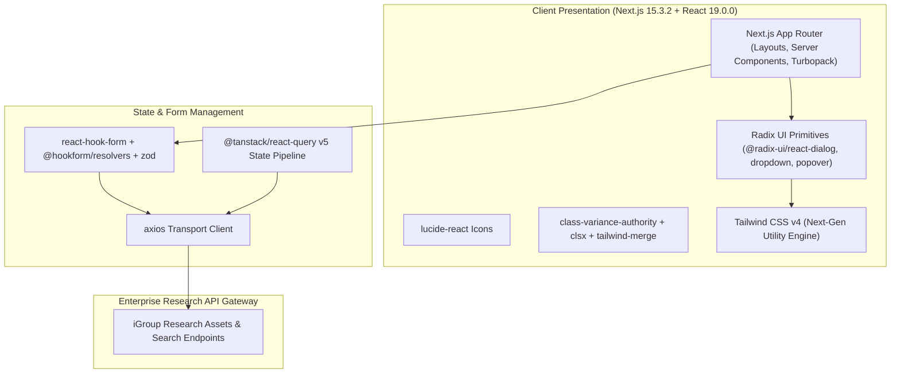

# 🏛️ iGroup Research & Digital Asset Portal (`igroup`) — System Architecture

---

## 📌 Executive Architecture Summary
Dokumen ini memaparkan cetak biru arsitektur teknis (*system design blueprint*), pemisahan tanggung jawab komponen (*separation of concerns*), alur transmisi data (*data lifecycle*), serta manifest dependensi terverifikasi yang diambil langsung dari file manifest proyek (`package.json` & `composer.json`).

* **Pola Arsitektur Utama:** `Modern Next.js 15 App Router & Radix UI Knowledge Portal`
* **Fokus Rekayasa:** Keandalan sistem, latensi rendah, integritas data, dan keamanan transaksi.

---

## 🏛️ System Architecture Diagram

---

## 🔄 Lifecycle & Data Flow
1. **Server-Side Hydration:** Next.js 15 App Router renders server components with zero client-side JavaScript overhead for static sections.
2. **Form Interaction & Validation:** `react-hook-form` paired with `zod` guarantees strict validation on research search filters.
3. **Client Caching:** `@tanstack/react-query` manages cached search queries and asset previews.
4. **Dynamic UI:** Radix primitives and Tailwind v4 provide fully accessible research catalog interfaces.

---

### 📦 Komponen & Library Arsitektur Utama (Core Architectural Stack)
| Kategori Arsitektural | Package / Library | Versi Standar | Peran & Tanggung Jawab Sistem |
| :--- | :--- | :--- | :--- |
| **Frontend Framework** | `next / react` | `v15.x / v19.x` | Modern Research Asset Portal with Turbopack |
| **State & Query Cache** | `@tanstack/react-query` | `v5.x` | Server-State Caching & Asset Previews |
| **Design System** | `tailwindcss + radix-ui` | `v4.x` | Accessible Research Catalog Primitives |

---

## 🔒 Security & Access Control
- **Zod Schema Parsing:** Strict data contract enforcement on all search and filter payloads.
- **Turbopack Build Verification:** Static analysis prevents build-time security leaks.

---

## ⚡ Performance & Scalability Considerations
- **Next.js 15 Server Components:** Minimizes bundle payload shipped to client browsers.
