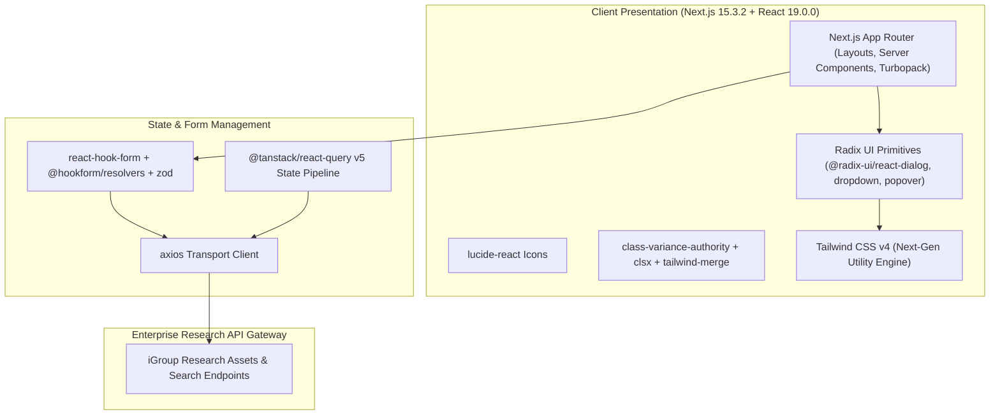

# 🏛️ iGroup Research & Digital Asset Portal (`igroup`) — System Architecture

---

## 📌 Executive Architecture Summary
Dokumen ini memaparkan cetak biru arsitektur teknis (*system design blueprint*), pemisahan tanggung jawab komponen (*separation of concerns*), alur transmisi data (*data lifecycle*), serta manifest dependensi terverifikasi yang diambil langsung dari file manifest proyek (`package.json` & `composer.json`).

* **Pola Arsitektur Utama:** `Modern Next.js 15 App Router & Radix UI Knowledge Portal`
* **Fokus Rekayasa:** Keandalan sistem, latensi rendah, integritas data, dan keamanan transaksi.

---

## 🏛️ System Architecture Diagram

---

## 🔄 Lifecycle & Data Flow
1. **Server-Side Hydration:** Next.js 15 App Router renders server components with zero client-side JavaScript overhead for static sections.
2. **Form Interaction & Validation:** `react-hook-form` paired with `zod` guarantees strict validation on research search filters.
3. **Client Caching:** `@tanstack/react-query` manages cached search queries and asset previews.
4. **Dynamic UI:** Radix primitives and Tailwind v4 provide fully accessible research catalog interfaces.

---

### 📦 Manifest Dependensi Terverifikasi (Direct from Codebase Manifests)
| Manifest Source | Package / Library | Version Constraint | Category & Architectural Role |
| :--- | :--- | :--- | :--- |
| `package.json` (`package.json`) | **`@radix-ui/react-dialog`** | `^1.1.14` | Production Dependency |
| `package.json` (`package.json`) | **`@radix-ui/react-dropdown-menu`** | `^2.1.15` | Production Dependency |
| `package.json` (`package.json`) | **`@radix-ui/react-select`** | `^2.2.5` | Production Dependency |
| `package.json` (`package.json`) | **`@radix-ui/react-slot`** | `^1.2.3` | Production Dependency |
| `package.json` (`package.json`) | **`@radix-ui/react-visually-hidden`** | `^1.2.3` | Production Dependency |
| `package.json` (`package.json`) | **`@tanstack/react-query`** | `^5.76.1` | Production Dependency |
| `package.json` (`package.json`) | **`@trivago/prettier-plugin-sort-imports`** | `^5.2.2` | Production Dependency |
| `package.json` (`package.json`) | **`axios`** | `^1.9.0` | Production Dependency |
| `package.json` (`package.json`) | **`class-variance-authority`** | `^0.7.1` | Production Dependency |
| `package.json` (`package.json`) | **`clsx`** | `^2.1.1` | Production Dependency |
| `package.json` (`package.json`) | **`lucide-react`** | `^0.511.0` | Production Dependency |
| `package.json` (`package.json`) | **`next`** | `15.3.2` | Production Dependency |
| `package.json` (`package.json`) | **`next-themes`** | `^0.4.6` | Production Dependency |
| `package.json` (`package.json`) | **`react`** | `^19.0.0` | Production Dependency |
| `package.json` (`package.json`) | **`react-dom`** | `^19.0.0` | Production Dependency |
| `package.json` (`package.json`) | **`react-icons`** | `^5.5.0` | Production Dependency |
| `package.json` (`package.json`) | **`react-markdown`** | `^10.1.0` | Production Dependency |
| `package.json` (`package.json`) | **`react-use-websocket`** | `^4.13.0` | Production Dependency |
| `package.json` (`package.json`) | **`sonner`** | `^2.0.3` | Production Dependency |
| `package.json` (`package.json`) | **`tailwind-merge`** | `^3.3.0` | Production Dependency |
| `package.json` (`package.json`) | **`uuid`** | `^11.1.0` | Production Dependency |
| `package.json` (`package.json`) | **`@eslint/eslintrc`** | `^3` | Dev Tool / Bundler |
| `package.json` (`package.json`) | **`@tailwindcss/postcss`** | `^4` | Dev Tool / Bundler |
| `package.json` (`package.json`) | **`@types/node`** | `^20` | Dev Tool / Bundler |
| `package.json` (`package.json`) | **`@types/react`** | `^19` | Dev Tool / Bundler |
| `package.json` (`package.json`) | **`@types/react-dom`** | `^19` | Dev Tool / Bundler |
| `package.json` (`package.json`) | **`eslint`** | `^9` | Dev Tool / Bundler |
| `package.json` (`package.json`) | **`eslint-config-next`** | `15.3.2` | Dev Tool / Bundler |
| `package.json` (`package.json`) | **`tailwindcss`** | `^4` | Dev Tool / Bundler |

---

## 🔒 Security & Access Control
- **Zod Schema Parsing:** Strict data contract enforcement on all search and filter payloads.
- **Turbopack Build Verification:** Static analysis prevents build-time security leaks.

---

## ⚡ Performance & Scalability Considerations
- **Next.js 15 Server Components:** Minimizes bundle payload shipped to client browsers.
