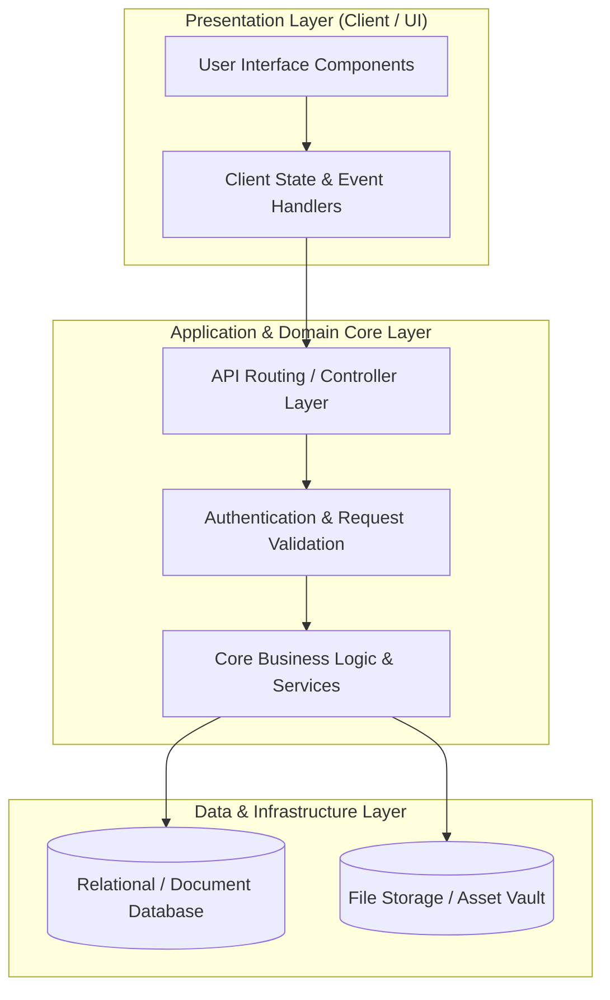

# 🏛️ Kb Builder — System Architecture & Design Blueprint

---

## 📌 Executive Architecture Summary
Dokumen ini menguraikan arsitektur sistem, pemisahan lapisan logika (*Layer Separation*), alur transmisi data (*Data Flow*), integrasi database, dan manifest dependensi terverifikasi untuk subproyek **`kb-builder`**.

---

## 🏛️ System Architecture Diagram

---

## 🔄 Lifecycle & Data Flow
1. **Request Ingestion:** Klien mengirimkan request terotentikasi melalui antarmuka pengguna ke endpoint API.
2. **Validation & Authorization:** Middleware memvalidasi integritas payload, sanitasi input, dan otorisasi hak akses peran pengguna.
3. **Domain Processing:** Service layer mengeksekusi logika bisnis, perhitungan data, dan manajemen status sistem.
4. **Persistence & Response:** Data transaksi disimpan ke database penyimpanan utama, dan status respons dikembalikan ke klien.

---

### 📦 Manifest Dependensi Terverifikasi (Direct from Codebase Manifests)
| Manifest Source | Package / Library | Version Constraint | Category & Architectural Role |
| :--- | :--- | :--- | :--- |
| `package.json` (`package.json`) | **`@auth0/nextjs-auth0`** | `^3.2.0` | Production Dependency |
| `package.json` (`package.json`) | **`@authorizerdev/authorizer-js`** | `^1.2.7` | Production Dependency |
| `package.json` (`package.json`) | **`@authorizerdev/authorizer-react`** | `^1.1.14` | Production Dependency |
| `package.json` (`package.json`) | **`@aws-sdk/client-s3`** | `^3.379.1` | Production Dependency |
| `package.json` (`package.json`) | **`@aws-sdk/credential-providers`** | `^3.405.0` | Production Dependency |
| `package.json` (`package.json`) | **`@aws-sdk/lib-storage`** | `^3.379.1` | Production Dependency |
| `package.json` (`package.json`) | **`@aws-sdk/s3-request-presigner`** | `^3.405.0` | Production Dependency |
| `package.json` (`package.json`) | **`@aws-sdk/signature-v4-crt`** | `^3.378.0` | Production Dependency |
| `package.json` (`package.json`) | **`@emotion/react`** | `^11.11.1` | Production Dependency |
| `package.json` (`package.json`) | **`@emotion/styled`** | `^11.11.0` | Production Dependency |
| `package.json` (`package.json`) | **`@headlessui/react`** | `^1.7.14` | Production Dependency |
| `package.json` (`package.json`) | **`@mui/icons-material`** | `^5.14.0` | Production Dependency |
| `package.json` (`package.json`) | **`@mui/material`** | `^5.14.0` | Production Dependency |
| `package.json` (`package.json`) | **`@tanstack/react-query`** | `^4.32.6` | Production Dependency |
| `package.json` (`package.json`) | **`@tanstack/react-query-devtools`** | `^4.36.1` | Production Dependency |
| `package.json` (`package.json`) | **`@types/node`** | `^20.2.5` | Production Dependency |
| `package.json` (`package.json`) | **`@types/react-dom`** | `^18.2.4` | Production Dependency |
| `package.json` (`package.json`) | **`@uppy/aws-s3`** | `^3.2.1` | Production Dependency |
| `package.json` (`package.json`) | **`@uppy/dashboard`** | `^3.5.0` | Production Dependency |
| `package.json` (`package.json`) | **`@uppy/drag-drop`** | `^3.0.2` | Production Dependency |
| `package.json` (`package.json`) | **`@uppy/file-input`** | `^3.0.2` | Production Dependency |
| `package.json` (`package.json`) | **`@uppy/form`** | `^3.0.2` | Production Dependency |
| `package.json` (`package.json`) | **`@uppy/progress-bar`** | `^3.0.2` | Production Dependency |
| `package.json` (`package.json`) | **`@uppy/react`** | `^3.1.3` | Production Dependency |
| `package.json` (`package.json`) | **`aws-sdk`** | `^2.1424.0` | Production Dependency |
| `package.json` (`package.json`) | **`axios`** | `^1.4.0` | Production Dependency |
| `package.json` (`package.json`) | **`chart.js`** | `^4.3.0` | Production Dependency |
| `package.json` (`package.json`) | **`chartjs-adapter-moment`** | `^1.0.1` | Production Dependency |
| `package.json` (`package.json`) | **`crypto`** | `^1.0.1` | Production Dependency |
| `package.json` (`package.json`) | **`crypto-js`** | `^4.1.1` | Production Dependency |
| `package.json` (`package.json`) | **`ethers`** | `^6.9.1` | Production Dependency |
| `package.json` (`package.json`) | **`flatpickr`** | `^4.6.13` | Production Dependency |
| `package.json` (`package.json`) | **`flatted`** | `^3.3.1` | Production Dependency |
| `package.json` (`package.json`) | **`formidable-serverless`** | `^1.1.1` | Production Dependency |
| `package.json` (`package.json`) | **`html-to-image`** | `^1.11.11` | Production Dependency |

---

## 🔒 Security & Performance Considerations
* **Authentication & Authorization:** Mekanisme otentikasi berbasis token/session dengan kontrol hak akses berbasis peran (RBAC).
* **Data Sanitization:** Sanitasi input dan proteksi terhadap SQL Injection, XSS, dan CSRF.
* **Optimasi Kinerja:** Pemanfaatan caching dan query indexing untuk memastikan responsivitas sistem.
