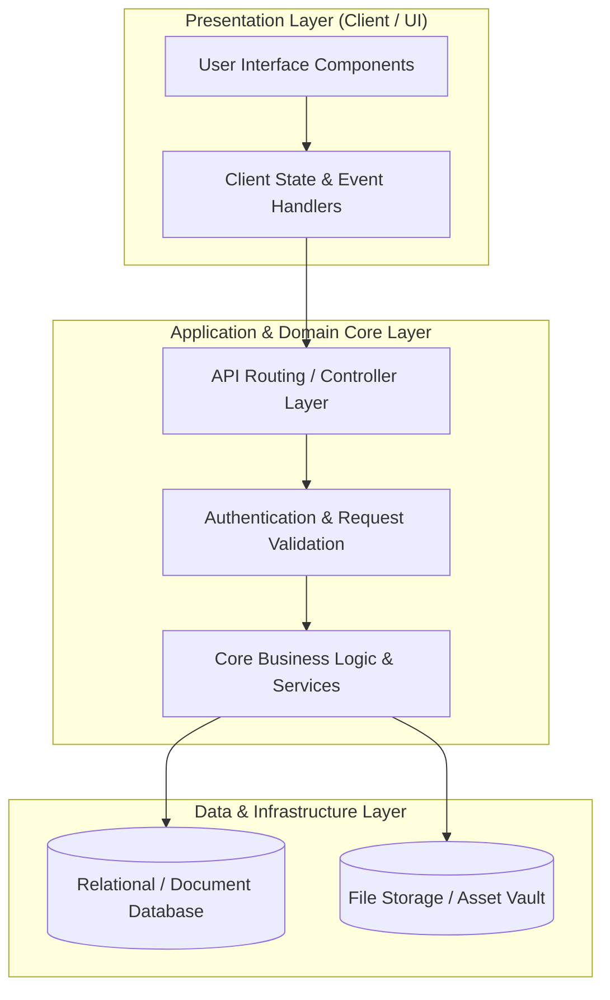

# 🏛️ Kip Ecosystem Website — System Architecture & Design Blueprint

---

## 📌 Executive Architecture Summary
Dokumen ini menguraikan arsitektur sistem, pemisahan lapisan logika (*Layer Separation*), alur transmisi data (*Data Flow*), integrasi database, dan manifest dependensi terverifikasi untuk subproyek **`kip-ecosystem-website`**.

---

## 🏛️ System Architecture Diagram

---

## 🔄 Lifecycle & Data Flow
1. **Request Ingestion:** Klien mengirimkan request terotentikasi melalui antarmuka pengguna ke endpoint API.
2. **Validation & Authorization:** Middleware memvalidasi integritas payload, sanitasi input, dan otorisasi hak akses peran pengguna.
3. **Domain Processing:** Service layer mengeksekusi logika bisnis, perhitungan data, dan manajemen status sistem.
4. **Persistence & Response:** Data transaksi disimpan ke database penyimpanan utama, dan status respons dikembalikan ke klien.

---

### 📦 Manifest Dependensi Terverifikasi (Direct from Codebase Manifests)
| Manifest Source | Package / Library | Version Constraint | Category & Architectural Role |
| :--- | :--- | :--- | :--- |
| `package.json` (`package.json`) | **`@apollo/client`** | `^3.13.4` | Production Dependency |
| `package.json` (`package.json`) | **`@auth0/nextjs-auth0`** | `^3.2.0` | Production Dependency |
| `package.json` (`package.json`) | **`@authorizerdev/authorizer-js`** | `^1.2.7` | Production Dependency |
| `package.json` (`package.json`) | **`@authorizerdev/authorizer-react`** | `^1.1.14` | Production Dependency |
| `package.json` (`package.json`) | **`@aws-sdk/client-s3`** | `^3.379.1` | Production Dependency |
| `package.json` (`package.json`) | **`@aws-sdk/credential-providers`** | `^3.405.0` | Production Dependency |
| `package.json` (`package.json`) | **`@aws-sdk/lib-storage`** | `^3.379.1` | Production Dependency |
| `package.json` (`package.json`) | **`@aws-sdk/s3-request-presigner`** | `^3.405.0` | Production Dependency |
| `package.json` (`package.json`) | **`@aws-sdk/signature-v4-crt`** | `^3.378.0` | Production Dependency |
| `package.json` (`package.json`) | **`@emotion/react`** | `^11.11.1` | Production Dependency |
| `package.json` (`package.json`) | **`@emotion/styled`** | `^11.11.0` | Production Dependency |
| `package.json` (`package.json`) | **`@headlessui/react`** | `^2.1.2` | Production Dependency |
| `package.json` (`package.json`) | **`@heroicons/react`** | `^2.2.0` | Production Dependency |
| `package.json` (`package.json`) | **`@hookform/resolvers`** | `^4.0.0` | Production Dependency |
| `package.json` (`package.json`) | **`@mui/icons-material`** | `^5.14.0` | Production Dependency |
| `package.json` (`package.json`) | **`@mui/material`** | `^5.14.0` | Production Dependency |
| `package.json` (`package.json`) | **`@openzeppelin/merkle-tree`** | `^1.0.8` | Production Dependency |
| `package.json` (`package.json`) | **`@particle-network/aa`** | `^1.5.1` | Production Dependency |
| `package.json` (`package.json`) | **`@particle-network/connect`** | `^1.2.1` | Production Dependency |
| `package.json` (`package.json`) | **`@particle-network/connect-react-ui`** | `^1.2.1` | Production Dependency |
| `package.json` (`package.json`) | **`@radix-ui/react-accordion`** | `^1.2.3` | Production Dependency |
| `package.json` (`package.json`) | **`@radix-ui/react-checkbox`** | `^1.1.4` | Production Dependency |
| `package.json` (`package.json`) | **`@radix-ui/react-dialog`** | `^1.1.6` | Production Dependency |
| `package.json` (`package.json`) | **`@radix-ui/react-dropdown-menu`** | `^2.1.6` | Production Dependency |
| `package.json` (`package.json`) | **`@radix-ui/react-label`** | `^2.1.2` | Production Dependency |
| `package.json` (`package.json`) | **`@radix-ui/react-navigation-menu`** | `^1.2.5` | Production Dependency |
| `package.json` (`package.json`) | **`@radix-ui/react-popover`** | `^1.1.6` | Production Dependency |
| `package.json` (`package.json`) | **`@radix-ui/react-select`** | `^2.1.6` | Production Dependency |
| `package.json` (`package.json`) | **`@radix-ui/react-separator`** | `^1.1.2` | Production Dependency |
| `package.json` (`package.json`) | **`@radix-ui/react-slot`** | `^1.1.1` | Production Dependency |
| `package.json` (`package.json`) | **`@radix-ui/react-switch`** | `^1.1.3` | Production Dependency |
| `package.json` (`package.json`) | **`@radix-ui/react-tabs`** | `^1.1.3` | Production Dependency |
| `package.json` (`package.json`) | **`@radix-ui/react-tooltip`** | `^1.1.8` | Production Dependency |
| `package.json` (`package.json`) | **`@radix-ui/react-visually-hidden`** | `^1.1.2` | Production Dependency |
| `package.json` (`package.json`) | **`@rainbow-me/rainbowkit`** | `^2.2.4` | Production Dependency |

---

## 🔒 Security & Performance Considerations
* **Authentication & Authorization:** Mekanisme otentikasi berbasis token/session dengan kontrol hak akses berbasis peran (RBAC).
* **Data Sanitization:** Sanitasi input dan proteksi terhadap SQL Injection, XSS, dan CSRF.
* **Optimasi Kinerja:** Pemanfaatan caching dan query indexing untuk memastikan responsivitas sistem.
