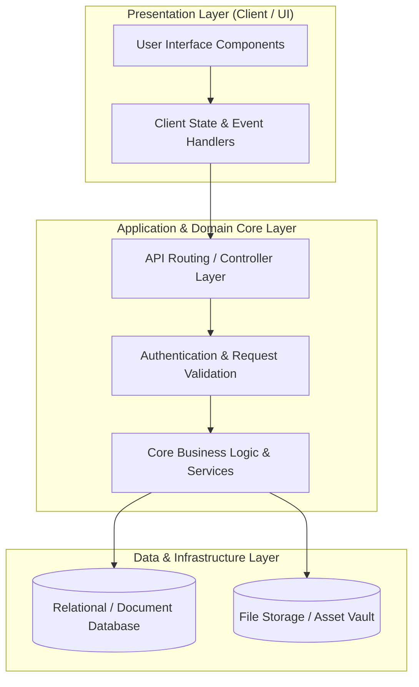

# 🏛️ Knowledge Fi — System Architecture & Design Blueprint

---

## 📌 Executive Architecture Summary
Dokumen ini menguraikan arsitektur sistem, pemisahan lapisan logika (*Layer Separation*), alur transmisi data (*Data Flow*), integrasi database, dan manifest dependensi terverifikasi untuk subproyek **`knowledge-fi`**.

---

## 🏛️ System Architecture Diagram

---

## 🔄 Lifecycle & Data Flow
1. **Request Ingestion:** Klien mengirimkan request terotentikasi melalui antarmuka pengguna ke endpoint API.
2. **Validation & Authorization:** Middleware memvalidasi integritas payload, sanitasi input, dan otorisasi hak akses peran pengguna.
3. **Domain Processing:** Service layer mengeksekusi logika bisnis, perhitungan data, dan manajemen status sistem.
4. **Persistence & Response:** Data transaksi disimpan ke database penyimpanan utama, dan status respons dikembalikan ke klien.

---

### 📦 Manifest Dependensi Terverifikasi (Direct from Codebase Manifests)
| Manifest Source | Package / Library | Version Constraint | Category & Architectural Role |
| :--- | :--- | :--- | :--- |
| `package.json` (`package.json`) | **`@aws-sdk/client-s3`** | `^3.490.0` | Production Dependency |
| `package.json` (`package.json`) | **`@aws-sdk/s3-request-presigner`** | `^3.490.0` | Production Dependency |
| `package.json` (`package.json`) | **`@emotion/react`** | `^11.10.4` | Production Dependency |
| `package.json` (`package.json`) | **`@emotion/styled`** | `^11.10.4` | Production Dependency |
| `package.json` (`package.json`) | **`@gsap/react`** | `^2.1.0` | Production Dependency |
| `package.json` (`package.json`) | **`@headlessui/react`** | `^1.7.14` | Production Dependency |
| `package.json` (`package.json`) | **`@mui/icons-material`** | `^5.10.14` | Production Dependency |
| `package.json` (`package.json`) | **`@mui/material`** | `^5.10.10` | Production Dependency |
| `package.json` (`package.json`) | **`@rainbow-me/rainbowkit`** | `^1.3.2` | Production Dependency |
| `package.json` (`package.json`) | **`@react-three/drei`** | `^9.34.3` | Production Dependency |
| `package.json` (`package.json`) | **`@react-three/fiber`** | `^8.8.9` | Production Dependency |
| `package.json` (`package.json`) | **`@react-three/flex`** | `^1.0.0` | Production Dependency |
| `package.json` (`package.json`) | **`@react-three/postprocessing`** | `^2.7.0` | Production Dependency |
| `package.json` (`package.json`) | **`@szhsin/react-accordion`** | `^1.2.3` | Production Dependency |
| `package.json` (`package.json`) | **`@tanstack/react-query`** | `^5.17.19` | Production Dependency |
| `package.json` (`package.json`) | **`@tanstack/react-query-devtools`** | `^5.17.21` | Production Dependency |
| `package.json` (`package.json`) | **`@types/node`** | `^20.2.5` | Production Dependency |
| `package.json` (`package.json`) | **`@types/react`** | `^18.2.7` | Production Dependency |
| `package.json` (`package.json`) | **`@types/react-dom`** | `^18.2.4` | Production Dependency |
| `package.json` (`package.json`) | **`animate.css`** | `^4.1.1` | Production Dependency |
| `package.json` (`package.json`) | **`axios`** | `^1.6.5` | Production Dependency |
| `package.json` (`package.json`) | **`chart.js`** | `^4.3.0` | Production Dependency |
| `package.json` (`package.json`) | **`chartjs-adapter-moment`** | `^1.0.1` | Production Dependency |
| `package.json` (`package.json`) | **`clsx`** | `^2.1.0` | Production Dependency |
| `package.json` (`package.json`) | **`color`** | `^4.2.3` | Production Dependency |
| `package.json` (`package.json`) | **`crypto-js`** | `^4.2.0` | Production Dependency |
| `package.json` (`package.json`) | **`encoding`** | `^0.1.13` | Production Dependency |
| `package.json` (`package.json`) | **`ethers`** | `^6.9.1` | Production Dependency |
| `package.json` (`package.json`) | **`gsap`** | `^3.11.3` | Production Dependency |
| `package.json` (`package.json`) | **`leva`** | `^0.9.34` | Production Dependency |
| `package.json` (`package.json`) | **`lokijs`** | `^1.5.12` | Production Dependency |
| `package.json` (`package.json`) | **`maath`** | `^0.4.2` | Production Dependency |
| `package.json` (`package.json`) | **`make-plural`** | `^7.3.0` | Production Dependency |
| `package.json` (`package.json`) | **`next`** | `^13.4.4` | Production Dependency |
| `package.json` (`package.json`) | **`next-auth`** | `^4.24.5` | Production Dependency |

---

## 🔒 Security & Performance Considerations
* **Authentication & Authorization:** Mekanisme otentikasi berbasis token/session dengan kontrol hak akses berbasis peran (RBAC).
* **Data Sanitization:** Sanitasi input dan proteksi terhadap SQL Injection, XSS, dan CSRF.
* **Optimasi Kinerja:** Pemanfaatan caching dan query indexing untuk memastikan responsivitas sistem.
