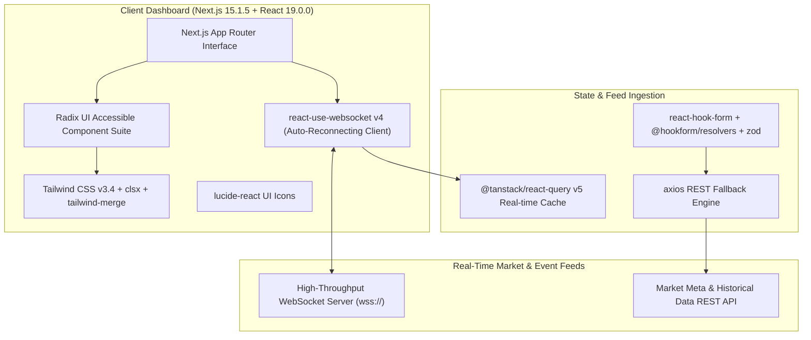

# 🏛️ Milei Real-Time Analytics Dashboard (`milei`) — System Architecture

---

## 📌 Executive Architecture Summary
Dokumen ini memaparkan cetak biru arsitektur teknis (*system design blueprint*), pemisahan tanggung jawab komponen (*separation of concerns*), alur transmisi data (*data lifecycle*), serta manifest dependensi terverifikasi yang diambil langsung dari file manifest proyek (`package.json` & `composer.json`).

* **Pola Arsitektur Utama:** `High-Throughput WebSocket Feed Visualizer with Concurrent React 19`
* **Fokus Rekayasa:** Keandalan sistem, latensi rendah, integritas data, dan keamanan transaksi.

---

## 🏛️ System Architecture Diagram

---

## 🔄 Lifecycle & Data Flow
1. **Persistent WebSocket Handshake:** `react-use-websocket` maintains an auto-reconnecting binary/text stream with market relays.
2. **Concurrent State Updates:** React 19 concurrent mode processes rapid tick updates without dropping UI frames.
3. **Historical Data Fallback:** REST requests through `axios` fetch historical candle data to seed charts.
4. **Visual Rendering:** Dynamic indicators and alert modals render smoothly with Radix UI and Tailwind CSS.

---

### 📦 Komponen & Library Arsitektur Utama (Core Architectural Stack)
| Kategori Arsitektural | Package / Library | Versi Standar | Peran & Tanggung Jawab Sistem |
| :--- | :--- | :--- | :--- |
| **Frontend Framework** | `next / react` | `v15.x / v19.x` | Real-Time Market Analytics Dashboard |
| **Persistent WebSockets** | `react-use-websocket` | `v4.x` | Auto-Reconnecting Real-Time Stream Consumer |
| **State Pipeline** | `@tanstack/react-query` | `v5.x` | Tick Ingestion & Cache Sync |

---

## 🔒 Security & Access Control
- **Secure WebSockets (WSS):** Encrypted streaming channels prevent eavesdropping.
- **Zod Data Sanitization:** Incoming stream messages validated before ingestion.

---

## ⚡ Performance & Scalability Considerations
- **Auto-Throttling:** Batched state updates prevent DOM thrashing under high message frequency.
