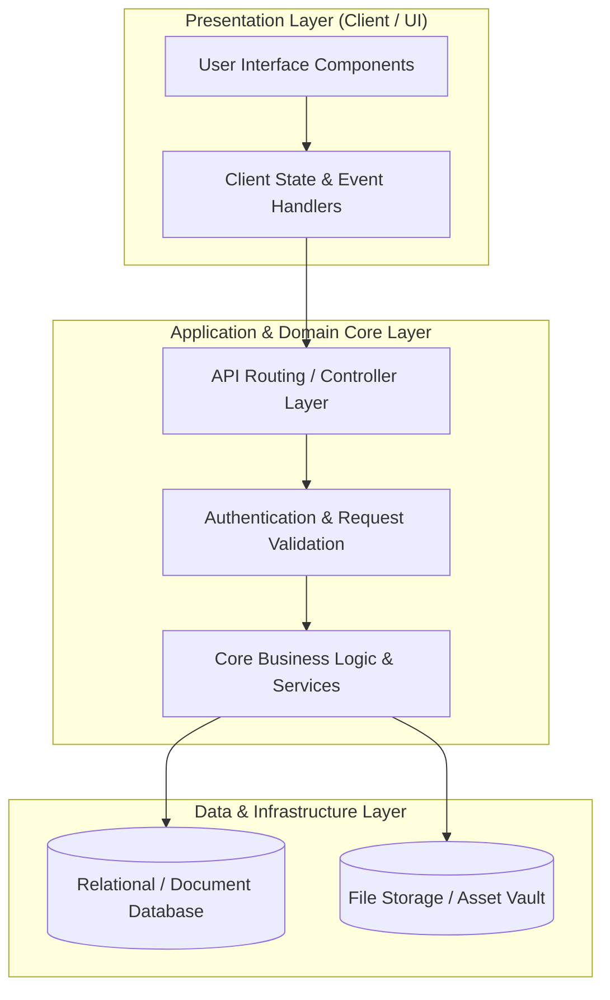

# 🏛️ Opencampus University — System Architecture & Design Blueprint

---

## 📌 Executive Architecture Summary
Dokumen ini menguraikan arsitektur sistem, pemisahan lapisan logika (*Layer Separation*), alur transmisi data (*Data Flow*), integrasi database, dan manifest dependensi terverifikasi untuk subproyek **`opencampus-university`**.

---

## 🏛️ System Architecture Diagram

---

## 🔄 Lifecycle & Data Flow
1. **Request Ingestion:** Klien mengirimkan request terotentikasi melalui antarmuka pengguna ke endpoint API.
2. **Validation & Authorization:** Middleware memvalidasi integritas payload, sanitasi input, dan otorisasi hak akses peran pengguna.
3. **Domain Processing:** Service layer mengeksekusi logika bisnis, perhitungan data, dan manajemen status sistem.
4. **Persistence & Response:** Data transaksi disimpan ke database penyimpanan utama, dan status respons dikembalikan ke klien.

---

### 📦 Manifest Dependensi Terverifikasi (Direct from Codebase Manifests)
| Manifest Source | Package / Library | Version Constraint | Category & Architectural Role |
| :--- | :--- | :--- | :--- |
| `package.json` (`package.json`) | **`@aws-sdk/client-s3`** | `^3.490.0` | Production Dependency |
| `package.json` (`package.json`) | **`@aws-sdk/s3-request-presigner`** | `^3.490.0` | Production Dependency |
| `package.json` (`package.json`) | **`@dnd-kit/core`** | `^6.3.1` | Production Dependency |
| `package.json` (`package.json`) | **`@dnd-kit/sortable`** | `^10.0.0` | Production Dependency |
| `package.json` (`package.json`) | **`@dnd-kit/utilities`** | `^3.2.2` | Production Dependency |
| `package.json` (`package.json`) | **`@emoji-mart/react`** | `^1.1.1` | Production Dependency |
| `package.json` (`package.json`) | **`@headlessui/react`** | `^1.7.14` | Production Dependency |
| `package.json` (`package.json`) | **`@opencampus/ocid-connect-js`** | `^1.2.3` | Production Dependency |
| `package.json` (`package.json`) | **`@rainbow-me/rainbowkit`** | `^1.3.2` | Production Dependency |
| `package.json` (`package.json`) | **`@react-pdf-viewer/core`** | `^3.12.0` | Production Dependency |
| `package.json` (`package.json`) | **`@react-pdf-viewer/default-layout`** | `^3.12.0` | Production Dependency |
| `package.json` (`package.json`) | **`@react-pdf-viewer/full-screen`** | `^3.12.0` | Production Dependency |
| `package.json` (`package.json`) | **`@react-pdf-viewer/toolbar`** | `^3.12.0` | Production Dependency |
| `package.json` (`package.json`) | **`@react-pdf-viewer/zoom`** | `^3.12.0` | Production Dependency |
| `package.json` (`package.json`) | **`@szhsin/react-accordion`** | `^1.2.3` | Production Dependency |
| `package.json` (`package.json`) | **`@tanstack/react-query`** | `^5.17.19` | Production Dependency |
| `package.json` (`package.json`) | **`@tanstack/react-query-devtools`** | `^5.17.21` | Production Dependency |
| `package.json` (`package.json`) | **`@tiptap/extension-heading`** | `^2.10.3` | Production Dependency |
| `package.json` (`package.json`) | **`@tiptap/extension-placeholder`** | `^2.10.3` | Production Dependency |
| `package.json` (`package.json`) | **`@tiptap/pm`** | `^2.9.1` | Production Dependency |
| `package.json` (`package.json`) | **`@tiptap/react`** | `^2.9.1` | Production Dependency |
| `package.json` (`package.json`) | **`@tiptap/starter-kit`** | `^2.9.1` | Production Dependency |
| `package.json` (`package.json`) | **`@tiptap/extension-image`** | `^2.11.5` | Production Dependency |
| `package.json` (`package.json`) | **`@tiptap/extension-link`** | `^2.11.5` | Production Dependency |
| `package.json` (`package.json`) | **`@types/node`** | `^20.2.5` | Production Dependency |
| `package.json` (`package.json`) | **`@types/react`** | `^18.2.7` | Production Dependency |
| `package.json` (`package.json`) | **`@types/react-dom`** | `^18.2.4` | Production Dependency |
| `package.json` (`package.json`) | **`axios`** | `^1.6.5` | Production Dependency |
| `package.json` (`package.json`) | **`chart.js`** | `^4.3.0` | Production Dependency |
| `package.json` (`package.json`) | **`chartjs-adapter-moment`** | `^1.0.1` | Production Dependency |
| `package.json` (`package.json`) | **`clsx`** | `^2.1.0` | Production Dependency |
| `package.json` (`package.json`) | **`crypto-js`** | `^4.2.0` | Production Dependency |
| `package.json` (`package.json`) | **`encoding`** | `^0.1.13` | Production Dependency |
| `package.json` (`package.json`) | **`ethers`** | `^6.9.1` | Production Dependency |
| `package.json` (`package.json`) | **`iconsax-react`** | `^0.0.8` | Production Dependency |

---

## 🔒 Security & Performance Considerations
* **Authentication & Authorization:** Mekanisme otentikasi berbasis token/session dengan kontrol hak akses berbasis peran (RBAC).
* **Data Sanitization:** Sanitasi input dan proteksi terhadap SQL Injection, XSS, dan CSRF.
* **Optimasi Kinerja:** Pemanfaatan caching dan query indexing untuk memastikan responsivitas sistem.
