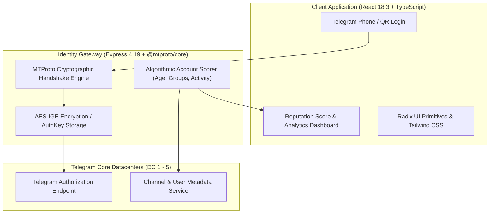

# 🏛️ Rethinkable.xyz — Telegram MTProto Identity Protocol Architecture

---

## 📌 Executive Architecture Summary
Dokumen ini memaparkan cetak biru arsitektur teknis (*system design blueprint*), pemisahan tanggung jawab komponen (*separation of concerns*), alur transmisi data (*data lifecycle*), serta pertimbangan keamanan dan skalabilitas untuk **`rethinkable-xyz`**.

* **Pola Arsitektur Utama:** `Direct MTProto Cryptographic Gateway & Reputation Scoring Pipeline`
* **Fokus Rekayasa:** Keandalan sistem, latensi rendah, integritas data, dan keamanan transaksi.

---

## 🏛️ System Architecture Diagram

---

## 🔄 Lifecycle & Data Flow
1. **MTProto Handshake:** The backend initiates Diffie-Hellman cryptographic exchange with official Telegram Datacenters (DCs).
2. **AuthKey Derivation:** Generates ephemeral session keys for AES-IGE encryption without storing user credentials.
3. **Identity Verification:** Queries Telegram account metadata, group memberships, and account longevity to compute trust reputation scores.
4. **Client Delivery:** Exposes verified identity claims to downstream Web3 dApps.

---

## 🔒 Security & Access Control
- **Zero Credential Retention:** Raw passwords/2FA codes are never stored on disk.
- **End-to-End MTProto Encryption:** Direct cryptographic socket tunnels to Telegram DCs.

---

## ⚡ Performance & Scalability Considerations
- **Connection Pooling:** Shared MTProto session multiplexing across concurrent identity verification requests.
