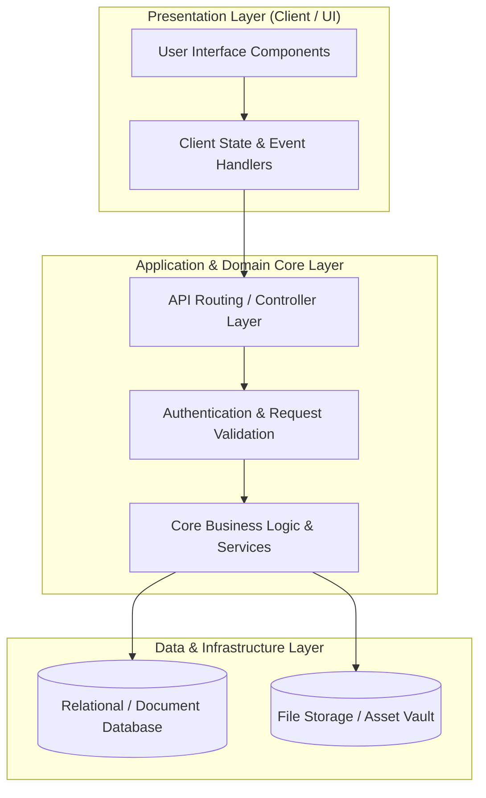

# 🏛️ Rethinkable Xyz — System Architecture & Design Blueprint

---

## 📌 Executive Architecture Summary
Dokumen ini menguraikan arsitektur sistem, pemisahan lapisan logika (*Layer Separation*), alur transmisi data (*Data Flow*), integrasi database, dan manifest dependensi terverifikasi untuk subproyek **`rethinkable-xyz`**.

---

## 🏛️ System Architecture Diagram

---

## 🔄 Lifecycle & Data Flow
1. **Request Ingestion:** Klien mengirimkan request terotentikasi melalui antarmuka pengguna ke endpoint API.
2. **Validation & Authorization:** Middleware memvalidasi integritas payload, sanitasi input, dan otorisasi hak akses peran pengguna.
3. **Domain Processing:** Service layer mengeksekusi logika bisnis, perhitungan data, dan manajemen status sistem.
4. **Persistence & Response:** Data transaksi disimpan ke database penyimpanan utama, dan status respons dikembalikan ke klien.

---

### 📦 Manifest Dependensi Terverifikasi (Direct from Codebase Manifests)
| Manifest Source | Package / Library | Version Constraint | Category & Architectural Role |
| :--- | :--- | :--- | :--- |
| `package.json` (`tg-profile-app\package.json`) | **`@hookform/resolvers`** | `^3.9.0` | Production Dependency |
| `package.json` (`tg-profile-app\package.json`) | **`@radix-ui/react-avatar`** | `^1.1.0` | Production Dependency |
| `package.json` (`tg-profile-app\package.json`) | **`@radix-ui/react-checkbox`** | `^1.1.1` | Production Dependency |
| `package.json` (`tg-profile-app\package.json`) | **`@radix-ui/react-dialog`** | `^1.1.1` | Production Dependency |
| `package.json` (`tg-profile-app\package.json`) | **`@radix-ui/react-label`** | `^2.1.0` | Production Dependency |
| `package.json` (`tg-profile-app\package.json`) | **`@radix-ui/react-popover`** | `^1.1.1` | Production Dependency |
| `package.json` (`tg-profile-app\package.json`) | **`@radix-ui/react-progress`** | `^1.1.0` | Production Dependency |
| `package.json` (`tg-profile-app\package.json`) | **`@radix-ui/react-radio-group`** | `^1.2.1` | Production Dependency |
| `package.json` (`tg-profile-app\package.json`) | **`@radix-ui/react-select`** | `^2.1.2` | Production Dependency |
| `package.json` (`tg-profile-app\package.json`) | **`@radix-ui/react-slot`** | `^1.1.0` | Production Dependency |
| `package.json` (`tg-profile-app\package.json`) | **`@radix-ui/react-tabs`** | `^1.1.0` | Production Dependency |
| `package.json` (`tg-profile-app\package.json`) | **`@radix-ui/react-toast`** | `^1.2.1` | Production Dependency |
| `package.json` (`tg-profile-app\package.json`) | **`@sentry/react`** | `^8.30.0` | Production Dependency |
| `package.json` (`tg-profile-app\package.json`) | **`@sentry/vite-plugin`** | `^2.22.4` | Production Dependency |
| `package.json` (`tg-profile-app\package.json`) | **`@stripe/react-stripe-js`** | `^3.0.0` | Production Dependency |
| `package.json` (`tg-profile-app\package.json`) | **`@stripe/stripe-js`** | `^5.2.0` | Production Dependency |
| `package.json` (`tg-profile-app\package.json`) | **`@telegram-apps/sdk`** | `^1.1.3` | Production Dependency |
| `package.json` (`tg-profile-app\package.json`) | **`@types/telegram-web-app`** | `^7.8.1` | Production Dependency |
| `package.json` (`tg-profile-app\package.json`) | **`axios`** | `^1.7.7` | Production Dependency |
| `package.json` (`tg-profile-app\package.json`) | **`browser-image-compression`** | `^2.0.2` | Production Dependency |
| `package.json` (`tg-profile-app\package.json`) | **`class-variance-authority`** | `^0.7.0` | Production Dependency |
| `package.json` (`tg-profile-app\package.json`) | **`clsx`** | `^2.1.1` | Production Dependency |
| `package.json` (`tg-profile-app\package.json`) | **`date-fns`** | `^3.6.0` | Production Dependency |
| `package.json` (`tg-profile-app\package.json`) | **`eruda`** | `^3.3.0` | Production Dependency |
| `package.json` (`tg-profile-app\package.json`) | **`framer-motion`** | `^11.3.28` | Production Dependency |
| `package.json` (`tg-profile-app\package.json`) | **`html-to-image`** | `^1.11.11` | Production Dependency |
| `package.json` (`tg-profile-app\package.json`) | **`linkify-react`** | `^4.2.0` | Production Dependency |
| `package.json` (`tg-profile-app\package.json`) | **`lodash`** | `^4.17.21` | Production Dependency |
| `package.json` (`tg-profile-app\package.json`) | **`lucide-react`** | `^0.428.0` | Production Dependency |
| `package.json` (`tg-profile-app\package.json`) | **`react`** | `^18.3.1` | Production Dependency |
| `package.json` (`tg-profile-app\package.json`) | **`react-copy-to-clipboard`** | `^5.1.0` | Production Dependency |
| `package.json` (`tg-profile-app\package.json`) | **`react-day-picker`** | `^8.10.1` | Production Dependency |
| `package.json` (`tg-profile-app\package.json`) | **`react-dnd`** | `^16.0.1` | Production Dependency |
| `package.json` (`tg-profile-app\package.json`) | **`react-dnd-html5-backend`** | `^16.0.1` | Production Dependency |
| `package.json` (`tg-profile-app\package.json`) | **`react-dom`** | `^18.3.1` | Production Dependency |

---

## 🔒 Security & Performance Considerations
* **Authentication & Authorization:** Mekanisme otentikasi berbasis token/session dengan kontrol hak akses berbasis peran (RBAC).
* **Data Sanitization:** Sanitasi input dan proteksi terhadap SQL Injection, XSS, dan CSRF.
* **Optimasi Kinerja:** Pemanfaatan caching dan query indexing untuk memastikan responsivitas sistem.
