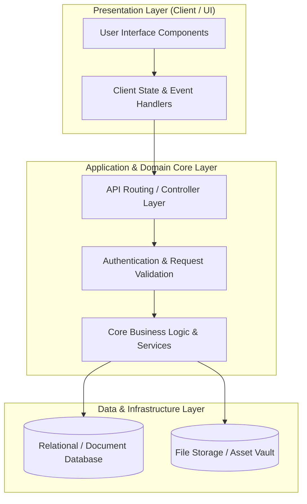

# 🏛️ Superior Agents — System Architecture & Design Blueprint

---

## 📌 Executive Architecture Summary
Dokumen ini menguraikan arsitektur sistem, pemisahan lapisan logika (*Layer Separation*), alur transmisi data (*Data Flow*), integrasi database, dan manifest dependensi terverifikasi untuk subproyek **`superior-agents`**.

---

## 🏛️ System Architecture Diagram

---

## 🔄 Lifecycle & Data Flow
1. **Request Ingestion:** Klien mengirimkan request terotentikasi melalui antarmuka pengguna ke endpoint API.
2. **Validation & Authorization:** Middleware memvalidasi integritas payload, sanitasi input, dan otorisasi hak akses peran pengguna.
3. **Domain Processing:** Service layer mengeksekusi logika bisnis, perhitungan data, dan manajemen status sistem.
4. **Persistence & Response:** Data transaksi disimpan ke database penyimpanan utama, dan status respons dikembalikan ke klien.

---

### 📦 Manifest Dependensi Terverifikasi (Direct from Codebase Manifests)
| Manifest Source | Package / Library | Version Constraint | Category & Architectural Role |
| :--- | :--- | :--- | :--- |
| `package.json` (`package.json`) | **`@release-it/conventional-changelog`** | `^10.0.0` | Production Dependency |
| `package.json` (`package.json`) | **`release-it`** | `^18.1.2` | Dev Tool / Bundler |
| `package.json` (`frontend\package.json`) | **`@auth/core`** | `^0.34.2` | Production Dependency |
| `package.json` (`frontend\package.json`) | **`@aws-sdk/client-s3`** | `^3.758.0` | Production Dependency |
| `package.json` (`frontend\package.json`) | **`@microsoft/fetch-event-source`** | `^2.0.1` | Production Dependency |
| `package.json` (`frontend\package.json`) | **`@rainbow-me/rainbowkit`** | `^2.2.3` | Production Dependency |
| `package.json` (`frontend\package.json`) | **`@stripe/stripe-js`** | `^5.8.0` | Production Dependency |
| `package.json` (`frontend\package.json`) | **`@tanstack/react-query`** | `^5.66.0` | Production Dependency |
| `package.json` (`frontend\package.json`) | **`axios`** | `^1.7.9` | Production Dependency |
| `package.json` (`frontend\package.json`) | **`ethers`** | `^6.13.7` | Production Dependency |
| `package.json` (`frontend\package.json`) | **`moment`** | `^2.30.1` | Production Dependency |
| `package.json` (`frontend\package.json`) | **`next`** | `15.1.6` | Production Dependency |
| `package.json` (`frontend\package.json`) | **`next-auth`** | `^4.24.11` | Production Dependency |
| `package.json` (`frontend\package.json`) | **`openai`** | `^4.93.0` | Production Dependency |
| `package.json` (`frontend\package.json`) | **`react`** | `^19.0.0` | Production Dependency |
| `package.json` (`frontend\package.json`) | **`react-dom`** | `^19.0.0` | Production Dependency |
| `package.json` (`frontend\package.json`) | **`react-select`** | `^5.10.1` | Production Dependency |
| `package.json` (`frontend\package.json`) | **`stripe`** | `^17.7.0` | Production Dependency |
| `package.json` (`frontend\package.json`) | **`uuid`** | `^11.0.5` | Production Dependency |
| `package.json` (`frontend\package.json`) | **`viem`** | `^2.22.21` | Production Dependency |
| `package.json` (`frontend\package.json`) | **`wagmi`** | `^2.14.9` | Production Dependency |
| `package.json` (`frontend\package.json`) | **`@eslint/eslintrc`** | `^3` | Dev Tool / Bundler |
| `package.json` (`frontend\package.json`) | **`@types/node`** | `^20` | Dev Tool / Bundler |
| `package.json` (`frontend\package.json`) | **`@types/react`** | `^19` | Dev Tool / Bundler |
| `package.json` (`frontend\package.json`) | **`@types/react-dom`** | `^19` | Dev Tool / Bundler |
| `package.json` (`frontend\package.json`) | **`eslint`** | `^9` | Dev Tool / Bundler |
| `package.json` (`frontend\package.json`) | **`eslint-config-next`** | `15.1.6` | Dev Tool / Bundler |
| `package.json` (`frontend\package.json`) | **`postcss`** | `^8` | Dev Tool / Bundler |
| `package.json` (`frontend\package.json`) | **`prettier`** | `^3.5.3` | Dev Tool / Bundler |
| `package.json` (`meta-swap-api\package.json`) | **`@finastra/nestjs-proxy`** | `^0.7.2` | Production Dependency |
| `package.json` (`meta-swap-api\package.json`) | **`@inquirer/input`** | `^4.1.8` | Production Dependency |
| `package.json` (`meta-swap-api\package.json`) | **`@inquirer/password`** | `^4.0.11` | Production Dependency |
| `package.json` (`meta-swap-api\package.json`) | **`@inquirer/prompts`** | `^7.4.0` | Production Dependency |
| `package.json` (`meta-swap-api\package.json`) | **`@nestjs/common`** | `^10.4.15` | Production Dependency |
| `package.json` (`meta-swap-api\package.json`) | **`@nestjs/config`** | `^3.3.0` | Production Dependency |

---

## 🔒 Security & Performance Considerations
* **Authentication & Authorization:** Mekanisme otentikasi berbasis token/session dengan kontrol hak akses berbasis peran (RBAC).
* **Data Sanitization:** Sanitasi input dan proteksi terhadap SQL Injection, XSS, dan CSRF.
* **Optimasi Kinerja:** Pemanfaatan caching dan query indexing untuk memastikan responsivitas sistem.
