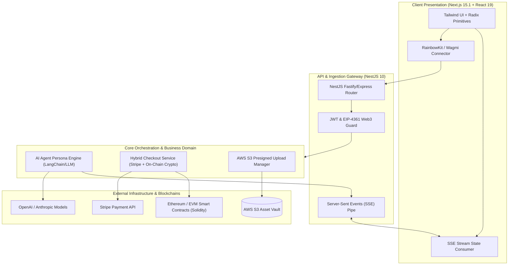

# 🏛️ Superior Agents — System Architecture

---

## 📌 Executive Architecture Summary
Dokumen ini memaparkan cetak biru arsitektur teknis (*system design blueprint*), pemisahan tanggung jawab komponen (*separation of concerns*), alur transmisi data (*data lifecycle*), serta pertimbangan keamanan dan skalabilitas untuk **`superior-agents`**.

* **Pola Arsitektur Utama:** `Decentralized AI Orchestration & Hybrid Checkout Engine`
* **Fokus Rekayasa:** Keandalan sistem, latensi rendah, integritas data, dan keamanan transaksi.

---

## 🏛️ System Architecture Diagram

---

## 🔄 Lifecycle & Data Flow
1. **User Authentication:** User connects non-custodial wallet (MetaMask/WalletConnect) via RainbowKit and signs EIP-4361 payload for stateless JWT issuance.
2. **AI Agent Configuration:** User defines agent system prompts, persona knowledge files (uploaded directly to AWS S3 via presigned URLs), and monetized paywalls.
3. **Conversational Stream:** Chat requests flow through NestJS Gateway to the LLM orchestrator; tokens stream back via Server-Sent Events (SSE) for low-latency interactive responses.
4. **Hybrid Checkout:** Payments for premium agent tiers trigger either Stripe Checkout (fiat) or an on-chain transaction call via Solidity smart contract listeners.

---

## 🔒 Security & Access Control
- **Stateless Web3 Authentication:** EIP-4361 (Sign-In with Ethereum) cryptographic nonce verification.
- **Direct S3 Upload Tokens:** Time-expiring HMAC presigned URLs prevent binary uploads through backend servers.
- **Rate Limiting:** Redis-backed sliding window rate limiter on streaming endpoints.

---

## ⚡ Performance & Scalability Considerations
- **SSE Streaming:** Dramatically reduces memory overhead compared to persistent bidirectional socket allocations for read-heavy chats.
- **Turbopack Build Optimization:** Next.js 15 Turbopack compilation ensures fast edge deploys and serverless scaling.
