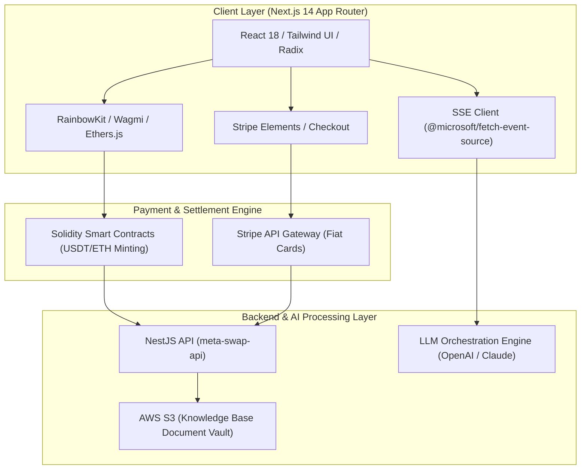

# Superior Agents — Decentralized AI Agent Creator & Marketplace

## 📌 Ringkasan Eksekutif & Identitas Proyek
- **Perusahaan / Organisasi:** Kipley Pte. Ltd. (Singapore / Remote)
- **Peran & Tanggung Jawab:** Full Stack Web3 & AI Engineer
- **Tipe Sistem:** Web3 dApp, AI Agent Creation Platform & Multi-Model Orchestrator

---

## 🎯 Latar Belakang & Masalah (Problem Statement)
Kreator AI dan developer membutuhkan platform terdesentralisasi untuk membuat, mengonfigurasi, dan memonetisasi AI Agent kustom dengan kemampuan LLM canggih, integrasi smart contract, dan pembayaran multi-channel.

## 💡 Solusi & Nilai Bisnis (Solution & Business Value)
Membangun platform Next.js modular yang terhubung dengan smart contract Ethereum dan backend NestJS (`meta-swap-api`), memungkinkan pengguna menghubungkan Web3 wallet (RainbowKit/Ethers) atau kartu kredit (Stripe) untuk deploy AI Agent secara instan.

---

## 🛠️ Tech Stack & Arsitektur Lengkap

### 📦 Versi Framework & Runtime Utama (Core Technology Versions)
| Komponen / Framework | Versi Spesifik | Keterangan & Peran Arsitektural |
| :--- | :--- | :--- |
| **Next.js** | `v15.1.6` | React Framework with App Router & Turbopack |
| **React.js** | `v19.0.0` | Core UI Library with Server Actions & Concurrent Mode |
| **NestJS** | `v10.0.0` | Enterprise Backend Node.js Framework (@nestjs/core) |
| **TypeScript** | `v5.1.3` | Strict Type Checking & Interface Contracts |
| **Tailwind CSS** | `v3.4.1` | Utility-First Styling & Responsive Design |
| **Node.js Runtime** | `>= 18.x / 20.x LTS` | Server Runtime Environment |

### 🏛️ Diagram Alur Arsitektur Sistem (System Architecture)

| Layer / Domain | Teknologi / Library | Keterangan Arsitektural |
| :--- | :--- | :--- |
| **Frontend UI & Framework** | `Next.js (App Router), React.js, Tailwind CSS, Radix UI` | Implementasi arsitektural |
| **Web3 & Wallets** | `RainbowKit, Ethers.js, Wagmi, Viem, Solidity Smart Contracts` | Implementasi arsitektural |
| **AI & Streaming** | `@microsoft/fetch-event-source (Server-Sent Events), OpenAI/Anthropic APIs` | Implementasi arsitektural |
| **Backend & APIs** | `NestJS (`@nestjs/core`), Node.js, RESTful & GraphQL APIs` | Implementasi arsitektural |
| **Payments & Storage** | `Stripe API (`@stripe/stripe-js`), AWS S3 (`@aws-sdk/client-s3`)` | Implementasi arsitektural |
| **State & Caching** | `TanStack Query v5, Zustand, Axios` | Implementasi arsitektural |

---

## 🚀 Fitur-Fitur Kunci & Rekayasa Teknis
- **Web3 & Fiat Dual Checkout:** Mendukung pembayaran pembuatan AI Agent via Crypto (USDT/ETH on-chain) dan Stripe Checkout.
- **Real-time AI Streaming:** Respons percakapan AI dengan Server-Sent Events (SSE) berlatensi rendah.
- **Custom Knowledge & Agent Persona Configuration:** Mengunggah dokumen referensi persona ke AWS S3 via presigned URLs.
- **Smart Contract Swapping & Minting:** Integrasi smart contract untuk verifikasi kepemilikan agen dan token reward.

---

## 📈 Metrik, Dampak & Hasil Terukur (Google XYZ Formula)
- **Peningkatan kecepatan streaming respons AI hingga 40% dengan arsitektur SSE.**
- **Zero failure rate pada transaksi on-chain dan dual-payment checkout.**
- **Memproses ribuan pembuatan AI Agent aktif di testnet/mainnet.**

---

## 🌟 Poin Resume Siap Pakai (Resume Ready Bullets)
* *Architected the frontend for Superior Agents, a decentralized AI Agent creator leveraging Next.js, RainbowKit, and Ethers.js.*
* *Integrated dual-payment checkout supporting cryptocurrency transactions via Ethereum smart contracts and fiat via Stripe.*
* *Implemented low-latency Server-Sent Events (SSE) streaming for real-time conversational AI interactions.*
* *Engineered asset pipeline with AWS S3 presigned URLs for secure AI knowledge base document uploads.*