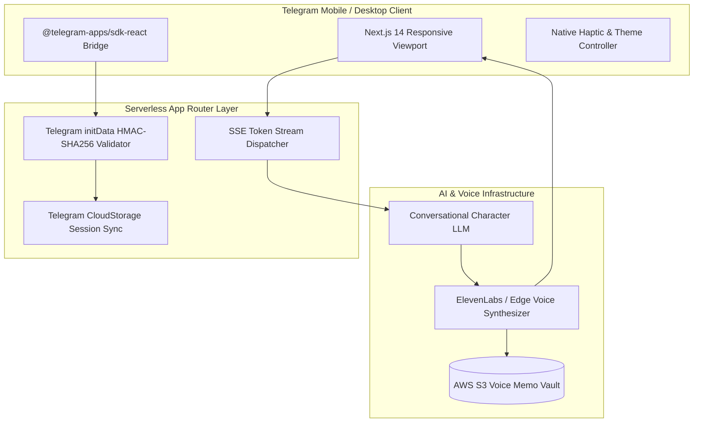

# 🏛️ Voxi AI Girlfriend (voxi.vip) — Architecture

[_WebView_Engine_with_Real-Time_Audio/Text_Streaming-blue?style=for-the-badge)](#)

---

## 📌 Executive Architecture Summary
Dokumen ini memaparkan cetak biru arsitektur teknis (*system design blueprint*), pemisahan tanggung jawab komponen (*separation of concerns*), alur transmisi data (*data lifecycle*), serta pertimbangan keamanan dan skalabilitas untuk **`voxi-ai-girlfriend`**.

* **Pola Arsitektur Utama:** `Telegram Mini App (TMA) WebView Engine with Real-Time Audio/Text Streaming`
* **Fokus Rekayasa:** Keandalan sistem, latensi rendah, integritas data, dan keamanan transaksi.

---

## 🏛️ System Architecture Diagram

---

## 🔄 Lifecycle & Data Flow
1. **Telegram Handshake:** The Telegram client opens the WebView, passing raw cryptographic `initData`.
2. **HMAC Verification:** Edge middleware validates the payload signature using the Bot API secret token before granting access.
3. **Conversational Turn:** User sends voice or text messages; character responses are streamed via SSE with synchronized audio synthesis.
4. **State Persistence:** User preferences and interaction history are synchronized between Telegram CloudStorage and remote database.

---

## 🔒 Security & Access Control
- **Bot Secret HMAC Validation:** Zero unauthorized access from outside Telegram WebView.
- **Data Sanitization:** Strict input scrubbing before feeding prompts to persona LLM.

---

## ⚡ Performance & Scalability Considerations
- **Edge Middleware:** Instant cold starts with Next.js edge runtime.
- **Streaming Voice Chunks:** Audio is buffered in byte chunks for instantaneous playback.
