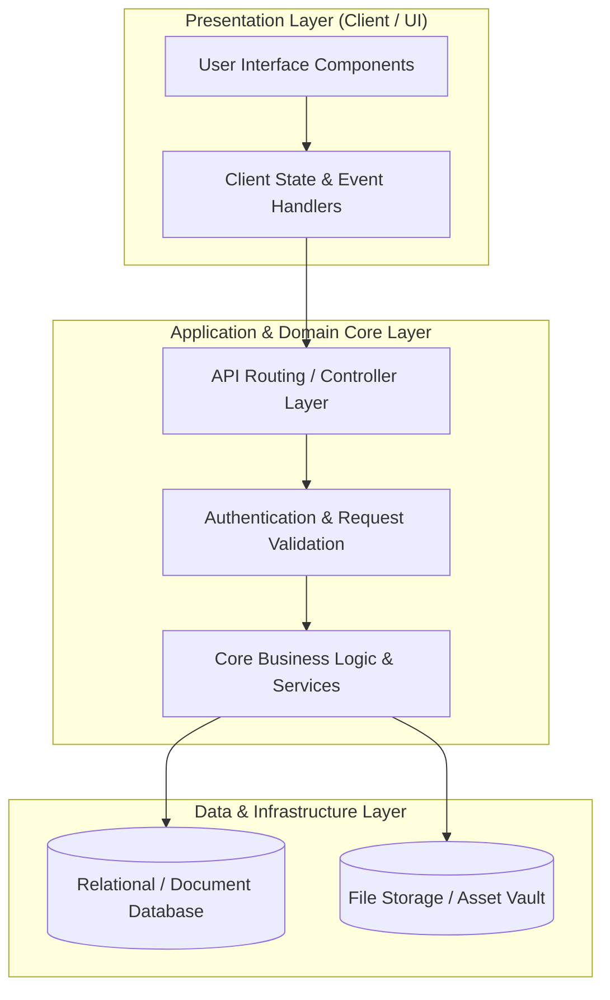

# 🏛️ Voxi Ai Girlfriend — System Architecture & Design Blueprint

---

## 📌 Executive Architecture Summary
Dokumen ini menguraikan arsitektur sistem, pemisahan lapisan logika (*Layer Separation*), alur transmisi data (*Data Flow*), integrasi database, dan manifest dependensi terverifikasi untuk subproyek **`voxi-ai-girlfriend`**.

---

## 🏛️ System Architecture Diagram

---

## 🔄 Lifecycle & Data Flow
1. **Request Ingestion:** Klien mengirimkan request terotentikasi melalui antarmuka pengguna ke endpoint API.
2. **Validation & Authorization:** Middleware memvalidasi integritas payload, sanitasi input, dan otorisasi hak akses peran pengguna.
3. **Domain Processing:** Service layer mengeksekusi logika bisnis, perhitungan data, dan manajemen status sistem.
4. **Persistence & Response:** Data transaksi disimpan ke database penyimpanan utama, dan status respons dikembalikan ke klien.

---

### 📦 Manifest Dependensi Terverifikasi (Direct from Codebase Manifests)
| Manifest Source | Package / Library | Version Constraint | Category & Architectural Role |
| :--- | :--- | :--- | :--- |
| `package.json` (`package.json`) | **`@chakra-ui/react`** | `^2.10.4` | Production Dependency |
| `package.json` (`package.json`) | **`@emotion/react`** | `^11.14.0` | Production Dependency |
| `package.json` (`package.json`) | **`@emotion/styled`** | `^11.14.0` | Production Dependency |
| `package.json` (`package.json`) | **`@glidejs/glide`** | `^3.7.1` | Production Dependency |
| `package.json` (`package.json`) | **`@microsoft/fetch-event-source`** | `^2.0.1` | Production Dependency |
| `package.json` (`package.json`) | **`@next/third-parties`** | `^15.3.1` | Production Dependency |
| `package.json` (`package.json`) | **`@tanstack/react-query`** | `^5.62.16` | Production Dependency |
| `package.json` (`package.json`) | **`@telegram-apps/sdk-react`** | `^2.0.5` | Production Dependency |
| `package.json` (`package.json`) | **`@telegram-apps/telegram-ui`** | `^2.1.5` | Production Dependency |
| `package.json` (`package.json`) | **`@ton/core`** | `^0.60.1` | Production Dependency |
| `package.json` (`package.json`) | **`@ton/ton`** | `^15.2.1` | Production Dependency |
| `package.json` (`package.json`) | **`@tonconnect/ui-react`** | `^2.0.5` | Production Dependency |
| `package.json` (`package.json`) | **`@twa-dev/sdk`** | `^8.0.2` | Production Dependency |
| `package.json` (`package.json`) | **`@types/glidejs__glide`** | `^3.6.6` | Production Dependency |
| `package.json` (`package.json`) | **`@vercel/speed-insights`** | `^1.2.0` | Production Dependency |
| `package.json` (`package.json`) | **`axios`** | `^1.7.9` | Production Dependency |
| `package.json` (`package.json`) | **`dayjs`** | `^1.11.13` | Production Dependency |
| `package.json` (`package.json`) | **`downshift`** | `^9.0.9` | Production Dependency |
| `package.json` (`package.json`) | **`embla-carousel`** | `^8.6.0` | Production Dependency |
| `package.json` (`package.json`) | **`embla-carousel-autoplay`** | `^8.6.0` | Production Dependency |
| `package.json` (`package.json`) | **`embla-carousel-react`** | `^8.6.0` | Production Dependency |
| `package.json` (`package.json`) | **`eruda`** | `^3.0.1` | Production Dependency |
| `package.json` (`package.json`) | **`framer-motion`** | `^11.15.0` | Production Dependency |
| `package.json` (`package.json`) | **`next`** | `14.2.4` | Production Dependency |
| `package.json` (`package.json`) | **`next-intl`** | `^3.17.6` | Production Dependency |
| `package.json` (`package.json`) | **`normalize.css`** | `^8.0.1` | Production Dependency |
| `package.json` (`package.json`) | **`react`** | `^18` | Production Dependency |
| `package.json` (`package.json`) | **`react-dom`** | `^18` | Production Dependency |
| `package.json` (`package.json`) | **`react-dropzone`** | `^14.3.5` | Production Dependency |
| `package.json` (`package.json`) | **`react-icons`** | `^5.4.0` | Production Dependency |
| `package.json` (`package.json`) | **`react-joyride`** | `^2.9.3` | Production Dependency |
| `package.json` (`package.json`) | **`react-swipeable`** | `^7.0.2` | Production Dependency |
| `package.json` (`package.json`) | **`react-use-websocket`** | `^4.13.0` | Production Dependency |
| `package.json` (`package.json`) | **`uuid`** | `^11.1.0` | Production Dependency |
| `package.json` (`package.json`) | **`@types/node`** | `^20` | Dev Tool / Bundler |

---

## 🔒 Security & Performance Considerations
* **Authentication & Authorization:** Mekanisme otentikasi berbasis token/session dengan kontrol hak akses berbasis peran (RBAC).
* **Data Sanitization:** Sanitasi input dan proteksi terhadap SQL Injection, XSS, dan CSRF.
* **Optimasi Kinerja:** Pemanfaatan caching dan query indexing untuk memastikan responsivitas sistem.
