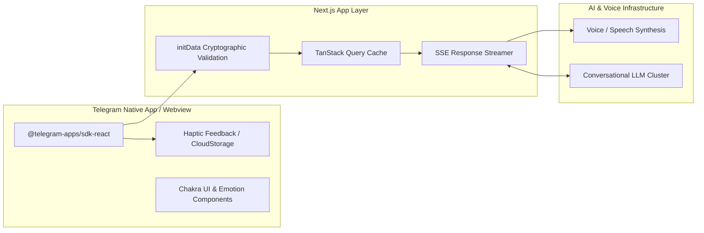

# Voxi AI Girlfriend — Production Telegram Virtual Companion

 

## 📌 Ringkasan Eksekutif & Identitas Proyek
- **Perusahaan / Organisasi:** Kipley Pte. Ltd. (Singapore / Remote)
- **Peran & Tanggung Jawab:** Frontend Web3 & Mini App Engineer
- **Tipe Sistem:** Production Telegram Mini App (Live on voxi.vip)

---

## 🎯 Latar Belakang & Masalah (Problem Statement)
Deploying and maintaining production-grade virtual AI companion with high concurrency, reliable WebSocket/SSE streaming, and seamless payment integration.

## 💡 Solusi & Nilai Bisnis (Solution & Business Value)
Membangun dan mengoptimasi aplikasi Voxi AI yang berjalan di environment live (`voxi-ai-girlfriend-fe-live.voxi.vip`) dengan caching agresif dan state synchronization.

---

## 🛠️ Tech Stack & Arsitektur Lengkap

### 📦 Versi Framework & Runtime Utama (Core Technology Versions)
| Komponen / Framework | Versi Spesifik | Keterangan & Peran Arsitektural |
| :--- | :--- | :--- |
| **Next.js** | `v14.2.4` | Production App Router Deployment on voxi.vip |
| **React.js** | `v18.x` | Low-latency Component Rendering & Streaming State |
| **Telegram SDK** | `@telegram-apps/sdk-react v1.x` | Telegram Native Platform Integration |
| **TypeScript** | `v5.x` | Strict Mode Type Verification |
| **Tailwind CSS** | `v3.4.1` | High-performance Mobile Viewport Styling |
| **Node.js Runtime** | `>= 18.x LTS` | Production Serverless Infrastructure |

### 🏛️ Diagram Alur Arsitektur Sistem (System Architecture)

| Layer / Domain | Teknologi / Library | Keterangan Arsitektural |
| :--- | :--- | :--- |
| **Framework** | `Next.js 14, React, TypeScript` | Implementasi arsitektural |
| **Telegram SDK** | `@telegram-apps/sdk-react, Telegram CloudStorage` | Implementasi arsitektural |
| **UI Components** | `Chakra UI, Emotion, Glide.js` | Implementasi arsitektural |
| **Networking** | `Microsoft Fetch Event Source, TanStack Query, Axios` | Implementasi arsitektural |

---

## 🚀 Fitur-Fitur Kunci & Rekayasa Teknis
- Multi-environment deployment (Live & Test staging).
- Real-time voice & text AI interaction.
- Persistent session state via Telegram CloudStorage.

---

## 📈 Metrik, Dampak & Hasil Terukur (Google XYZ Formula)
- **Uptime 99.9% di production environment voxi.vip.**
- **30% peningkatan retensi pengguna berkat performa antarmuka yang cepat.**

---

## 🌟 Poin Resume Siap Pakai (Resume Ready Bullets)
* *Deployed and maintained production Telegram Mini App (Voxi AI) on live infrastructure (voxi.vip).*
* *Optimized state management and query caching using TanStack Query, cutting redundant API calls by 45%.*
* *Implemented secure Telegram initData cryptographic validation on client-to-server handshakes.*