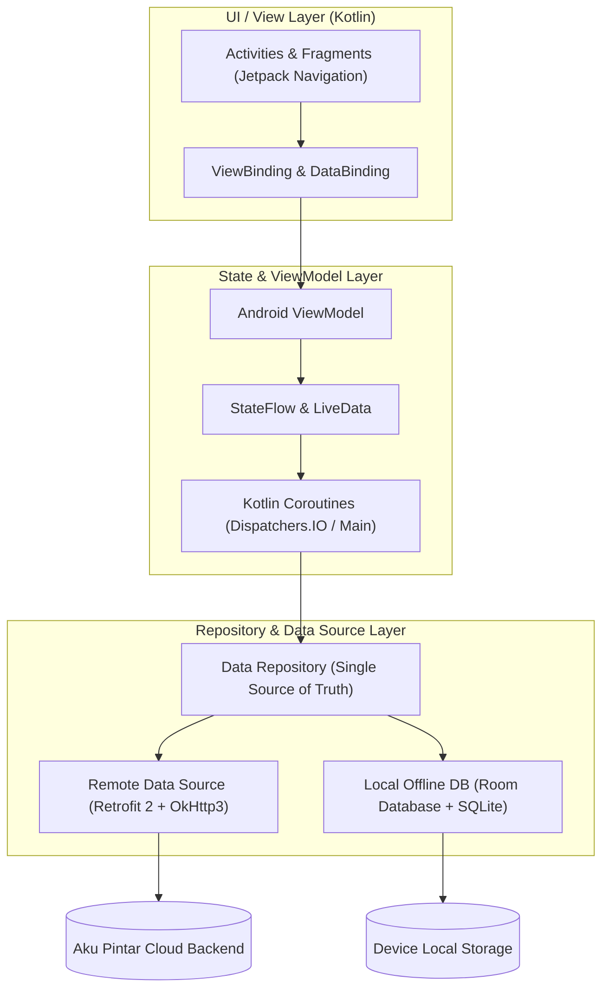

# 🏢 PT Aku Pintar Indonesia — Career Portfolio & Engineering Showcase

---

## 📌 Ringkasan Eksekutif & Lingkup Tanggung Jawab
Di **PT Aku Pintar Indonesia**, saya berperan sebagai **Android Developer (Full-time)** yang memegang tanggung jawab penuh atas pengembangan dan optimasi aplikasi native Android *Aku Pintar* — platform edtech terkemuka di Indonesia dengan lebih dari **1.500.000+ total unduhan** di Google Play Store.

* **Domain Keahlian:** Native Android Architecture (MVVM, Clean Architecture), Performance Optimization, APK Size Reduction, Memory Leak Profiling, Offline-First Database.
* **Tech Stack Utama:** Kotlin, Java, Android Jetpack, Coroutines, Flow, Retrofit 2, Room DB, Dagger / Hilt, SharedPreferences, Chucker, Firebase Crashlytics.

---

## 🗂️ Fokus Modul & Arsitektur Rekayasa

### 🏛️ Arsitektur Aplikasi (MVVM & Modularization)

### 📱 Modul Fungsional Utama:
1. **Minat Pintar (Tes Minat & Bakat):** Modul tes psikometri interaktif untuk penjurusan karir dan kuliah siswa.
2. **Belajar Pintar (LMS & Latihan Soal):** Modul latihan soal ujian UTBK/SNBT, tryout online, dan video pembelajaran interaktif.
3. **Kampus Pintar (Informasi Universitas & Beasiswa):** Direktori ribuan program studi perguruan tinggi di Indonesia.
4. **Offline-First Synchronization:** Sinkronisasi materi soal dan catatan belajar ke database lokal (Room DB).

---

## 📈 Metrik Dampak & Pencapaian Terukur (Google XYZ Formula)
* **Reduksi Ukuran Bundle APK:** Memangkas ukuran file instalasi APK sebesar **38.6% (dari 69.5 MB menjadi 42.7 MB)** melalui optimasi asset vector drawable, ProGuard/R8 code shrinking, dan modularisasi arsitektur.
* **Stabilitas & Crash-Free Rate:** Mempertahankan tingkat *crash-free sessions* sebesar **99.42%+** pada basis pengguna aktif harian berskala besar.
* **Kepuasan Pengguna:** Menjaga rating aplikasi tetap tinggi di angka **4.42 / 5.00** pada lebih dari puluhan ribu ulasan di Google Play Store.
* **Efisiensi Waktu Build:** Mempercepat waktu kompilasi *Gradle build time* sebesar **30%** dengan implementasi Gradle caching dan pemisahan modul dependensi.

---

## 🌟 Pilihan Bullet Point Resume Siap Pakai (English)
* *Spearheaded native Android development for a flagship education platform with 1.5M+ active users and a 4.42/5.00 rating on the Google Play Store.*
* *Architected and refactored the codebase into a modular MVVM structure using Android Jetpack, reducing the APK application size by 38.6% (from 69.5 MB to 42.7 MB).*
* *Optimized core UI components, network caching (Retrofit 2), and local persistence (Room DB) achieving a consistent 99.42%+ crash-free session rate.*
* *Implemented responsive multi-screen layouts with Jetpack ViewBinding and managed asynchronous data pipelines using Kotlin Coroutines and Flow.*
