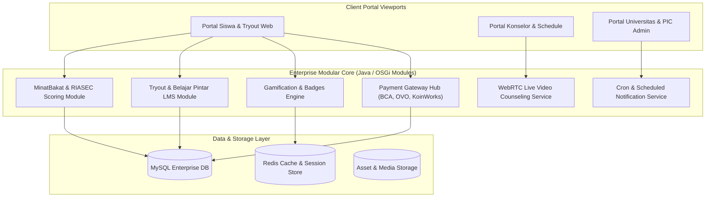

# 🏛️ Aku Pintar MVP Web Platform — System Architecture

---

## 📌 Executive Architecture Summary
Dokumen ini menguraikan arsitektur portal modular (*OSGi Multi-Module Architecture*) yang mengorkestrasi lebih dari 100 micro-module mandiri untuk ekosistem platform edukasi Aku Pintar.

---

## 🏛️ System Architecture Diagram

---

## 🔄 Lifecycle & Data Flow
1. **Module Resolution:** Container OSGi memuat lifecycle bundle secara dinamis tanpa memerlukan restart server menyeluruh.
2. **Psychometrics Processing:** Jawaban tes minat bakat dikomputasi menggunakan matriks RIASEC untuk menghasilkan profil kepribadian dan rekomendasi jurusan seketika.
3. **Live WebRTC Session:** Konseling online menginisiasi WebRTC peer handshake antara siswa dan psikolog bersertifikasi.
4. **Transaction Settlement:** Modul pembayaran memverifikasi callback OVO / Virtual Account BCA sebelum mengkreditkan koin pintar ke akun pengguna.

---

### 📦 Komponen & Library Arsitektur Utama (Core Architectural Stack)
| Kategori Arsitektural | Package / Component | Versi Standar | Peran & Tanggung Jawab Sistem |
| :--- | :--- | :--- | :--- |
| **Enterprise Portal Core** | `Java / OSGi Platform` | `Enterprise` | Modular Component Architecture & Service Builder |
| **Build Automation** | `Gradle Multi-Module` | `v6.x+` | Dependency Management across 100+ Modules |
| **Live Tele-Counseling** | `WebRTC Stream API` | `Standard` | Peer-to-Peer Low Latency Video Stream |
| **Psychometrics Engine** | `RIASEC Matrix Algorithm` | `Proprietary` | Trait Analysis & University Major Matching |
| **Payment Gateway** | `BCA VA & OVO Integration` | `API v2` | Digital Top-up & Coin Purchase Settlement |
| **P2P Student Loan** | `KoinWorks Lending API` | `API v1` | Education Financing Calculator & Proposals |

---

## 🔒 Security & Access Control
* **Modular RBAC:** Hak akses terisolasi ketat antara peran Siswa, Konselor, dan Administrator Universitas.
* **Encrypted Payment Tokens:** Signature HMAC pada webhook pembayaran mencegah injeksi saldo palsu.

---

## ⚡ Performance & Scalability Considerations
* **OSGi Hot-Swapping:** Update pada satu modul tidak mengganggu ketersediaan modul lainnya (*High Availability*).
