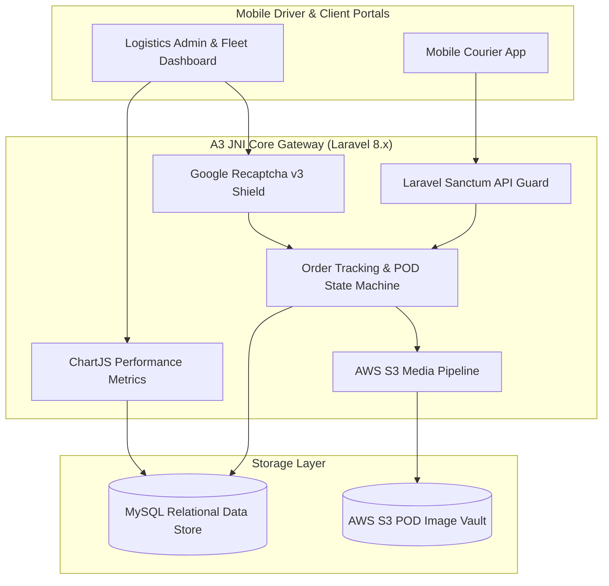

# 🏛️ A3 JNI Logistics Backend — System Architecture

---

## 📌 Executive Architecture Summary
Dokumen ini menguraikan cetak biru arsitektur RESTful API gateway untuk armada pengiriman logistik A3 JNI.

---

## 🏛️ System Architecture Diagram

---

### 📦 Komponen & Library Arsitektur Utama (Core Architectural Stack)
| Kategori Arsitektural | Package / Library | Versi Standar | Peran & Tanggung Jawab Sistem |
| :--- | :--- | :--- | :--- |
| **Backend Framework** | `laravel/framework` | `v8.x` | Logistics REST API & State Machine |
| **Bot Protection** | `josiasmontag/laravel-recaptchav3` | `v1.x` | Invisible Anti-Scraping Protection |
| **Cloud Storage** | `league/flysystem-aws-s3-v3` | `v1.x` | High-Resolution POD Image Archival |
| **API Authentication** | `laravel/sanctum` | `v2.x` | Device-tied Courier Token Auth |
| **Performance Charts** | `fx3costa/laravelchartjs` | `v3.x` | Fleet On-Time Delivery Analytics |
