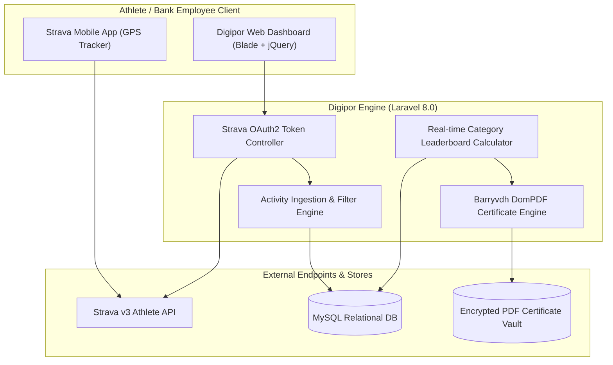

# 🏛️ Digipor Bank BMPD Jatim — Architecture

---

## 📌 Executive Architecture Summary
Dokumen ini memaparkan cetak biru arsitektur teknis (*system design blueprint*), pemisahan tanggung jawab komponen (*separation of concerns*), alur transmisi data (*data lifecycle*), serta pertimbangan keamanan dan skalabilitas untuk **`digipor-bank-bmpdjatim`**.

* **Pola Arsitektur Utama:** `OAuth2 Health Sync & Automated Document Generation Architecture`
* **Fokus Rekayasa:** Keandalan sistem, latensi rendah, integritas data, dan keamanan transaksi.

---

## 🏛️ System Architecture Diagram

---

## 🔄 Lifecycle & Data Flow
1. **Athlete Authorization:** Users link their personal Strava accounts via Strava OAuth2 exchange.
2. **Activity Synchronization:** Ingests distance, elevation, and duration metrics for running and cycling activities.
3. **Fair-Play Verification:** Automated validation filters out invalid speeds and non-qualifying workouts.
4. **Instant E-Certificate:** DomPDF dynamically renders verified completion certificates with unique verification hashes.

---

## 🔒 Security & Access Control
- **Encrypted Strava Tokens:** Access and refresh tokens stored with AES-256 encryption in MySQL.
- **Anti-Cheat Validation:** Algorithmic speed ceilings filter motorized activities.

---

## ⚡ Performance & Scalability Considerations
- **Batched Sync Jobs:** Chunked queue workers prevent hitting Strava API 15-minute rate limits.
