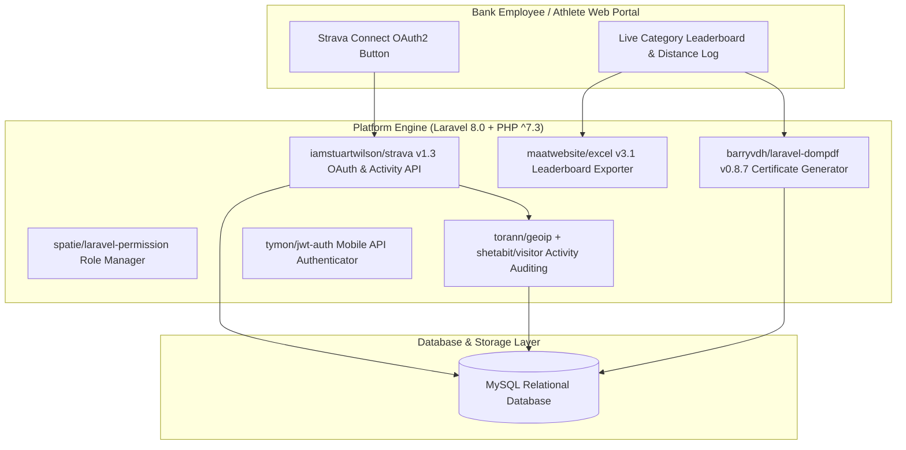

# 🏛️ Digipor Bank BMPD Jatim (`digipor-bank-bmpdjatim`) — System Architecture

---

## 📌 Executive Architecture Summary
Dokumen ini memaparkan cetak biru arsitektur teknis (*system design blueprint*), pemisahan tanggung jawab komponen (*separation of concerns*), alur transmisi data (*data lifecycle*), serta manifest dependensi terverifikasi yang diambil langsung dari file manifest proyek (`package.json` & `composer.json`).

* **Pola Arsitektur Utama:** `Sports Competition Platform with Strava OAuth2 & Automated PDF Certificates`
* **Fokus Rekayasa:** Keandalan sistem, latensi rendah, integritas data, dan keamanan transaksi.

---

## 🏛️ System Architecture Diagram

---

## 🔄 Lifecycle & Data Flow
1. **OAuth2 Handshake:** Athlete authenticates via `iamstuartwilson/strava` SDK, exchanging authorization codes for refreshable athlete tokens.
2. **Activity Pull & Verification:** Ingests distance, speed, and elapsed time; validates against anti-cheat rules.
3. **Leaderboard Compilation:** Aggregates ranking scores per banking institution across East Java.
4. **Certificate Generation:** `barryvdh/laravel-dompdf` dynamically renders high-resolution verified PDF completion certificates.

---

### 📦 Manifest Dependensi Terverifikasi (Direct from Codebase Manifests)
| Manifest Source | Package / Library | Version Constraint | Category & Architectural Role |
| :--- | :--- | :--- | :--- |
| `package.json` (`package.json`) | **`axios`** | `^0.19` | Dev Tool / Bundler |
| `package.json` (`package.json`) | **`cross-env`** | `^7.0` | Dev Tool / Bundler |
| `package.json` (`package.json`) | **`laravel-mix`** | `^5.0.1` | Dev Tool / Bundler |
| `package.json` (`package.json`) | **`lodash`** | `^4.17.19` | Dev Tool / Bundler |
| `package.json` (`package.json`) | **`resolve-url-loader`** | `^3.1.0` | Dev Tool / Bundler |
| `package.json` (`public\assets\backend\plugin\dropify\package.json`) | **`jquery`** | `*` | Production Dependency |
| `package.json` (`public\assets\backend\plugin\dropify\package.json`) | **`gulp`** | `^3.9.0` | Dev Tool / Bundler |
| `package.json` (`public\assets\backend\plugin\dropify\package.json`) | **`gulp-autoprefixer`** | `^3.1.0` | Dev Tool / Bundler |
| `package.json` (`public\assets\backend\plugin\dropify\package.json`) | **`gulp-header`** | `^1.7.1` | Dev Tool / Bundler |
| `package.json` (`public\assets\backend\plugin\dropify\package.json`) | **`gulp-load-plugins`** | `^1.2.0` | Dev Tool / Bundler |
| `package.json` (`public\assets\backend\plugin\dropify\package.json`) | **`gulp-minify-css`** | `1.2.4` | Dev Tool / Bundler |
| `package.json` (`public\assets\backend\plugin\dropify\package.json`) | **`gulp-plumber`** | `^1.0.1` | Dev Tool / Bundler |
| `package.json` (`public\assets\backend\plugin\dropify\package.json`) | **`gulp-sass`** | `^3.1.0` | Dev Tool / Bundler |
| `package.json` (`public\assets\backend\plugin\dropify\package.json`) | **`gulp-uglify`** | `^2.1.0` | Dev Tool / Bundler |
| `composer.json` (`composer.json`) | **`php`** | `^7.3` | Backend Framework Component |
| `composer.json` (`composer.json`) | **`anhskohbo/no-captcha`** | `^3.3` | Backend Framework Component |
| `composer.json` (`composer.json`) | **`doctrine/dbal`** | `^2.12` | Backend Framework Component |
| `composer.json` (`composer.json`) | **`fideloper/proxy`** | `^4.2` | Backend Framework Component |
| `composer.json` (`composer.json`) | **`fruitcake/laravel-cors`** | `^2.0` | Backend Framework Component |
| `composer.json` (`composer.json`) | **`fx3costa/laravelchartjs`** | `^2.8` | Backend Framework Component |
| `composer.json` (`composer.json`) | **`guzzlehttp/guzzle`** | `^7.0.1` | Backend Framework Component |
| `composer.json` (`composer.json`) | **`iamstuartwilson/strava`** | `^1.4` | Backend Framework Component |
| `composer.json` (`composer.json`) | **`intervention/image`** | `^2.5` | Backend Framework Component |
| `composer.json` (`composer.json`) | **`laravel/framework`** | `^8.0` | Backend Framework Component |
| `composer.json` (`composer.json`) | **`laravel/legacy-factories`** | `^1.0` | Backend Framework Component |
| `composer.json` (`composer.json`) | **`laravel/tinker`** | `^2.0` | Backend Framework Component |
| `composer.json` (`composer.json`) | **`laravelcollective/html`** | `^6.2` | Backend Framework Component |
| `composer.json` (`composer.json`) | **`milon/barcode`** | `^8.0` | Backend Framework Component |
| `composer.json` (`composer.json`) | **`socialiteproviders/strava`** | `^4.0` | Backend Framework Component |
| `composer.json` (`composer.json`) | **`spatie/laravel-permission`** | `^3.17` | Backend Framework Component |
| `composer.json` (`composer.json`) | **`tymon/jwt-auth`** | `^1.0` | Backend Framework Component |
| `composer.json` (`composer.json`) | **`barryvdh/laravel-debugbar`** | `^3.5` | Dev / Testing Tool |
| `composer.json` (`composer.json`) | **`facade/ignition`** | `^2.3.6` | Dev / Testing Tool |
| `composer.json` (`composer.json`) | **`fzaninotto/faker`** | `^1.9.1` | Dev / Testing Tool |
| `composer.json` (`composer.json`) | **`laravel/ui`** | `^3.0` | Dev / Testing Tool |

---

## 🔒 Security & Access Control
- **AES Token Storage:** Strava access/refresh tokens stored securely in MySQL.
- **Spatie Permissions:** Enforces role segregation between Bank Administrator, Judge, and Athlete.

---

## ⚡ Performance & Scalability Considerations
- **Batch Queue Processing:** Activity synchronization queued in chunks to respect Strava API rate limits.
