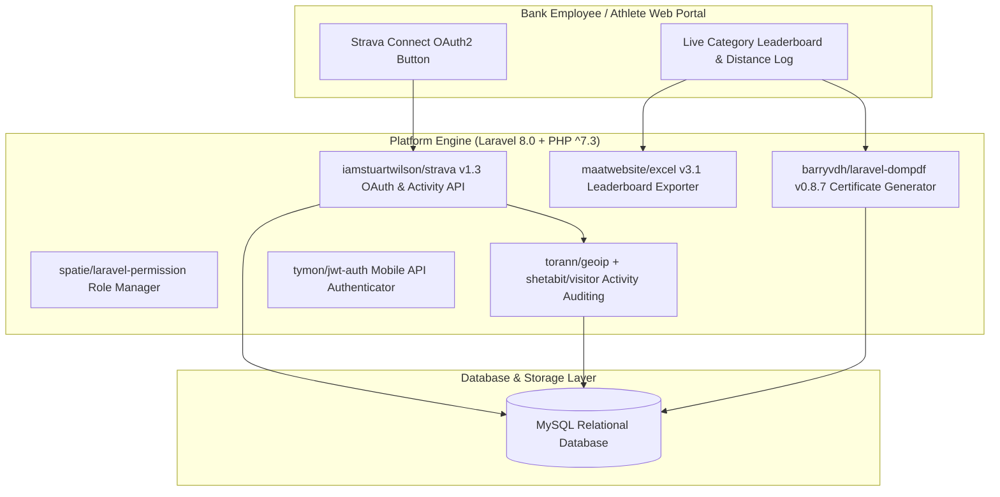

# 🏛️ Digipor Bank BMPD Jatim (`digipor-bank-bmpdjatim`) — System Architecture

---

## 📌 Executive Architecture Summary
Dokumen ini memaparkan cetak biru arsitektur teknis (*system design blueprint*), pemisahan tanggung jawab komponen (*separation of concerns*), alur transmisi data (*data lifecycle*), serta manifest dependensi terverifikasi yang diambil langsung dari file manifest proyek (`package.json` & `composer.json`).

* **Pola Arsitektur Utama:** `Sports Competition Platform with Strava OAuth2 & Automated PDF Certificates`
* **Fokus Rekayasa:** Keandalan sistem, latensi rendah, integritas data, dan keamanan transaksi.

---

## 🏛️ System Architecture Diagram

---

## 🔄 Lifecycle & Data Flow
1. **OAuth2 Handshake:** Athlete authenticates via `iamstuartwilson/strava` SDK, exchanging authorization codes for refreshable athlete tokens.
2. **Activity Pull & Verification:** Ingests distance, speed, and elapsed time; validates against anti-cheat rules.
3. **Leaderboard Compilation:** Aggregates ranking scores per banking institution across East Java.
4. **Certificate Generation:** `barryvdh/laravel-dompdf` dynamically renders high-resolution verified PDF completion certificates.

---

### 📦 Komponen & Library Arsitektur Utama (Core Architectural Stack)
| Kategori Arsitektural | Package / Library | Versi Standar | Peran & Tanggung Jawab Sistem |
| :--- | :--- | :--- | :--- |
| **Backend Framework** | `laravel/framework` | `v8.x` | Core Competition Management API |
| **Fitness Data Sync** | `iamstuartwilson/strava` | `v1.x` | Strava OAuth2 & Activity Ingestion SDK |
| **PDF Certificate Engine** | `barryvdh/laravel-dompdf` | `v0.8+` | Automated High-Resolution Certificate Generation |
| **Data Export Engine** | `maatwebsite/excel` | `v3.x` | Multi-Category Leaderboard Excel Exporter |
| **Role Management** | `spatie/laravel-permission` | `v3.x+` | RBAC for Admin, Judge, and Athletes |

---

## 🔒 Security & Access Control
- **AES Token Storage:** Strava access/refresh tokens stored securely in MySQL.
- **Spatie Permissions:** Enforces role segregation between Bank Administrator, Judge, and Athlete.

---

## ⚡ Performance & Scalability Considerations
- **Batch Queue Processing:** Activity synchronization queued in chunks to respect Strava API rate limits.
