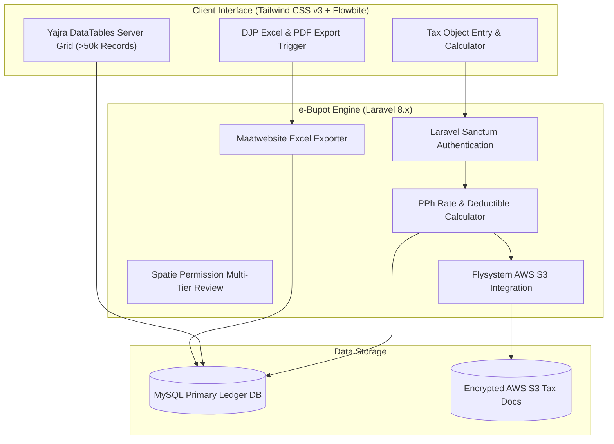

# 🏛️ Sistem e-Bupot — System Architecture

---

## 📌 Executive Architecture Summary
Dokumen ini menguraikan cetak biru arsitektur teknis sistem e-Bupot untuk kalkulasi bukti potong pajak, validasi transaksi, dan penyimpanan dokumen terenkripsi.

---

## 🏛️ System Architecture Diagram

---

## 🔄 Lifecycle & Data Flow
1. **Transaction Ingestion:** Akuntan menginput data transaksi vendor dan memilih kode objek pajak.
2. **Automated Calculation:** Mesin kalkulasi menghitung DPP dan PPh terutang secara otomatis.
3. **Approval & Lock:** Dokumen bukti potong direview dan di-lock secara permanen (*immutable ledger*).
4. **Document Archival:** Dokumen bukti potong di-generate dan diarsipkan ke AWS S3.

---

### 📦 Komponen & Library Arsitektur Utama (Core Architectural Stack)
| Kategori Arsitektural | Package / Library | Versi Standar | Peran & Tanggung Jawab Sistem |
| :--- | :--- | :--- | :--- |
| **Backend Framework** | `laravel/framework` | `v8.x` | Core Financial & Tax Calculation Engine |
| **API Authentication** | `laravel/sanctum` | `v2.x` | Tokenized Session Guard |
| **Data Grid Engine** | `yajra/laravel-datatables-oracle` | `v9.x` | High-Performance Server-Side Accounting Grid |
| **Cloud Storage** | `league/flysystem-aws-s3-v3` | `v1.x` | S3 Secure Document Vault |
| **Spreadsheet Exporter** | `maatwebsite/excel` | `v3.x` | DJP Tax Report Exporter |
| **Role-Based Access** | `spatie/laravel-permission` | `v5.x` | Tax Accountant, Verifier, and Admin RBAC |

---

## 🔒 Security & Access Control
* **Immutable Records:** Bukti potong yang telah disetujui tidak dapat diubah tanpa audit trail resmi.
* **Captcha & Brute-Force Shield:** Proteksi `mews/captcha` pada formulir otentikasi.
