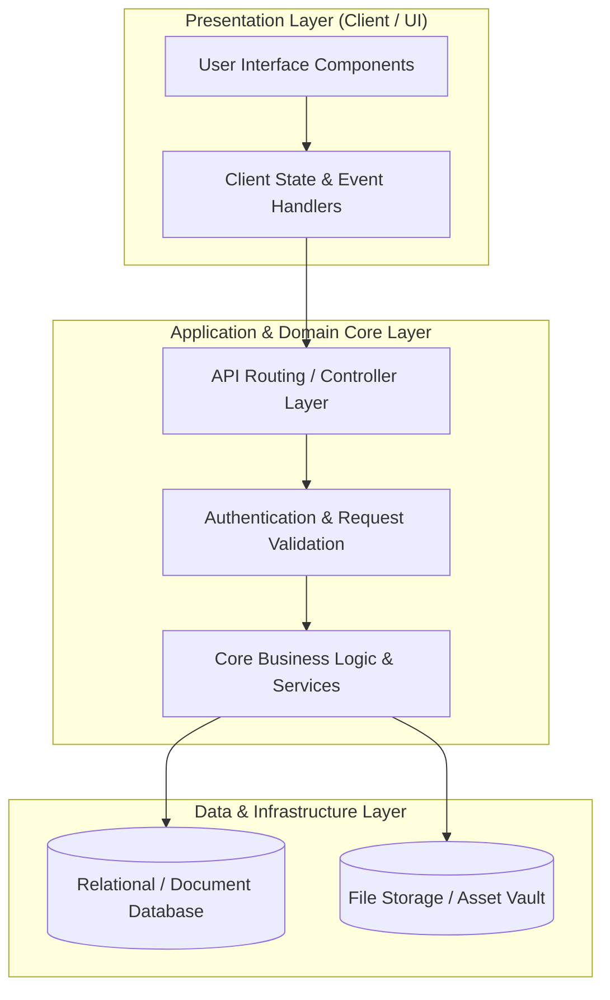

# 🏛️ Efosh V1 — System Architecture & Design Blueprint

---

## 📌 Executive Architecture Summary
Dokumen ini menguraikan arsitektur sistem, pemisahan lapisan logika (*Layer Separation*), alur transmisi data (*Data Flow*), integrasi database, dan manifest dependensi terverifikasi untuk subproyek **`efosh-v1`**.

---

## 🏛️ System Architecture Diagram

---

## 🔄 Lifecycle & Data Flow
1. **Request Ingestion:** Klien mengirimkan request terotentikasi melalui antarmuka pengguna ke endpoint API.
2. **Validation & Authorization:** Middleware memvalidasi integritas payload, sanitasi input, dan otorisasi hak akses peran pengguna.
3. **Domain Processing:** Service layer mengeksekusi logika bisnis, perhitungan data, dan manajemen status sistem.
4. **Persistence & Response:** Data transaksi disimpan ke database penyimpanan utama, dan status respons dikembalikan ke klien.

---

### 📦 Manifest Dependensi Terverifikasi (Direct from Codebase Manifests)
| Manifest Source | Package / Library | Version Constraint | Category & Architectural Role |
| :--- | :--- | :--- | :--- |
| `package.json` (`account\AccountApp\package.json`) | **`axios`** | `^0.19` | Dev Tool / Bundler |
| `package.json` (`account\AccountApp\package.json`) | **`cross-env`** | `^7.0` | Dev Tool / Bundler |
| `package.json` (`account\AccountApp\package.json`) | **`laravel-mix`** | `^5.0.1` | Dev Tool / Bundler |
| `package.json` (`account\AccountApp\package.json`) | **`lodash`** | `^4.17.19` | Dev Tool / Bundler |
| `package.json` (`account\AccountApp\package.json`) | **`resolve-url-loader`** | `^3.1.0` | Dev Tool / Bundler |
| `package.json` (`account\AccountApp\package.json`) | **`sass`** | `^1.15.2` | Dev Tool / Bundler |
| `package.json` (`account\AccountApp\package.json`) | **`sass-loader`** | `^8.0.0` | Dev Tool / Bundler |
| `package.json` (`account\MasterApp\package.json`) | **`axios`** | `^0.19` | Dev Tool / Bundler |
| `package.json` (`account\MasterApp\package.json`) | **`bootstrap`** | `^4.0.0` | Dev Tool / Bundler |
| `package.json` (`account\MasterApp\package.json`) | **`cross-env`** | `^7.0` | Dev Tool / Bundler |
| `package.json` (`account\MasterApp\package.json`) | **`jquery`** | `^3.2` | Dev Tool / Bundler |
| `package.json` (`account\MasterApp\package.json`) | **`laravel-mix`** | `^5.0.1` | Dev Tool / Bundler |
| `package.json` (`account\MasterApp\package.json`) | **`lodash`** | `^4.17.19` | Dev Tool / Bundler |
| `package.json` (`account\MasterApp\package.json`) | **`popper.js`** | `^1.12` | Dev Tool / Bundler |
| `package.json` (`account\MasterApp\package.json`) | **`resolve-url-loader`** | `^2.3.1` | Dev Tool / Bundler |
| `package.json` (`account\MasterApp\public\plugin\dropify\package.json`) | **`jquery`** | `*` | Production Dependency |
| `package.json` (`account\MasterApp\public\plugin\dropify\package.json`) | **`gulp`** | `^3.9.0` | Dev Tool / Bundler |
| `package.json` (`account\MasterApp\public\plugin\dropify\package.json`) | **`gulp-autoprefixer`** | `^3.1.0` | Dev Tool / Bundler |
| `package.json` (`account\MasterApp\public\plugin\dropify\package.json`) | **`gulp-header`** | `^1.7.1` | Dev Tool / Bundler |
| `package.json` (`account\MasterApp\public\plugin\dropify\package.json`) | **`gulp-load-plugins`** | `^1.2.0` | Dev Tool / Bundler |
| `package.json` (`account\MasterApp\public\plugin\dropify\package.json`) | **`gulp-minify-css`** | `1.2.4` | Dev Tool / Bundler |
| `package.json` (`account\MasterApp\public\plugin\dropify\package.json`) | **`gulp-plumber`** | `^1.0.1` | Dev Tool / Bundler |
| `package.json` (`account\MasterApp\public\plugin\dropify\package.json`) | **`gulp-sass`** | `^3.1.0` | Dev Tool / Bundler |
| `package.json` (`account\MasterApp\public\plugin\dropify\package.json`) | **`gulp-uglify`** | `^2.1.0` | Dev Tool / Bundler |
| `package.json` (`account\MasterApp\public\plugin\sweetalert2\package.json`) | **`@babel/core`** | `^7.2.2` | Dev Tool / Bundler |
| `package.json` (`account\MasterApp\public\plugin\sweetalert2\package.json`) | **`@babel/plugin-transform-object-assign`** | `^7.2.0` | Dev Tool / Bundler |
| `package.json` (`account\MasterApp\public\plugin\sweetalert2\package.json`) | **`@babel/preset-env`** | `^7.3.1` | Dev Tool / Bundler |
| `package.json` (`account\MasterApp\public\plugin\sweetalert2\package.json`) | **`@cypress/code-coverage`** | `^3.0.0` | Dev Tool / Bundler |
| `package.json` (`account\MasterApp\public\plugin\sweetalert2\package.json`) | **`@rollup/plugin-json`** | `^4.0.2` | Dev Tool / Bundler |
| `package.json` (`account\MasterApp\public\plugin\sweetalert2\package.json`) | **`@sweetalert2/eslint-config`** | `^1.0.0` | Dev Tool / Bundler |
| `package.json` (`account\MasterApp\public\plugin\sweetalert2\package.json`) | **`@sweetalert2/execute`** | `^1.0.0` | Dev Tool / Bundler |
| `package.json` (`account\MasterApp\public\plugin\sweetalert2\package.json`) | **`@sweetalert2/stylelint-config`** | `^1.1.5` | Dev Tool / Bundler |
| `package.json` (`account\MasterApp\public\StartUI\package.json`) | **`popper.js`** | `^1.12.5` | Production Dependency |
| `package.json` (`account\MasterApp\public\StartUI\package.json`) | **`gulp-concat`** | `^2.6.0` | Dev Tool / Bundler |
| `package.json` (`account\MasterApp\public\StartUI\package.json`) | **`gulp-ignore`** | `^2.0.1` | Dev Tool / Bundler |

---

## 🔒 Security & Performance Considerations
* **Authentication & Authorization:** Mekanisme otentikasi berbasis token/session dengan kontrol hak akses berbasis peran (RBAC).
* **Data Sanitization:** Sanitasi input dan proteksi terhadap SQL Injection, XSS, dan CSRF.
* **Optimasi Kinerja:** Pemanfaatan caching dan query indexing untuk memastikan responsivitas sistem.
