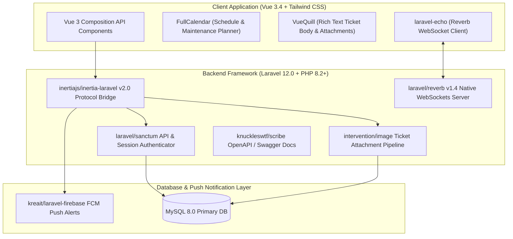

# 🏛️ ERI Helpdesk Ticketing System (`eri-helpdesk`) — System Architecture

---

## 📌 Executive Architecture Summary
Dokumen ini memaparkan cetak biru arsitektur teknis (*system design blueprint*), pemisahan tanggung jawab komponen (*separation of concerns*), alur transmisi data (*data lifecycle*), serta manifest dependensi terverifikasi yang diambil langsung dari file manifest proyek (`package.json` & `composer.json`).

* **Pola Arsitektur Utama:** `Monolithic SPA via Inertia.js 2.0 with Native Laravel Reverb WebSockets`
* **Fokus Rekayasa:** Keandalan sistem, latensi rendah, integritas data, dan keamanan transaksi.

---

## 🏛️ System Architecture Diagram

---

## 🔄 Lifecycle & Data Flow
1. **Ticket Submission:** User drafts ticket with rich formatted text via `VueQuill` and submits through `inertiajs/inertia-laravel`.
2. **Attachment Processing:** `intervention/image` resizes and optimizes evidence screenshots before disk storage.
3. **Real-time Event Broadcast:** `laravel/reverb` broadcasts state changes on private channels to connected operators.
4. **Push Notification:** `kreait/laravel-firebase` dispatches mobile notifications to assigned field engineers.

---

### 📦 Komponen & Library Arsitektur Utama (Core Architectural Stack)
| Kategori Arsitektural | Package / Library | Versi Standar | Peran & Tanggung Jawab Sistem |
| :--- | :--- | :--- | :--- |
| **Backend Framework** | `laravel/framework` | `v12.x` | Enterprise MVC Framework |
| **Real-Time WebSockets** | `laravel/reverb` | `v1.x` | High-Concurrency Native WebSockets Server |
| **Monolithic SPA Bridge** | `inertiajs/inertia-laravel` | `v2.x` | Server-Driven Single Page Application |
| **Client UI Framework** | `vue` | `v3.x` | Composition API Client Components |
| **API Authentication** | `laravel/sanctum` | `v4.x` | Token & Cookie-Based Authorization Guard |
| **Push Notifications** | `kreait/laravel-firebase` | `v5.x` | Mobile Push Alert Dispatcher |
| **Interactive Schedule** | `fullcalendar` | `v6.x` | Maintenance & Helpdesk Calendar Scheduler |
| **Rich Text Editor** | `vue-quill` | `v1.x` | WYSIWYG Ticket Description & Attachment Body |

---

## 🔒 Security & Access Control
- **Laravel Sanctum Authentication:** Token-based security and cookie session guard.
- **Private Channel Authorization:** Reverb validates broadcast channel access per user role.

---

## ⚡ Performance & Scalability Considerations
- **Native Reverb WebSockets:** Eliminates external pusher costs while maintaining high-concurrency socket channels.
