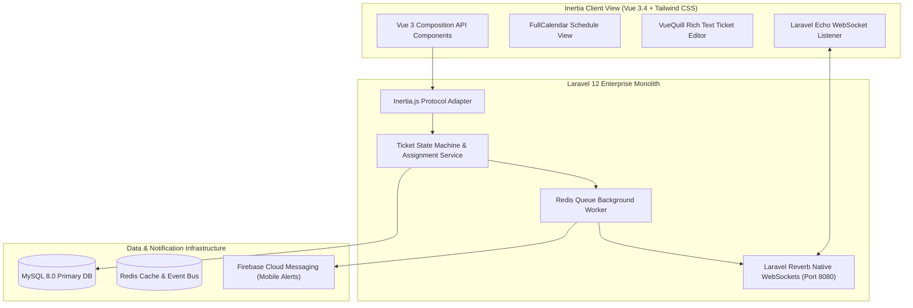

# 🏛️ ERI Helpdesk System — Modern Full-Stack Architecture

---

## 📌 Executive Architecture Summary
Dokumen ini memaparkan cetak biru arsitektur teknis (*system design blueprint*), pemisahan tanggung jawab komponen (*separation of concerns*), alur transmisi data (*data lifecycle*), serta pertimbangan keamanan dan skalabilitas untuk **`eri-helpdesk`**.

* **Pola Arsitektur Utama:** `Monolithic SPA via Inertia.js 2.0 with Native Laravel Reverb WebSockets`
* **Fokus Rekayasa:** Keandalan sistem, latensi rendah, integritas data, dan keamanan transaksi.

---

## 🏛️ System Architecture Diagram

---

## 🔄 Lifecycle & Data Flow
1. **Ticket Creation:** Operator submits a technical ticket with rich text formatting (VueQuill) via Inertia client visit.
2. **State Machine Transition:** Laravel 12 assigns the ticket according to priority and notifies technical staff.
3. **WebSocket Event Dispatch:** Laravel Reverb dispatches a private channel broadcast without requiring external third-party services.
4. **Instant UI Reaction:** Laravel Echo catches the event on the client, updating ticket statuses and comment feeds in real time.

---

## 🔒 Security & Access Control
- **Private Channel Authorization:** Laravel Reverb enforces channel-level authorization policies.
- **CSRF Token Synchronization:** Automatically handled by Inertia.js on all mutating visits.

---

## ⚡ Performance & Scalability Considerations
- **Native Reverb Architecture:** Capable of handling thousands of simultaneous open socket connections on minimal server resources.
