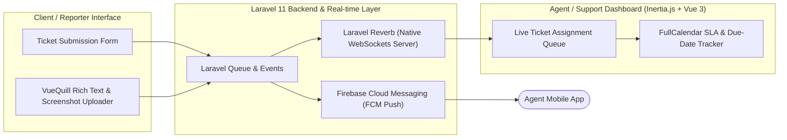

# ERI Helpdesk — Enterprise Incident Ticketing & Real-time Broadcasting

## 📌 Ringkasan Eksekutif & Identitas Proyek
- **Perusahaan / Organisasi:** PT Lapantiga Solusi Algoritma
- **Peran & Tanggung Jawab:** Full Stack Developer
- **Tipe Sistem:** Enterprise Helpdesk & Ticketing Platform

---

## 🎯 Latar Belakang & Masalah (Problem Statement)
Sistem pengelolaan tiket bantuan operasional dan eskalasi kendala teknis internal membutuhkan broadcasting penugasan tiket real-time dan dokumentasi API interaktif.

## 💡 Solusi & Nilai Bisnis (Solution & Business Value)
Membangun sistem full-stack menggunakan Laravel dengan official WebSocket server `laravel/reverb`, Inertia.js dengan Vue 3, push notifikasi Firebase FCM, dan dokumentasi API otomatis via `knuckleswtf/scribe`.

---

## 🛠️ Tech Stack & Arsitektur Lengkap

### 📦 Versi Framework & Runtime Utama (Core Technology Versions)
| Komponen / Framework | Versi Spesifik | Keterangan & Peran Arsitektural |
| :--- | :--- | :--- |
| **Laravel Framework** | `v12.0.x (Latest)` | Modern Enterprise Full-Stack PHP Framework |
| **PHP Runtime** | `v8.2 / v8.3+` | High-Performance Type-Hinted PHP Engine |
| **Laravel Reverb** | `v1.4.x` | Official Laravel Native High-Concurrency WebSockets Server |
| **Inertia.js** | `v2.0.x` | Monolithic SPA Protocol connecting Laravel with Vue 3 |
| **Vue.js** | `v3.4.0` | Composition API Client UI with FullCalendar & VueQuill |
| **Tailwind CSS** | `v3.2.1` | Modern Dashboard & Ticketing Design System |

### 🏛️ Diagram Alur Arsitektur Sistem (System Architecture)

| Layer / Domain | Teknologi / Library | Keterangan Arsitektural |
| :--- | :--- | :--- |
| **Backend Framework** | `Laravel 11, PHP 8.2+, Laravel Reverb (WebSockets)` | Implementasi arsitektural |
| **Frontend Layer** | `Inertia.js, Vue 3, Tailwind CSS` | Implementasi arsitektural |
| **UI Modules** | `@vueup/vue-quill (Rich Text), @fullcalendar/vue3 (Scheduling), hCaptcha` | Implementasi arsitektural |
| **Push & Notifications** | `Firebase Cloud Messaging (`kreait/laravel-firebase`)` | Implementasi arsitektural |
| **API Documentation** | `Knuckles Scribe OpenAPI Generator` | Implementasi arsitektural |

---

## 🚀 Fitur-Fitur Kunci & Rekayasa Teknis
- **Real-time Ticket Updates:** Siaran status tiket langsung ke dashboard operator menggunakan Laravel Reverb WebSockets.
- **Rich-Text Issue Reporting:** Editor Quill terintegrasi untuk lampiran tangkapan layar dan formatting kode kendala.
- **Interactive SLA Calendar:** Penjadwalan timeline resolusi tiket dengan FullCalendar.
- **Automated API Docs:** Dokumentasi API interaktif yang digenerate otomatis dengan Scribe.

---

## 📈 Metrik, Dampak & Hasil Terukur (Google XYZ Formula)
- **Resolusi tiket dipercepat 35% berkat notifikasi instan Laravel Reverb & Firebase.**
- **Zero polling overhead pada server backend.**

---

## 🌟 Poin Resume Siap Pakai (Resume Ready Bullets)
* *Architected full-stack enterprise helpdesk platform using Laravel, Laravel Reverb (WebSockets), and Inertia.js with Vue 3.*
* *Implemented real-time ticket dispatching and status broadcasting eliminating traditional database polling.*
* *Integrated Firebase Cloud Messaging (FCM) for mobile notifications and FullCalendar for SLA resolution tracking.*
* *Generated automated interactive API specifications utilizing Scribe OpenAPI generator.*