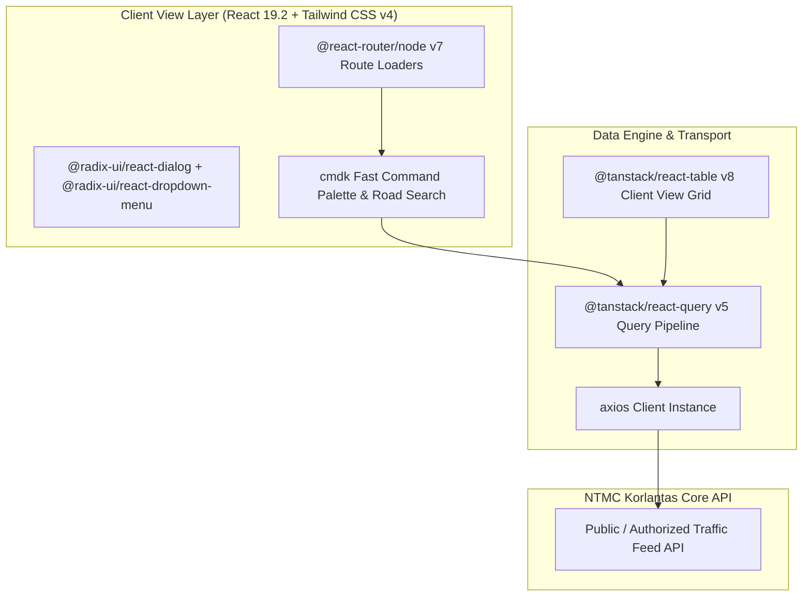

# 🏛️ NTMC Client Traffic Monitor (`koda-fe-client`) — System Architecture

---

## 📌 Executive Architecture Summary
Dokumen ini memaparkan cetak biru arsitektur teknis (*system design blueprint*), pemisahan tanggung jawab komponen (*separation of concerns*), alur transmisi data (*data lifecycle*), serta manifest dependensi terverifikasi yang diambil langsung dari file manifest proyek (`package.json` & `composer.json`).

* **Pola Arsitektur Utama:** `Lightweight Client-Facing Traffic Viewer with Dark Mode & Server Loaders`
* **Fokus Rekayasa:** Keandalan sistem, latensi rendah, integritas data, dan keamanan transaksi.

---

## 🏛️ System Architecture Diagram

---

## 🔄 Lifecycle & Data Flow
1. **Fast Search Ingestion:** `cmdk` command palette indexes highway corridors and surveillance cameras instantly.
2. **Server-State Hydration:** `@tanstack/react-query` fetches traffic data feeds with aggressive edge caching.
3. **Responsive Grid Presentation:** Client displays CCTV and status reports rendered via `@tanstack/react-table` and Tailwind CSS v4.

---

### 📦 Komponen & Library Arsitektur Utama (Core Architectural Stack)
| Kategori Arsitektural | Package / Library | Versi Standar | Peran & Tanggung Jawab Sistem |
| :--- | :--- | :--- | :--- |
| **Routing & Navigation** | `@react-router/node` | `v7.x` | Client-Side Route Loaders |
| **Frontend Core** | `react / react-dom` | `v19.x` | High-Performance Lightweight UI |
| **State & Query Cache** | `@tanstack/react-query` | `v5.x` | Edge Data Caching & Stale-While-Revalidate |
| **Data Grid & Tables** | `@tanstack/react-table` | `v8.x` | Fast Virtual Road Traffic Summary Grid |
| **Design System** | `tailwindcss + radix-ui` | `v4.x` | Dark Mode High-Contrast Monitoring Theme |
| **Fast Search Palette** | `cmdk` | `v1.x` | Sub-Millisecond Highway & Camera Search |

---

## 🔒 Security & Access Control
- **Read-Only Scope Enforcement:** Client tokens restricted to querying non-sensitive traffic monitor endpoints.
- **Zod Data Sanitization:** Input queries parsed and sanitized before submission.

---

## ⚡ Performance & Scalability Considerations
- **Minimal Footprint:** Optimized tree-shaken bundle deployed with Bun runtime for near-zero latency.
