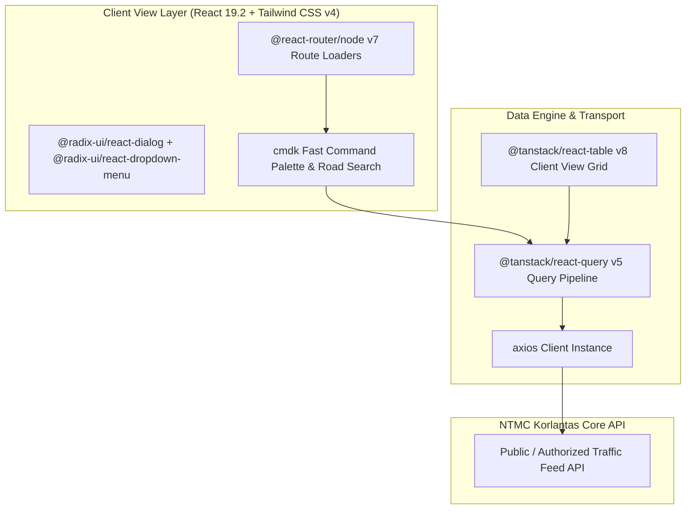

# 🏛️ NTMC Client Traffic Monitor (`koda-fe-client`) — System Architecture

---

## 📌 Executive Architecture Summary
Dokumen ini memaparkan cetak biru arsitektur teknis (*system design blueprint*), pemisahan tanggung jawab komponen (*separation of concerns*), alur transmisi data (*data lifecycle*), serta manifest dependensi terverifikasi yang diambil langsung dari file manifest proyek (`package.json` & `composer.json`).

* **Pola Arsitektur Utama:** `Lightweight Client-Facing Traffic Viewer with Dark Mode & Server Loaders`
* **Fokus Rekayasa:** Keandalan sistem, latensi rendah, integritas data, dan keamanan transaksi.

---

## 🏛️ System Architecture Diagram

---

## 🔄 Lifecycle & Data Flow
1. **Fast Search Ingestion:** `cmdk` command palette indexes highway corridors and surveillance cameras instantly.
2. **Server-State Hydration:** `@tanstack/react-query` fetches traffic data feeds with aggressive edge caching.
3. **Responsive Grid Presentation:** Client displays CCTV and status reports rendered via `@tanstack/react-table` and Tailwind CSS v4.

---

### 📦 Manifest Dependensi Terverifikasi (Direct from Codebase Manifests)
| Manifest Source | Package / Library | Version Constraint | Category & Architectural Role |
| :--- | :--- | :--- | :--- |
| `package.json` (`package.json`) | **`@base-ui/react`** | `^1.5.0` | Production Dependency |
| `package.json` (`package.json`) | **`@fontsource-variable/geist`** | `^5.2.9` | Production Dependency |
| `package.json` (`package.json`) | **`@hookform/resolvers`** | `^5.4.0` | Production Dependency |
| `package.json` (`package.json`) | **`@react-router/node`** | `7.16.0` | Production Dependency |
| `package.json` (`package.json`) | **`@tanstack/react-query`** | `^5.100.14` | Production Dependency |
| `package.json` (`package.json`) | **`@tanstack/react-table`** | `^8.21.3` | Production Dependency |
| `package.json` (`package.json`) | **`axios`** | `^1.16.1` | Production Dependency |
| `package.json` (`package.json`) | **`class-variance-authority`** | `^0.7.1` | Production Dependency |
| `package.json` (`package.json`) | **`clsx`** | `^2.1.1` | Production Dependency |
| `package.json` (`package.json`) | **`cmdk`** | `^1.1.1` | Production Dependency |
| `package.json` (`package.json`) | **`date-fns`** | `^4.4.0` | Production Dependency |
| `package.json` (`package.json`) | **`embla-carousel-react`** | `^8.6.0` | Production Dependency |
| `package.json` (`package.json`) | **`hls.js`** | `^1.6.16` | Production Dependency |
| `package.json` (`package.json`) | **`input-otp`** | `^1.4.2` | Production Dependency |
| `package.json` (`package.json`) | **`isbot`** | `^5.1.36` | Production Dependency |
| `package.json` (`package.json`) | **`lucide-react`** | `^1.17.0` | Production Dependency |
| `package.json` (`package.json`) | **`mapbox-gl`** | `^3.25.0` | Production Dependency |
| `package.json` (`package.json`) | **`pusher-js`** | `^8.5.0` | Production Dependency |
| `package.json` (`package.json`) | **`react`** | `^19.2.6` | Production Dependency |
| `package.json` (`package.json`) | **`react-day-picker`** | `^10.0.1` | Production Dependency |
| `package.json` (`package.json`) | **`react-dom`** | `^19.2.6` | Production Dependency |
| `package.json` (`package.json`) | **`react-hook-form`** | `^7.77.0` | Production Dependency |
| `package.json` (`package.json`) | **`react-router`** | `7.16.0` | Production Dependency |
| `package.json` (`package.json`) | **`recharts`** | `3.8.0` | Production Dependency |
| `package.json` (`package.json`) | **`shadcn`** | `^4.10.0` | Production Dependency |
| `package.json` (`package.json`) | **`sonner`** | `^2.0.7` | Production Dependency |
| `package.json` (`package.json`) | **`sweetalert2`** | `^11.26.25` | Production Dependency |
| `package.json` (`package.json`) | **`tailwind-merge`** | `^3.6.0` | Production Dependency |
| `package.json` (`package.json`) | **`tw-animate-css`** | `^1.4.0` | Production Dependency |
| `package.json` (`package.json`) | **`vaul`** | `^1.1.2` | Production Dependency |
| `package.json` (`package.json`) | **`zod`** | `^4.4.3` | Production Dependency |
| `package.json` (`package.json`) | **`@react-router/dev`** | `7.16.0` | Dev Tool / Bundler |
| `package.json` (`package.json`) | **`@tailwindcss/vite`** | `^4.2.2` | Dev Tool / Bundler |
| `package.json` (`package.json`) | **`@tanstack/react-query-devtools`** | `^5.100.14` | Dev Tool / Bundler |
| `package.json` (`package.json`) | **`@testing-library/jest-dom`** | `^6.9.1` | Dev Tool / Bundler |

---

## 🔒 Security & Access Control
- **Read-Only Scope Enforcement:** Client tokens restricted to querying non-sensitive traffic monitor endpoints.
- **Zod Data Sanitization:** Input queries parsed and sanitized before submission.

---

## ⚡ Performance & Scalability Considerations
- **Minimal Footprint:** Optimized tree-shaken bundle deployed with Bun runtime for near-zero latency.
