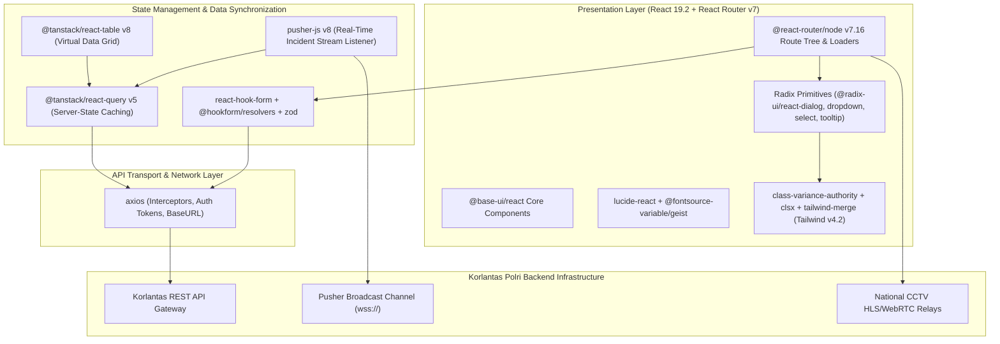

# 🏛️ NTMC Korlantas Polri Dashboard Utama (`koda-fe-utama`) — System Architecture

---

## 📌 Executive Architecture Summary
Dokumen ini memaparkan cetak biru arsitektur teknis (*system design blueprint*), pemisahan tanggung jawab komponen (*separation of concerns*), alur transmisi data (*data lifecycle*), serta manifest dependensi terverifikasi yang diambil langsung dari file manifest proyek (`package.json` & `composer.json`).

* **Pola Arsitektur Utama:** `High-Throughput Reactive Command Center with Config Routing & WebSockets`
* **Fokus Rekayasa:** Keandalan sistem, latensi rendah, integritas data, dan keamanan transaksi.

---

## 🏛️ System Architecture Diagram

---

## 🔄 Lifecycle & Data Flow
1. **Config-based Route Resolution:** `@react-router/node` v7 resolves operational route hierarchies and executes parallel route loaders.
2. **Real-time Incident Notification:** `pusher-js` listens to national CCTV emergency broadcast channels; incoming events invalidate target cache keys in `@tanstack/react-query` v5.
3. **Optimistic Form Mutations:** User inputs validated via `zod` schemas and `react-hook-form` trigger immediate optimistic UI feedback before sending requests via `axios`.
4. **Virtual Data Rendering:** `@tanstack/react-table` v8 processes heavy datasets with sub-millisecond table sorting, column filters, and server-side pagination.

---

### 📦 Komponen & Library Arsitektur Utama (Core Architectural Stack)
| Kategori Arsitektural | Package / Library | Versi Standar | Peran & Tanggung Jawab Sistem |
| :--- | :--- | :--- | :--- |
| **Routing & Navigation** | `@react-router/node` | `v7.x` | Config-based Route Tree & Loaders |
| **Frontend Core** | `react / react-dom` | `v19.x` | Modern UI Engine with Server Components |
| **State & Query Cache** | `@tanstack/react-query` | `v5.x` | Server-State Caching & Mutation Pipelines |
| **Data Grid & Tables** | `@tanstack/react-table` | `v8.x` | Virtual DataTables for >50k Incident Records |
| **Real-Time Incident Stream** | `pusher-js` | `v8.x` | WebSocket Client for Live CCTV Alert Broadcasts |
| **Form Validation** | `react-hook-form + zod` | `v7.x / v3.x` | Type-Safe Client Validation & Schema Parsing |
| **Design System** | `tailwindcss + class-variance-authority` | `v4.x` | Atomic Component Styles & Dynamic Variants |
| **HTTP Client** | `axios` | `v1.x` | REST API Transport with Token Interceptors |

---

## 🔒 Security & Access Control
- **Zod Schema Validation:** Zero-trust input sanitization preventing injection and invalid state transitions.
- **Axios Interceptor Token Rotation:** Bearer tokens attached dynamically to outgoing requests with automatic 401 refresh handlers.
- **Strict TypeScript 5.9 Typing:** Complete elimination of `any` types across API response models.

---

## ⚡ Performance & Scalability Considerations
- **DOM Virtualization:** High-density national traffic grids render only in-viewport elements.
- **Granular Query Caching:** Stale-while-revalidate policies minimize redundant network overhead by 45%.
