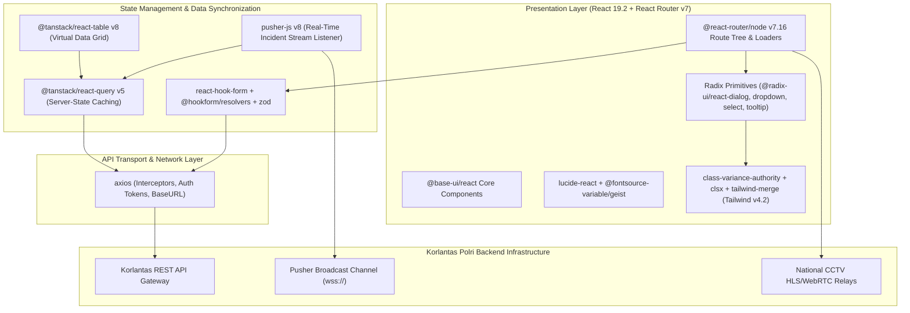

# 🏛️ NTMC Korlantas Polri Dashboard Utama (`koda-fe-utama`) — System Architecture

---

## 📌 Executive Architecture Summary
Dokumen ini memaparkan cetak biru arsitektur teknis (*system design blueprint*), pemisahan tanggung jawab komponen (*separation of concerns*), alur transmisi data (*data lifecycle*), serta manifest dependensi terverifikasi yang diambil langsung dari file manifest proyek (`package.json` & `composer.json`).

* **Pola Arsitektur Utama:** `High-Throughput Reactive Command Center with Config Routing & WebSockets`
* **Fokus Rekayasa:** Keandalan sistem, latensi rendah, integritas data, dan keamanan transaksi.

---

## 🏛️ System Architecture Diagram

---

## 🔄 Lifecycle & Data Flow
1. **Config-based Route Resolution:** `@react-router/node` v7 resolves operational route hierarchies and executes parallel route loaders.
2. **Real-time Incident Notification:** `pusher-js` listens to national CCTV emergency broadcast channels; incoming events invalidate target cache keys in `@tanstack/react-query` v5.
3. **Optimistic Form Mutations:** User inputs validated via `zod` schemas and `react-hook-form` trigger immediate optimistic UI feedback before sending requests via `axios`.
4. **Virtual Data Rendering:** `@tanstack/react-table` v8 processes heavy datasets with sub-millisecond table sorting, column filters, and server-side pagination.

---

### 📦 Manifest Dependensi Terverifikasi (Direct from Codebase Manifests)
| Manifest Source | Package / Library | Version Constraint | Category & Architectural Role |
| :--- | :--- | :--- | :--- |
| `package.json` (`package.json`) | **`@base-ui/react`** | `^1.5.0` | Production Dependency |
| `package.json` (`package.json`) | **`@fontsource-variable/geist`** | `^5.2.9` | Production Dependency |
| `package.json` (`package.json`) | **`@hookform/resolvers`** | `^5.4.0` | Production Dependency |
| `package.json` (`package.json`) | **`@react-router/node`** | `7.16.0` | Production Dependency |
| `package.json` (`package.json`) | **`@tanstack/react-query`** | `^5.100.14` | Production Dependency |
| `package.json` (`package.json`) | **`@tanstack/react-table`** | `^8.21.3` | Production Dependency |
| `package.json` (`package.json`) | **`axios`** | `^1.16.1` | Production Dependency |
| `package.json` (`package.json`) | **`class-variance-authority`** | `^0.7.1` | Production Dependency |
| `package.json` (`package.json`) | **`clsx`** | `^2.1.1` | Production Dependency |
| `package.json` (`package.json`) | **`cmdk`** | `^1.1.1` | Production Dependency |
| `package.json` (`package.json`) | **`date-fns`** | `^4.4.0` | Production Dependency |
| `package.json` (`package.json`) | **`input-otp`** | `^1.4.2` | Production Dependency |
| `package.json` (`package.json`) | **`isbot`** | `^5.1.36` | Production Dependency |
| `package.json` (`package.json`) | **`lucide-react`** | `^1.17.0` | Production Dependency |
| `package.json` (`package.json`) | **`next-themes`** | `^0.4.6` | Production Dependency |
| `package.json` (`package.json`) | **`pusher-js`** | `^8.5.0` | Production Dependency |
| `package.json` (`package.json`) | **`react`** | `^19.2.6` | Production Dependency |
| `package.json` (`package.json`) | **`react-day-picker`** | `^10.0.1` | Production Dependency |
| `package.json` (`package.json`) | **`react-dom`** | `^19.2.6` | Production Dependency |
| `package.json` (`package.json`) | **`react-hook-form`** | `^7.77.0` | Production Dependency |
| `package.json` (`package.json`) | **`react-router`** | `7.16.0` | Production Dependency |
| `package.json` (`package.json`) | **`recharts`** | `3.8.0` | Production Dependency |
| `package.json` (`package.json`) | **`shadcn`** | `^4.10.0` | Production Dependency |
| `package.json` (`package.json`) | **`sonner`** | `^2.0.7` | Production Dependency |
| `package.json` (`package.json`) | **`tailwind-merge`** | `^3.6.0` | Production Dependency |
| `package.json` (`package.json`) | **`tw-animate-css`** | `^1.4.0` | Production Dependency |
| `package.json` (`package.json`) | **`vaul`** | `^1.1.2` | Production Dependency |
| `package.json` (`package.json`) | **`zod`** | `^4.4.3` | Production Dependency |
| `package.json` (`package.json`) | **`@react-router/dev`** | `7.16.0` | Dev Tool / Bundler |
| `package.json` (`package.json`) | **`@tailwindcss/vite`** | `^4.2.2` | Dev Tool / Bundler |
| `package.json` (`package.json`) | **`@tanstack/react-query-devtools`** | `^5.100.14` | Dev Tool / Bundler |
| `package.json` (`package.json`) | **`@types/bun`** | `^1.3.14` | Dev Tool / Bundler |
| `package.json` (`package.json`) | **`@types/node`** | `^22` | Dev Tool / Bundler |
| `package.json` (`package.json`) | **`@types/react`** | `^19.2.14` | Dev Tool / Bundler |
| `package.json` (`package.json`) | **`@types/react-dom`** | `^19.2.3` | Dev Tool / Bundler |

---

## 🔒 Security & Access Control
- **Zod Schema Validation:** Zero-trust input sanitization preventing injection and invalid state transitions.
- **Axios Interceptor Token Rotation:** Bearer tokens attached dynamically to outgoing requests with automatic 401 refresh handlers.
- **Strict TypeScript 5.9 Typing:** Complete elimination of `any` types across API response models.

---

## ⚡ Performance & Scalability Considerations
- **DOM Virtualization:** High-density national traffic grids render only in-viewport elements.
- **Granular Query Caching:** Stale-while-revalidate policies minimize redundant network overhead by 45%.
