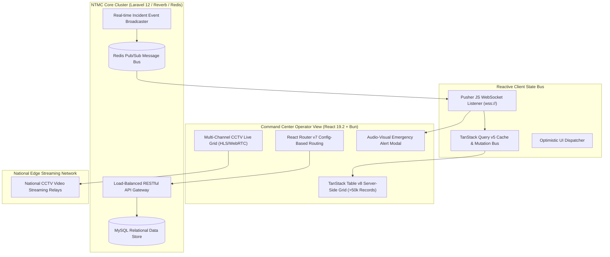

# 🏛️ NTMC Korlantas Polri Dashboard — Mission-Critical System Architecture

---

## 📌 Executive Architecture Summary
Dokumen ini memaparkan cetak biru arsitektur teknis (*system design blueprint*), pemisahan tanggung jawab komponen (*separation of concerns*), alur transmisi data (*data lifecycle*), serta pertimbangan keamanan dan skalabilitas untuk **`koda-fe-utama`**.

* **Pola Arsitektur Utama:** `High-Throughput Reactive Command Center with WebSocket Event Bus`
* **Fokus Rekayasa:** Keandalan sistem, latensi rendah, integritas data, dan keamanan transaksi.

---

## 🏛️ System Architecture Diagram

---

## 🔄 Lifecycle & Data Flow
1. **Live Emergency Incident Broadcast:** When an incident occurs anywhere in Indonesia, Korlantas backend publishes an event to Redis Pub/Sub.
2. **WebSocket Broadcast:** The Pusher/Reverb server pushes the incident payload to all connected command center operators within `< 500ms`.
3. **Optimistic Cache Invalidation:** TanStack Query intercepts the event and selectively invalidates only the relevant table query keys.
4. **Data Rendering:** TanStack Table v8 performs virtualization and server-side pagination, ensuring zero UI lag even with 50,000+ records.

---

## 🔒 Security & Access Control
- **JWT + Refresh Token Protocol:** Secure token rotation stored in HttpOnly cookies.
- **Role-Based Access Control (RBAC):** Granular permissions for Operator, Supervisor, and National Administrator.
- **XSS & CSRF Protection:** Strict CSP headers and zero raw `dangerouslySetInnerHTML` usage.

---

## ⚡ Performance & Scalability Considerations
- **Virtualization:** High-density CCTV grids and tables render only viewport DOM elements.
- **Bun Runtime:** Sub-second bundling and hot-module replacement for enterprise reliability.
