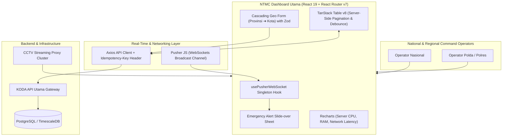

# NTMC Dashboard Utama — National Traffic Command & Control System

## 📌 Ringkasan Eksekutif & Identitas Proyek
- **Perusahaan / Organisasi:** PT Lapantiga Solusi Algoritma / Korlantas Polri
- **Peran & Tanggung Jawab:** Lead Frontend Engineer / Software Engineer
- **Tipe Sistem:** Mission-Critical Real-time Traffic Monitoring Dashboard (SPA)

---

## 🎯 Latar Belakang & Masalah (Problem Statement)
Korlantas Polri (NTMC) membutuhkan dashboard terpadu modern untuk memonitor ribuan channel CCTV, memantau utilisasi server, dan menyiarkan pengumuman/peringatan darurat real-time ke seluruh operator se-Indonesia.

## 💡 Solusi & Nilai Bisnis (Solution & Business Value)
Membangun arsitektur SPA mutakhir menggunakan React 19, React Router v7 config-based routing, Tailwind CSS v4, shadcn/ui, TanStack Query v5, TanStack Table v8, dan integrasi Pusher WebSockets.

---

## 🛠️ Tech Stack & Arsitektur Lengkap

### 📦 Versi Framework & Runtime Utama (Core Technology Versions)
| Komponen / Framework | Versi Spesifik | Keterangan & Peran Arsitektural |
| :--- | :--- | :--- |
| **React.js** | `v19.2.6` | Bleeding-Edge React UI Framework with React Server Features |
| **React Router** | `v7.16.0` | Config-based Routing, Loaders & Type-safe Navigation |
| **TypeScript** | `v5.9.3` | Strict-Mode Static Typing (Zero 'any' Policy) |
| **Tailwind CSS** | `v4.2.2` | Next-Gen CSS Engine with CSS-first Configuration |
| **Pusher WebSockets** | `pusher-js v8.x` | Persistent Real-time Traffic Event Listener |
| **TanStack Engine** | `Query v5.x / Table v8.x` | Server-state Caching & High-Performance DataTables |
| **Bun Runtime** | `v1.0+` | Ultra-fast Package Execution & Local Dev Server |

### 🏛️ Diagram Alur Arsitektur Sistem (System Architecture)

| Layer / Domain | Teknologi / Library | Keterangan Arsitektural |
| :--- | :--- | :--- |
| **Framework & UI** | `React 19, React Router v7, Tailwind CSS v4, shadcn/ui, Lucide Icons` | Implementasi arsitektural |
| **Language & Runtime** | `TypeScript 5.9 (Strict No-Any), Bun 1.0+, Vite` | Implementasi arsitektural |
| **Real-Time** | `Pusher JS (WebSockets singleton & custom hooks)` | Implementasi arsitektural |
| **Data & State** | `TanStack Query v5 (keepPreviousData), TanStack Table v8, Axios` | Implementasi arsitektural |
| **Forms & Validation** | `React Hook Form, Zod v4 schema validation, SearchableSelect` | Implementasi arsitektural |
| **Charts & Analytics** | `Recharts (CPU/RAM utilization, Network latency)` | Implementasi arsitektural |

---

## 🚀 Fitur-Fitur Kunci & Rekayasa Teknis
- **Live Incident Streaming:** Alert insiden lalu lintas real-time via Pusher WebSockets dengan panel notifikasi slide-over (Sheet).
- **Server-Side Data Tables:** Table pagination, debounce search, dan multi-column sorting berkinerja tinggi berbasis TanStack Table v8.
- **Cascading Master Data:** Form manajemen channel CCTV dengan dependent select bertingkat (Provinsi ➔ Kota) dan validasi Zod.
- **Idempotent Broadcast Tool:** Penyiaran pengumuman darurat nasional dengan `crypto.randomUUID` idempotency key.

---

## 📈 Metrik, Dampak & Hasil Terukur (Google XYZ Formula)
- **Latensi alert darurat < 500ms secara simultan ke seluruh operator.**
- **Pola arsitektur 3-file modular (`index.tsx`, `columns.tsx`, `form-dialog.tsx`) memangkas waktu dev fitur baru 50%.**
- **100% type-safe strict mode tanpa runtime type error.**

---

## 🌟 Poin Resume Siap Pakai (Resume Ready Bullets)
* *Architected the NTMC Dashboard Utama for Korlantas Polri using React 19, React Router v7, TypeScript, and Tailwind CSS v4.*
* *Integrated real-time WebSocket communication via Pusher JS for instantaneous nationwide traffic incident streaming.*
* *Engineered high-performance server-side data tables with TanStack Table v8 and server state caching with TanStack Query v5.*
* *Built robust, schema-validated forms utilizing React Hook Form and Zod with cascading dependent geographic dropdowns.*