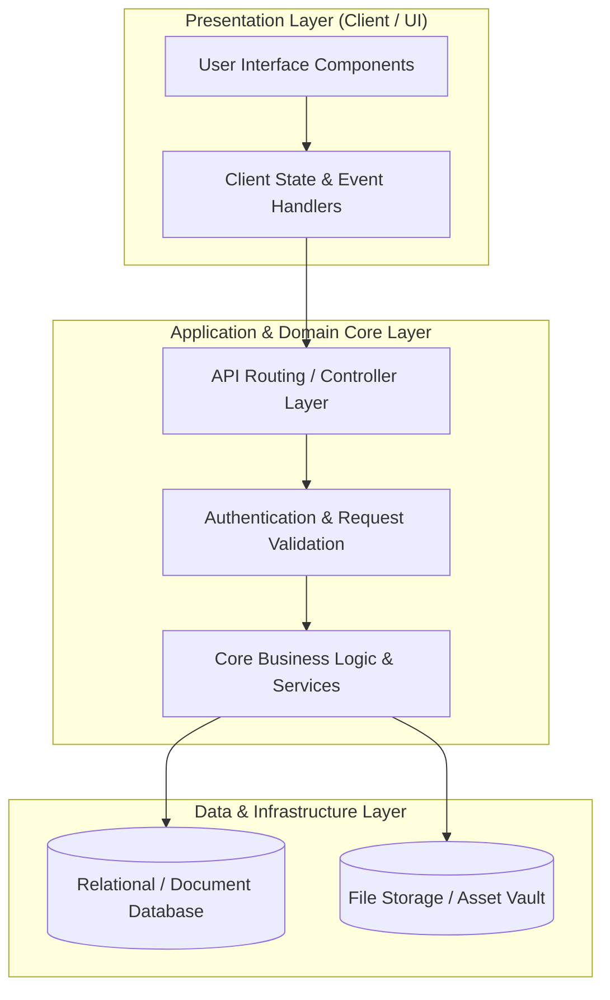

# 🏛️ Miracle Wish Fe — System Architecture & Design Blueprint

---

## 📌 Executive Architecture Summary
Dokumen ini menguraikan arsitektur sistem, pemisahan lapisan logika (*Layer Separation*), alur transmisi data (*Data Flow*), integrasi database, dan manifest dependensi terverifikasi untuk subproyek **`miracle-wish-fe`**.

---

## 🏛️ System Architecture Diagram

---

## 🔄 Lifecycle & Data Flow
1. **Request Ingestion:** Klien mengirimkan request terotentikasi melalui antarmuka pengguna ke endpoint API.
2. **Validation & Authorization:** Middleware memvalidasi integritas payload, sanitasi input, dan otorisasi hak akses peran pengguna.
3. **Domain Processing:** Service layer mengeksekusi logika bisnis, perhitungan data, dan manajemen status sistem.
4. **Persistence & Response:** Data transaksi disimpan ke database penyimpanan utama, dan status respons dikembalikan ke klien.

---

### 📦 Manifest Dependensi Terverifikasi (Direct from Codebase Manifests)
| Manifest Source | Package / Library | Version Constraint | Category & Architectural Role |
| :--- | :--- | :--- | :--- |
| `package.json` (`MWCore\package.json`) | **`axios`** | `^0.17` | Dev Tool / Bundler |
| `package.json` (`MWCore\package.json`) | **`bootstrap-sass`** | `^3.3.7` | Dev Tool / Bundler |
| `package.json` (`MWCore\package.json`) | **`cross-env`** | `^5.1` | Dev Tool / Bundler |
| `package.json` (`MWCore\package.json`) | **`jquery`** | `^3.2` | Dev Tool / Bundler |
| `package.json` (`MWCore\package.json`) | **`laravel-mix`** | `^1.0` | Dev Tool / Bundler |
| `package.json` (`MWCore\package.json`) | **`lodash`** | `^4.17.4` | Dev Tool / Bundler |
| `package.json` (`MWCore\package.json`) | **`vue`** | `^2.5.7` | Dev Tool / Bundler |
| `package.json` (`MWCore\public\assets\tema\MWFrontend\pluginsV2\bootstrap\package.json`) | **`autoprefixer`** | `^9.4.7` | Dev Tool / Bundler |
| `package.json` (`MWCore\public\assets\tema\MWFrontend\pluginsV2\bootstrap\package.json`) | **`btoa`** | `^1.2.1` | Dev Tool / Bundler |
| `package.json` (`MWCore\public\assets\tema\MWFrontend\pluginsV2\bootstrap\package.json`) | **`cross-env`** | `^5.2.0` | Dev Tool / Bundler |
| `package.json` (`MWCore\public\assets\tema\MWFrontend\pluginsV2\bootstrap\package.json`) | **`glob`** | `^7.1.3` | Dev Tool / Bundler |
| `package.json` (`MWCore\public\assets\tema\MWFrontend\pluginsV2\bootstrap\package.json`) | **`grunt`** | `^1.0.3` | Dev Tool / Bundler |
| `package.json` (`MWCore\public\assets\tema\MWFrontend\pluginsV2\bootstrap\package.json`) | **`grunt-contrib-clean`** | `^2.0.0` | Dev Tool / Bundler |
| `package.json` (`MWCore\public\assets\tema\MWFrontend\pluginsV2\bootstrap\package.json`) | **`grunt-contrib-concat`** | `^1.0.1` | Dev Tool / Bundler |
| `package.json` (`MWCore\public\assets\tema\MWFrontend\pluginsV2\bootstrap\package.json`) | **`grunt-contrib-connect`** | `^2.0.0` | Dev Tool / Bundler |
| `package.json` (`MWCore\public\assets\tema\MWFrontend\pluginsV2\bootstrap-datepicker\package.json`) | **`jquery`** | `>=1.7.1 <4.0.0` | Production Dependency |
| `package.json` (`MWCore\public\assets\tema\MWFrontend\pluginsV2\bootstrap-datepicker\package.json`) | **`grunt`** | `^1.0.4` | Dev Tool / Bundler |
| `package.json` (`MWCore\public\assets\tema\MWFrontend\pluginsV2\bootstrap-datepicker\package.json`) | **`grunt-banner`** | `~0.6.0` | Dev Tool / Bundler |
| `package.json` (`MWCore\public\assets\tema\MWFrontend\pluginsV2\bootstrap-datepicker\package.json`) | **`grunt-contrib-clean`** | `^1.0.0` | Dev Tool / Bundler |
| `package.json` (`MWCore\public\assets\tema\MWFrontend\pluginsV2\bootstrap-datepicker\package.json`) | **`grunt-contrib-compress`** | `^1.5.0` | Dev Tool / Bundler |
| `package.json` (`MWCore\public\assets\tema\MWFrontend\pluginsV2\bootstrap-datepicker\package.json`) | **`grunt-contrib-concat`** | `^1.0.1` | Dev Tool / Bundler |
| `package.json` (`MWCore\public\assets\tema\MWFrontend\pluginsV2\bootstrap-datepicker\package.json`) | **`grunt-contrib-csslint`** | `^2.0.0` | Dev Tool / Bundler |
| `package.json` (`MWCore\public\assets\tema\MWFrontend\pluginsV2\bootstrap-datepicker\package.json`) | **`grunt-contrib-cssmin`** | `^1.0.2` | Dev Tool / Bundler |
| `package.json` (`MWCore\public\assets\tema\MWFrontend\pluginsV2\bootstrap-datepicker\package.json`) | **`grunt-contrib-jshint`** | `^1.1.0` | Dev Tool / Bundler |
| `package.json` (`MWCore\public\assets\tema\MWFrontend\pluginsV2\bootstrap-daterangepicker\package.json`) | **`jquery`** | `>=1.10` | Production Dependency |
| `package.json` (`MWCore\public\assets\tema\MWFrontend\pluginsV2\bootstrap-daterangepicker\package.json`) | **`moment`** | `^2.9.0` | Production Dependency |
| `package.json` (`MWCore\public\assets\tema\MWFrontend\pluginsV2\bootstrap-daterangepicker\package.json`) | **`node-sass`** | `^3.4.2` | Dev Tool / Bundler |
| `package.json` (`MWCore\public\assets\tema\MWFrontend\vendors\eonasdan-bootstrap-datetimepicker\package.json`) | **`moment`** | `~2.8` | Production Dependency |
| `package.json` (`MWCore\public\assets\tema\MWFrontend\vendors\eonasdan-bootstrap-datetimepicker\package.json`) | **`moment-timezone`** | `~0.4` | Production Dependency |
| `package.json` (`MWCore\public\assets\tema\MWFrontend\vendors\eonasdan-bootstrap-datetimepicker\package.json`) | **`bootstrap`** | `^3.3` | Production Dependency |
| `package.json` (`MWCore\public\assets\tema\MWFrontend\vendors\eonasdan-bootstrap-datetimepicker\package.json`) | **`jquery`** | `>=1.8.3 <2.2.0` | Production Dependency |
| `package.json` (`MWCore\public\assets\tema\MWFrontend\vendors\eonasdan-bootstrap-datetimepicker\package.json`) | **`grunt`** | `latest` | Dev Tool / Bundler |
| `package.json` (`MWCore\public\assets\tema\MWFrontend\vendors\eonasdan-bootstrap-datetimepicker\package.json`) | **`grunt-contrib-jasmine`** | `^0.7.0` | Dev Tool / Bundler |
| `package.json` (`MWCore\public\assets\tema\MWFrontend\vendors\eonasdan-bootstrap-datetimepicker\package.json`) | **`grunt-contrib-jshint`** | `latest` | Dev Tool / Bundler |
| `package.json` (`MWCore\public\assets\tema\MWFrontend\vendors\eonasdan-bootstrap-datetimepicker\package.json`) | **`grunt-contrib-less`** | `latest` | Dev Tool / Bundler |

---

## 🔒 Security & Performance Considerations
* **Authentication & Authorization:** Mekanisme otentikasi berbasis token/session dengan kontrol hak akses berbasis peran (RBAC).
* **Data Sanitization:** Sanitasi input dan proteksi terhadap SQL Injection, XSS, dan CSRF.
* **Optimasi Kinerja:** Pemanfaatan caching dan query indexing untuk memastikan responsivitas sistem.
