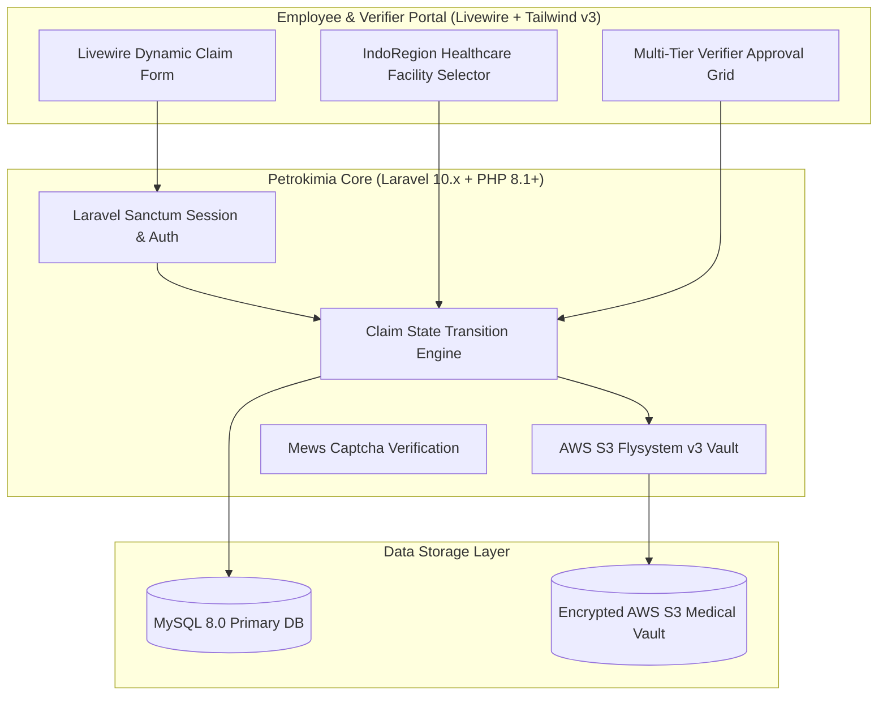

# 🏛️ Sistem Asuransi PT Petrokimia Gresik — System Architecture

---

## 📌 Executive Architecture Summary
Dokumen ini menguraikan arsitektur sistem klaim asuransi kesehatan karyawan berbasis Laravel 10 dan Livewire.

---

## 🏛️ System Architecture Diagram

---

### 📦 Komponen & Library Arsitektur Utama (Core Architectural Stack)
| Kategori Arsitektural | Package / Library | Versi Standar | Peran & Tanggung Jawab Sistem |
| :--- | :--- | :--- | :--- |
| **Backend Framework** | `laravel/framework` | `v10.x` | Enterprise Claim Processing & Business Logic |
| **Reactive UI** | `livewire/livewire` | `v2.x` | Server-Driven Real-time Dynamic UI Components |
| **Frontend Bundler** | `vite + laravel-vite-plugin` | `v4.x` | Modern ESM Asset Pipeline |
| **Cloud Storage** | `league/flysystem-aws-s3-v3` | `v3.x` | S3 Encrypted Medical Document Storage |
| **Regional Service** | `azishapidin/indoregion` | `v3.x` | Indonesia Province/City Health Facility Service |
| **Role-Based Access** | `spatie/laravel-permission` | `v5.x` | Employee, Verifier, and Medical Board Roles |
