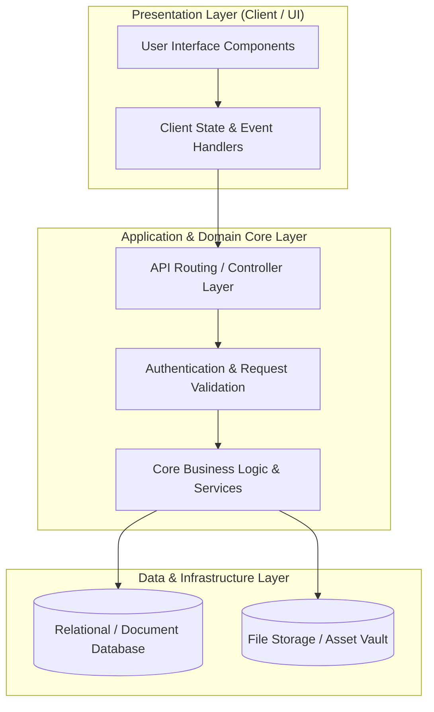

# 🏛️ Produk Lokal — System Architecture & Design Blueprint

---

## 📌 Executive Architecture Summary
Dokumen ini menguraikan arsitektur sistem, pemisahan lapisan logika (*Layer Separation*), alur transmisi data (*Data Flow*), integrasi database, dan manifest dependensi terverifikasi untuk subproyek **`produk-lokal`**.

---

## 🏛️ System Architecture Diagram

---

## 🔄 Lifecycle & Data Flow
1. **Request Ingestion:** Klien mengirimkan request terotentikasi melalui antarmuka pengguna ke endpoint API.
2. **Validation & Authorization:** Middleware memvalidasi integritas payload, sanitasi input, dan otorisasi hak akses peran pengguna.
3. **Domain Processing:** Service layer mengeksekusi logika bisnis, perhitungan data, dan manajemen status sistem.
4. **Persistence & Response:** Data transaksi disimpan ke database penyimpanan utama, dan status respons dikembalikan ke klien.

---

### 📦 Manifest Dependensi Terverifikasi (Direct from Codebase Manifests)
| Manifest Source | Package / Library | Version Constraint | Category & Architectural Role |
| :--- | :--- | :--- | :--- |
| `package.json` (`package.json`) | **`axios`** | `^0.19` | Dev Tool / Bundler |
| `package.json` (`package.json`) | **`cross-env`** | `^7.0` | Dev Tool / Bundler |
| `package.json` (`package.json`) | **`laravel-mix`** | `^5.0.1` | Dev Tool / Bundler |
| `package.json` (`package.json`) | **`lodash`** | `^4.17.19` | Dev Tool / Bundler |
| `package.json` (`package.json`) | **`resolve-url-loader`** | `^3.1.0` | Dev Tool / Bundler |
| `package.json` (`public\assets\backend\plugin\dropify\package.json`) | **`jquery`** | `*` | Production Dependency |
| `package.json` (`public\assets\backend\plugin\dropify\package.json`) | **`gulp`** | `^3.9.0` | Dev Tool / Bundler |
| `package.json` (`public\assets\backend\plugin\dropify\package.json`) | **`gulp-autoprefixer`** | `^3.1.0` | Dev Tool / Bundler |
| `package.json` (`public\assets\backend\plugin\dropify\package.json`) | **`gulp-header`** | `^1.7.1` | Dev Tool / Bundler |
| `package.json` (`public\assets\backend\plugin\dropify\package.json`) | **`gulp-load-plugins`** | `^1.2.0` | Dev Tool / Bundler |
| `package.json` (`public\assets\backend\plugin\dropify\package.json`) | **`gulp-minify-css`** | `1.2.4` | Dev Tool / Bundler |
| `package.json` (`public\assets\backend\plugin\dropify\package.json`) | **`gulp-plumber`** | `^1.0.1` | Dev Tool / Bundler |
| `package.json` (`public\assets\backend\plugin\dropify\package.json`) | **`gulp-sass`** | `^3.1.0` | Dev Tool / Bundler |
| `package.json` (`public\assets\backend\plugin\dropify\package.json`) | **`gulp-uglify`** | `^2.1.0` | Dev Tool / Bundler |
| `composer.json` (`composer.json`) | **`php`** | `^7.3` | Backend Framework Component |
| `composer.json` (`composer.json`) | **`anhskohbo/no-captcha`** | `^3.3` | Backend Framework Component |
| `composer.json` (`composer.json`) | **`barryvdh/laravel-dompdf`** | `^0.8.7` | Backend Framework Component |
| `composer.json` (`composer.json`) | **`doctrine/dbal`** | `^2.12` | Backend Framework Component |
| `composer.json` (`composer.json`) | **`fideloper/proxy`** | `^4.2` | Backend Framework Component |
| `composer.json` (`composer.json`) | **`fruitcake/laravel-cors`** | `^2.0` | Backend Framework Component |
| `composer.json` (`composer.json`) | **`fx3costa/laravelchartjs`** | `^2.8` | Backend Framework Component |
| `composer.json` (`composer.json`) | **`guzzlehttp/guzzle`** | `^7.0.1` | Backend Framework Component |
| `composer.json` (`composer.json`) | **`intervention/image`** | `^2.5` | Backend Framework Component |
| `composer.json` (`composer.json`) | **`laravel/framework`** | `^8.0` | Backend Framework Component |
| `composer.json` (`composer.json`) | **`laravel/legacy-factories`** | `^1.0` | Backend Framework Component |
| `composer.json` (`composer.json`) | **`laravel/tinker`** | `^2.0` | Backend Framework Component |
| `composer.json` (`composer.json`) | **`laravelcollective/html`** | `^6.2` | Backend Framework Component |
| `composer.json` (`composer.json`) | **`macsidigital/laravel-zoom`** | `^4.1` | Backend Framework Component |
| `composer.json` (`composer.json`) | **`milon/barcode`** | `^8.0` | Backend Framework Component |
| `composer.json` (`composer.json`) | **`shetabit/visitor`** | `^3.0` | Backend Framework Component |
| `composer.json` (`composer.json`) | **`spatie/laravel-permission`** | `^3.17` | Backend Framework Component |
| `composer.json` (`composer.json`) | **`torann/geoip`** | `^3.0` | Backend Framework Component |
| `composer.json` (`composer.json`) | **`tymon/jwt-auth`** | `^1.0` | Backend Framework Component |
| `composer.json` (`composer.json`) | **`yajra/laravel-datatables-oracle`** | `^9.14` | Backend Framework Component |
| `composer.json` (`composer.json`) | **`barryvdh/laravel-debugbar`** | `^3.5` | Dev / Testing Tool |

---

## 🔒 Security & Performance Considerations
* **Authentication & Authorization:** Mekanisme otentikasi berbasis token/session dengan kontrol hak akses berbasis peran (RBAC).
* **Data Sanitization:** Sanitasi input dan proteksi terhadap SQL Injection, XSS, dan CSRF.
* **Optimasi Kinerja:** Pemanfaatan caching dan query indexing untuk memastikan responsivitas sistem.
