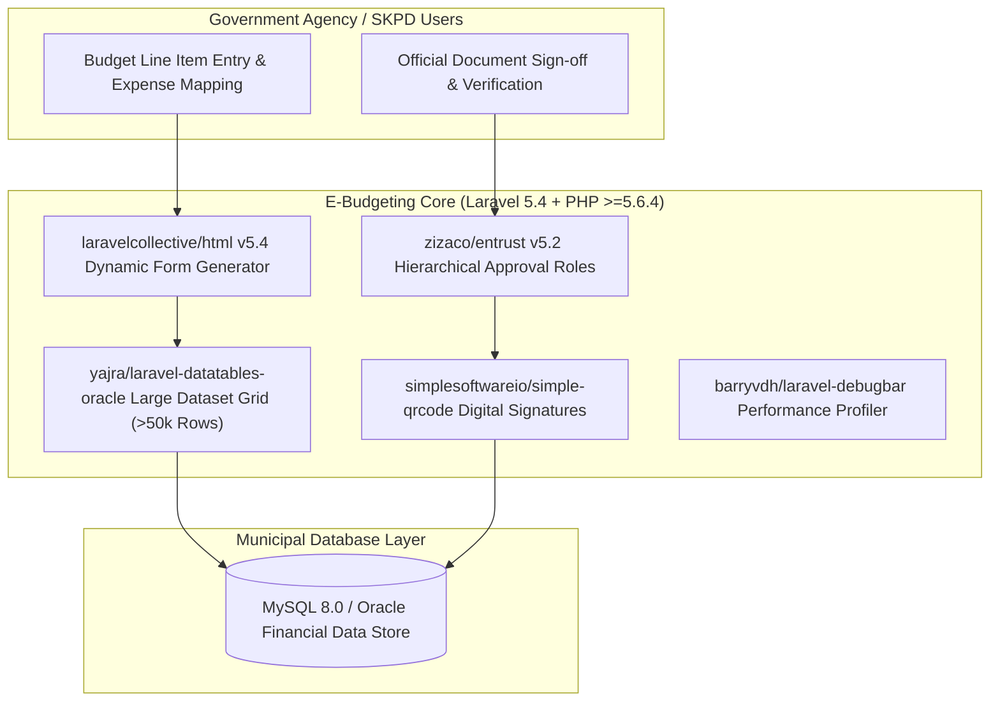

# 🏛️ E-Budgeting Regional Government Core (`e-budgeting`) — System Architecture

---

## 📌 Executive Architecture Summary
Dokumen ini memaparkan cetak biru arsitektur teknis (*system design blueprint*), pemisahan tanggung jawab komponen (*separation of concerns*), alur transmisi data (*data lifecycle*), serta manifest dependensi terverifikasi yang diambil langsung dari file manifest proyek (`package.json` & `composer.json`).

* **Pola Arsitektur Utama:** `High-Volume Municipal Financial Approval Platform with Oracle DataTables`
* **Fokus Rekayasa:** Keandalan sistem, latensi rendah, integritas data, dan keamanan transaksi.

---

## 🏛️ System Architecture Diagram

---

## 🔄 Lifecycle & Data Flow
1. **Budget Line Input:** SKPD operators input detailed municipal budget allocations.
2. **High-Performance Grid Rendering:** `yajra/laravel-datatables-oracle` performs server-side queries on datasets exceeding 50,000 budget items.
3. **Tiered Approval Workflow:** `zizaco/entrust` validates approval hierarchy from Staff, Head of Subdivision, to Head of Agency.
4. **Digital Signature Verification:** `simplesoftwareio/simple-qrcode` embeds dynamic QR validation tokens on signed municipal budget receipts.

---

### 📦 Manifest Dependensi Terverifikasi (Direct from Codebase Manifests)
| Manifest Source | Package / Library | Version Constraint | Category & Architectural Role |
| :--- | :--- | :--- | :--- |
| `package.json` (`package.json`) | **`axios`** | `^0.16.2` | Dev Tool / Bundler |
| `package.json` (`package.json`) | **`bootstrap-sass`** | `^3.3.7` | Dev Tool / Bundler |
| `package.json` (`package.json`) | **`cross-env`** | `^5.0.1` | Dev Tool / Bundler |
| `package.json` (`package.json`) | **`jquery`** | `^3.1.1` | Dev Tool / Bundler |
| `package.json` (`package.json`) | **`laravel-mix`** | `^1.0` | Dev Tool / Bundler |
| `package.json` (`package.json`) | **`lodash`** | `^4.17.4` | Dev Tool / Bundler |
| `package.json` (`package.json`) | **`vue`** | `^2.1.10` | Dev Tool / Bundler |
| `composer.json` (`composer.json`) | **`php`** | `>=5.6.4` | Backend Framework Component |
| `composer.json` (`composer.json`) | **`barryvdh/laravel-debugbar`** | `~2.4` | Backend Framework Component |
| `composer.json` (`composer.json`) | **`laravel/framework`** | `5.4.*` | Backend Framework Component |
| `composer.json` (`composer.json`) | **`laravel/tinker`** | `~1.0` | Backend Framework Component |
| `composer.json` (`composer.json`) | **`laravelcollective/html`** | `^5.4.0` | Backend Framework Component |
| `composer.json` (`composer.json`) | **`simplesoftwareio/simple-qrcode`** | `~2` | Backend Framework Component |
| `composer.json` (`composer.json`) | **`yajra/laravel-datatables`** | `1.0` | Backend Framework Component |
| `composer.json` (`composer.json`) | **`yajra/laravel-datatables-oracle`** | `~8.0` | Backend Framework Component |
| `composer.json` (`composer.json`) | **`zizaco/entrust`** | `5.2.x-dev` | Backend Framework Component |
| `composer.json` (`composer.json`) | **`fzaninotto/faker`** | `~1.4` | Dev / Testing Tool |
| `composer.json` (`composer.json`) | **`mockery/mockery`** | `0.9.*` | Dev / Testing Tool |
| `composer.json` (`composer.json`) | **`phpunit/phpunit`** | `~5.7` | Dev / Testing Tool |

---

## 🔒 Security & Access Control
- **Entrust RBAC Hierarchy:** Enforces strict government separation of approval powers.
- **Tamper-Evident QR Hashes:** Authenticates printed budget documents against live database records.

---

## ⚡ Performance & Scalability Considerations
- **Server-Side DataTables:** Zero browser freeze when paging through massive municipal budget books.
