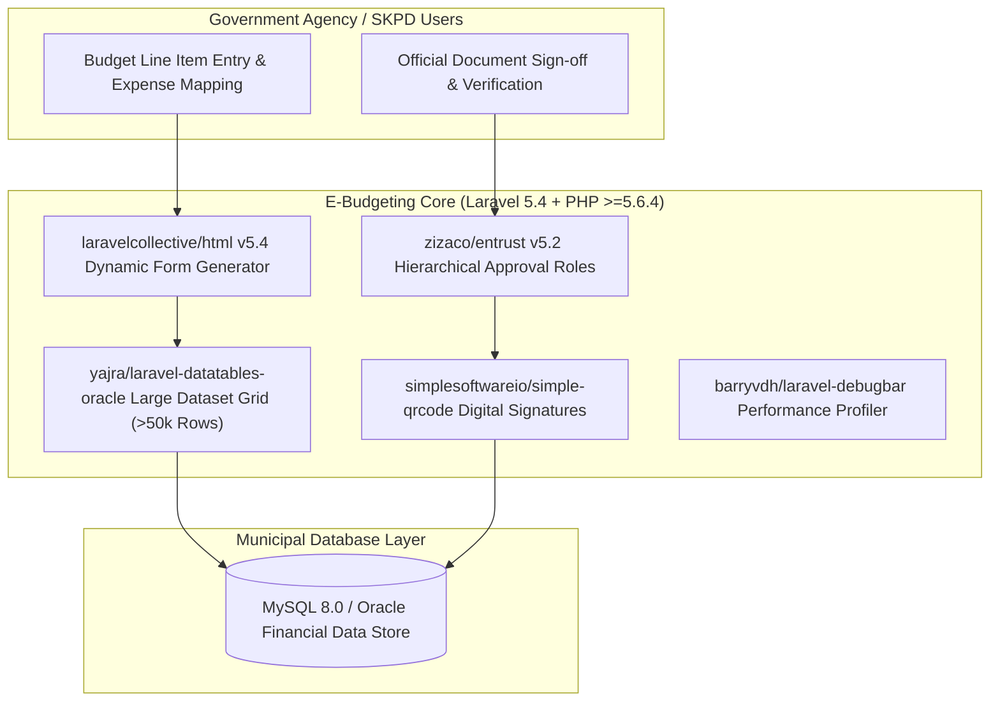

# 🏛️ E-Budgeting Regional Government Core (`e-budgeting`) — System Architecture

---

## 📌 Executive Architecture Summary
Dokumen ini memaparkan cetak biru arsitektur teknis (*system design blueprint*), pemisahan tanggung jawab komponen (*separation of concerns*), alur transmisi data (*data lifecycle*), serta manifest dependensi terverifikasi yang diambil langsung dari file manifest proyek (`package.json` & `composer.json`).

* **Pola Arsitektur Utama:** `High-Volume Municipal Financial Approval Platform with Oracle DataTables`
* **Fokus Rekayasa:** Keandalan sistem, latensi rendah, integritas data, dan keamanan transaksi.

---

## 🏛️ System Architecture Diagram

---

## 🔄 Lifecycle & Data Flow
1. **Budget Line Input:** SKPD operators input detailed municipal budget allocations.
2. **High-Performance Grid Rendering:** `yajra/laravel-datatables-oracle` performs server-side queries on datasets exceeding 50,000 budget items.
3. **Tiered Approval Workflow:** `zizaco/entrust` validates approval hierarchy from Staff, Head of Subdivision, to Head of Agency.
4. **Digital Signature Verification:** `simplesoftwareio/simple-qrcode` embeds dynamic QR validation tokens on signed municipal budget receipts.

---

### 📦 Komponen & Library Arsitektur Utama (Core Architectural Stack)
| Kategori Arsitektural | Package / Library | Versi Standar | Peran & Tanggung Jawab Sistem |
| :--- | :--- | :--- | :--- |
| **Backend Framework** | `laravel/framework` | `v5.x` | Municipal Budgeting Core Engine |
| **Large Dataset Tables** | `yajra/laravel-datatables-oracle` | `v8.x` | High-Performance Grid for >50k Line Items |
| **Hierarchical RBAC** | `zizaco/entrust` | `v5.x` | Government Agency Approval Hierarchy |
| **Digital Sign-off QR** | `simplesoftwareio/simple-qrcode` | `v2.x` | Dynamic QR Document Validation |

---

## 🔒 Security & Access Control
- **Entrust RBAC Hierarchy:** Enforces strict government separation of approval powers.
- **Tamper-Evident QR Hashes:** Authenticates printed budget documents against live database records.

---

## ⚡ Performance & Scalability Considerations
- **Server-Side DataTables:** Zero browser freeze when paging through massive municipal budget books.
