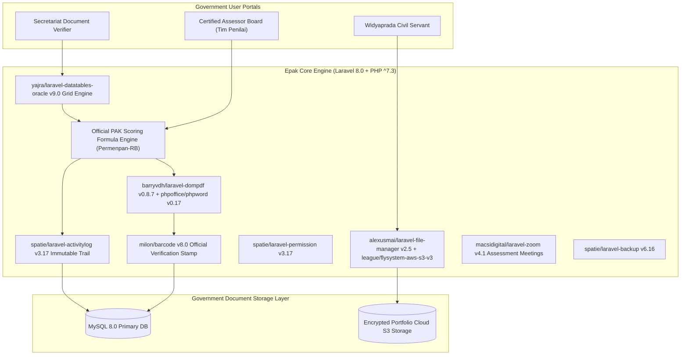

# 🏛️ Epak Widyaprada Kemdikbudristek RI (`epak-dev`) — System Architecture

---

## 📌 Executive Architecture Summary
Dokumen ini memaparkan cetak biru arsitektur teknis (*system design blueprint*), pemisahan tanggung jawab komponen (*separation of concerns*), alur transmisi data (*data lifecycle*), serta manifest dependensi terverifikasi yang diambil langsung dari file manifest proyek (`package.json` & `composer.json`).

* **Pola Arsitektur Utama:** `National Civil Servant Credit Scoring Platform & Document Security Pipeline`
* **Fokus Rekayasa:** Keandalan sistem, latensi rendah, integritas data, dan keamanan transaksi.

---

## 🏛️ System Architecture Diagram

---

## 🔄 Lifecycle & Data Flow
1. **Portfolio Evidence Upload:** Civil servants upload promotion evidence via `alexusmai/laravel-file-manager` to cloud S3 storage (`league/flysystem-aws-s3-v3`).
2. **Secretariat Pre-screening:** Verifiers filter submissions using high-performance `yajra/laravel-datatables-oracle` server-side tables.
3. **Assessment Scoring:** Certified assessors evaluate portfolio points; every score mutation is immutably logged via `spatie/laravel-activitylog`.
4. **Legal Document Issuance:** Generates official Penetapan Angka Kredit (PAK) PDF via `barryvdh/laravel-dompdf` stamped with unique QR barcodes (`milon/barcode`).

---

### 📦 Manifest Dependensi Terverifikasi (Direct from Codebase Manifests)
| Manifest Source | Package / Library | Version Constraint | Category & Architectural Role |
| :--- | :--- | :--- | :--- |
| `package.json` (`package.json`) | **`axios`** | `^0.19` | Dev Tool / Bundler |
| `package.json` (`package.json`) | **`cross-env`** | `^7.0` | Dev Tool / Bundler |
| `package.json` (`package.json`) | **`laravel-mix`** | `^5.0.1` | Dev Tool / Bundler |
| `package.json` (`package.json`) | **`lodash`** | `^4.17.19` | Dev Tool / Bundler |
| `package.json` (`package.json`) | **`resolve-url-loader`** | `^3.1.0` | Dev Tool / Bundler |
| `package.json` (`public\assets\backend\plugin\dropify\package.json`) | **`jquery`** | `*` | Production Dependency |
| `package.json` (`public\assets\backend\plugin\dropify\package.json`) | **`gulp`** | `^3.9.0` | Dev Tool / Bundler |
| `package.json` (`public\assets\backend\plugin\dropify\package.json`) | **`gulp-autoprefixer`** | `^3.1.0` | Dev Tool / Bundler |
| `package.json` (`public\assets\backend\plugin\dropify\package.json`) | **`gulp-header`** | `^1.7.1` | Dev Tool / Bundler |
| `package.json` (`public\assets\backend\plugin\dropify\package.json`) | **`gulp-load-plugins`** | `^1.2.0` | Dev Tool / Bundler |
| `package.json` (`public\assets\backend\plugin\dropify\package.json`) | **`gulp-minify-css`** | `1.2.4` | Dev Tool / Bundler |
| `package.json` (`public\assets\backend\plugin\dropify\package.json`) | **`gulp-plumber`** | `^1.0.1` | Dev Tool / Bundler |
| `package.json` (`public\assets\backend\plugin\dropify\package.json`) | **`gulp-sass`** | `^3.1.0` | Dev Tool / Bundler |
| `package.json` (`public\assets\backend\plugin\dropify\package.json`) | **`gulp-uglify`** | `^2.1.0` | Dev Tool / Bundler |
| `composer.json` (`composer.json`) | **`php`** | `^7.3` | Backend Framework Component |
| `composer.json` (`composer.json`) | **`alexusmai/laravel-file-manager`** | `^2.5` | Backend Framework Component |
| `composer.json` (`composer.json`) | **`anhskohbo/no-captcha`** | `^3.3` | Backend Framework Component |
| `composer.json` (`composer.json`) | **`barryvdh/laravel-dompdf`** | `^0.8.7` | Backend Framework Component |
| `composer.json` (`composer.json`) | **`doctrine/dbal`** | `^2.12` | Backend Framework Component |
| `composer.json` (`composer.json`) | **`fideloper/proxy`** | `^4.2` | Backend Framework Component |
| `composer.json` (`composer.json`) | **`fruitcake/laravel-cors`** | `^2.0` | Backend Framework Component |
| `composer.json` (`composer.json`) | **`fx3costa/laravelchartjs`** | `^2.8` | Backend Framework Component |
| `composer.json` (`composer.json`) | **`guzzlehttp/guzzle`** | `^7.0.1` | Backend Framework Component |
| `composer.json` (`composer.json`) | **`intervention/image`** | `^2.5` | Backend Framework Component |
| `composer.json` (`composer.json`) | **`laravel/framework`** | `^8.0` | Backend Framework Component |
| `composer.json` (`composer.json`) | **`laravel/legacy-factories`** | `^1.0` | Backend Framework Component |
| `composer.json` (`composer.json`) | **`laravel/tinker`** | `^2.0` | Backend Framework Component |
| `composer.json` (`composer.json`) | **`laravel/ui`** | `^3.2` | Backend Framework Component |
| `composer.json` (`composer.json`) | **`laravelcollective/html`** | `^6.2` | Backend Framework Component |
| `composer.json` (`composer.json`) | **`league/flysystem-aws-s3-v3`** | `^1.0` | Backend Framework Component |
| `composer.json` (`composer.json`) | **`maatwebsite/excel`** | `^3.1` | Backend Framework Component |
| `composer.json` (`composer.json`) | **`macsidigital/laravel-zoom`** | `^4.1` | Backend Framework Component |
| `composer.json` (`composer.json`) | **`mews/captcha`** | `^3.2` | Backend Framework Component |
| `composer.json` (`composer.json`) | **`milon/barcode`** | `^8.0` | Backend Framework Component |
| `composer.json` (`composer.json`) | **`phpoffice/phpword`** | `^0.17.0` | Backend Framework Component |

---

## 🔒 Security & Access Control
- **Spatie Multi-Tier RBAC:** Strict separation of duties between candidate, secretariat, and assessor.
- **Spatie Activity Log:** Complete audit trail tracking user ID, IP address (`torann/geoip`), and exact point changes.

---

## ⚡ Performance & Scalability Considerations
- **Yajra DataTables:** Server-side pagination handles tens of thousands of educator submissions smoothly.
