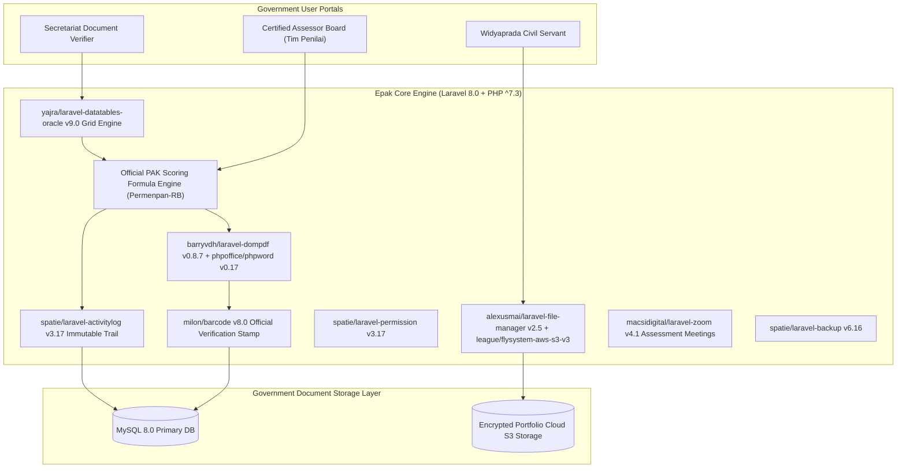

# 🏛️ Epak Widyaprada Kemdikbudristek RI (`epak-dev`) — System Architecture

---

## 📌 Executive Architecture Summary
Dokumen ini memaparkan cetak biru arsitektur teknis (*system design blueprint*), pemisahan tanggung jawab komponen (*separation of concerns*), alur transmisi data (*data lifecycle*), serta manifest dependensi terverifikasi yang diambil langsung dari file manifest proyek (`package.json` & `composer.json`).

* **Pola Arsitektur Utama:** `National Civil Servant Credit Scoring Platform & Document Security Pipeline`
* **Fokus Rekayasa:** Keandalan sistem, latensi rendah, integritas data, dan keamanan transaksi.

---

## 🏛️ System Architecture Diagram

---

## 🔄 Lifecycle & Data Flow
1. **Portfolio Evidence Upload:** Civil servants upload promotion evidence via `alexusmai/laravel-file-manager` to cloud S3 storage (`league/flysystem-aws-s3-v3`).
2. **Secretariat Pre-screening:** Verifiers filter submissions using high-performance `yajra/laravel-datatables-oracle` server-side tables.
3. **Assessment Scoring:** Certified assessors evaluate portfolio points; every score mutation is immutably logged via `spatie/laravel-activitylog`.
4. **Legal Document Issuance:** Generates official Penetapan Angka Kredit (PAK) PDF via `barryvdh/laravel-dompdf` stamped with unique QR barcodes (`milon/barcode`).

---

### 📦 Komponen & Library Arsitektur Utama (Core Architectural Stack)
| Kategori Arsitektural | Package / Library | Versi Standar | Peran & Tanggung Jawab Sistem |
| :--- | :--- | :--- | :--- |
| **Backend Framework** | `laravel/framework` | `v8.x` | Government Assessment Core Engine |
| **Secure Document Vault** | `alexusmai/laravel-file-manager + S3` | `v2.x` | Cloud Portfolio Evidence Vault |
| **High-Performance Grid** | `yajra/laravel-datatables-oracle` | `v9.x` | Server-Side Table Engine for Large Cohorts |
| **Immutable Audit Trail** | `spatie/laravel-activitylog` | `v3.x+` | Assessor Activity & Point Mutation Logging |
| **Official PAK Generator** | `barryvdh/laravel-dompdf + phpword` | `v0.8+` | Legally Binding Government Certificate Generator |
| **Digital Verification Stamp** | `milon/barcode` | `v8.x` | Security QR Stamp & Certificate Validation |
| **Virtual Assessment Meet** | `macsidigital/laravel-zoom` | `v4.x` | Zoom Integration for Candidate Oral Exams |
| **Role-Based Access (RBAC)** | `spatie/laravel-permission` | `v3.x+` | Multi-Tier Separation of Duties |

---

## 🔒 Security & Access Control
- **Spatie Multi-Tier RBAC:** Strict separation of duties between candidate, secretariat, and assessor.
- **Spatie Activity Log:** Complete audit trail tracking user ID, IP address (`torann/geoip`), and exact point changes.

---

## ⚡ Performance & Scalability Considerations
- **Yajra DataTables:** Server-side pagination handles tens of thousands of educator submissions smoothly.
