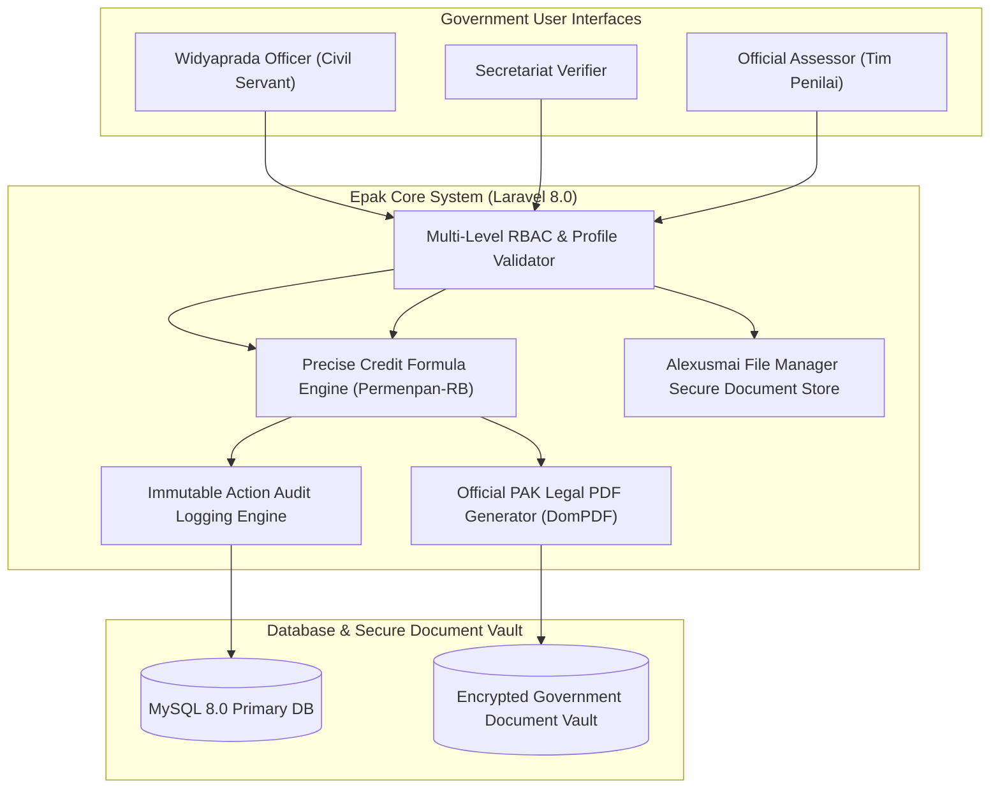

# 🏛️ Epak Widyaprada (Kemdikbudristek RI) — Architecture

---

## 📌 Executive Architecture Summary
Dokumen ini memaparkan cetak biru arsitektur teknis (*system design blueprint*), pemisahan tanggung jawab komponen (*separation of concerns*), alur transmisi data (*data lifecycle*), serta pertimbangan keamanan dan skalabilitas untuk **`epak-dev`**.

* **Pola Arsitektur Utama:** `Multi-Tier Government Audit Trail & Legal Document Pipeline`
* **Fokus Rekayasa:** Keandalan sistem, latensi rendah, integritas data, dan keamanan transaksi.

---

## 🏛️ System Architecture Diagram

---

## 🔄 Lifecycle & Data Flow
1. **Portfolio Submission:** Civil servant officers upload work evidence portfolios into the secured document manager.
2. **Secretariat Pre-Screening:** Verifiers check document completeness before forwarding to certified assessors.
3. **Assessment & Credit Scoring:** Evaluators score criteria according to official ministerial scoring matrices.
4. **Official PAK Issuance:** Generates legally binding PDF Penetapan Angka Kredit (PAK) with digital signature stamps.

---

## 🔒 Security & Access Control
- **Multi-Tier Separation of Duties:** Assessors cannot evaluate candidates without prior secretariat clearance.
- **Comprehensive Audit Trail:** Logs every point modification with timestamp and assessor ID.

---

## ⚡ Performance & Scalability Considerations
- **Database Indexing:** Indexed candidate records ensure rapid calculation across nationwide cohorts.
