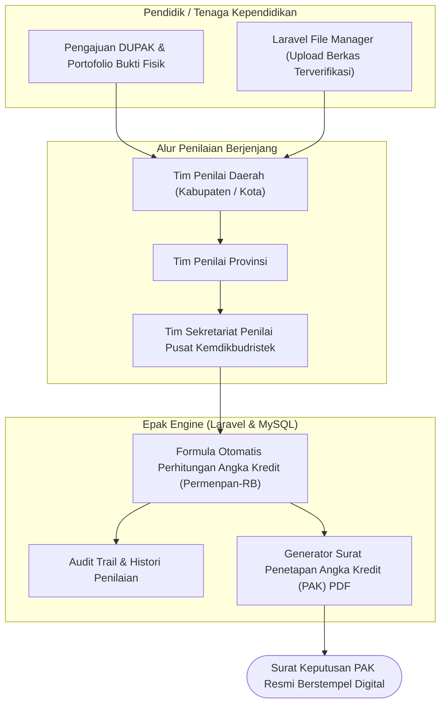

# Epak Widyaprada — Kemdikbudristek Credit Score Assessment System

## 📌 Ringkasan Eksekutif & Identitas Proyek
- **Perusahaan / Organisasi:** PT Qira Teknologi Indonesia / Kemdikbudristek RI
- **Peran & Tanggung Jawab:** Lead Software Engineer
- **Tipe Sistem:** National Government Credit Scoring & Promotion Management System

---

## 🎯 Latar Belakang & Masalah (Problem Statement)
Kementerian Pendidikan, Kebudayaan, Riset, dan Teknologi (Kemdikbudristek) membutuhkan platform resmi nasional untuk proses pengajuan, verifikasi berkas, dan perhitungan angka kredit jabatan fungsional Widyaprada secara transparan dan akurat.

## 💡 Solusi & Nilai Bisnis (Solution & Business Value)
Membangun sistem web enterprise berbasis Laravel dengan modul perhitungan angka kredit otomatis, verifikasi berkas berkas digital (`alexusmai/laravel-file-manager`), penerbitan penetapan angka kredit (PAK) PDF resmi (`barryvdh/dompdf`), dan visualisasi grafik kelulusan.

---

## 🛠️ Tech Stack & Arsitektur Lengkap

### 📦 Versi Framework & Runtime Utama (Core Technology Versions)
| Komponen / Framework | Versi Spesifik | Keterangan & Peran Arsitektural |
| :--- | :--- | :--- |
| **Laravel Framework** | `v8.0.x` | Official Kemdikbudristek Assessment Platform |
| **PHP Runtime** | `v7.3 / v8.0+` | High-Precision Credit Calculation Engine |
| **File Manager** | `alexusmai/laravel-file-manager v2.x` | Secure Government Portfolio Document Vault |
| **DomPDF Engine** | `barryvdh/laravel-dompdf v0.9+` | Official PAK Certificate Formatting Engine |
| **MySQL Database** | `v8.0` | Multi-Tier Assessor Audit Trail Database |

### 🏛️ Diagram Alur Arsitektur Sistem (System Architecture)

| Layer / Domain | Teknologi / Library | Keterangan Arsitektural |
| :--- | :--- | :--- |
| **Backend Core** | `Laravel, PHP, MySQL, Doctrine DBAL` | Implementasi arsitektural |
| **File & Document Management** | `Alexusmai Laravel File Manager, Intervention Image` | Implementasi arsitektural |
| **PDF Generation** | `Barryvdh DomPDF (Official Government Certificate formatting)` | Implementasi arsitektural |
| **Security & Anti-Bot** | `Google NoCaptcha, Fideloper Proxy, Fruitcake CORS` | Implementasi arsitektural |
| **Analytics** | `FX3Costa LaravelChartJS, GuzzleHttp` | Implementasi arsitektural |

---

## 🚀 Fitur-Fitur Kunci & Rekayasa Teknis
- **Credit Score Calculation Engine:** Algoritma otomatis penghitungan angka kredit butir kegiatan Widyaprada.
- **Multi-Tier Assessor Verification:** Alur verifikasi berjenjang oleh tim penilai dari tingkat daerah hingga pusat.
- **Digital File Repository:** Manajemen penyimpanan berkas portofolio bukti kegiatan resmi pendidik.
- **Official PAK PDF Generator:** Generator surat Penetapan Angka Kredit (PAK) resmi berstempel digital.

---

## 📈 Metrik, Dampak & Hasil Terukur (Google XYZ Formula)
- **Memproses ribuan berkas pengajuan angka kredit aparatur sipil negara di seluruh Indonesia.**
- **Memangkas waktu proses penilaian dari 3 bulan menjadi kurang dari 2 minggu.**
- **Akurasi perhitungan formula angka kredit 100% sesuai regulasi Permenpan-RB.**

---

## 🌟 Poin Resume Siap Pakai (Resume Ready Bullets)
* *Architected official national credit scoring platform (Epak Widyaprada) for Kemdikbudristek RI using Laravel and MySQL.*
* *Engineered automated calculation engine for assessing civil servant educator promotion credit points.*
* *Implemented multi-tier verification workflows and secure digital document management via Laravel File Manager.*
* *Developed automated PDF generator for official government credit determination certificates (PAK).*