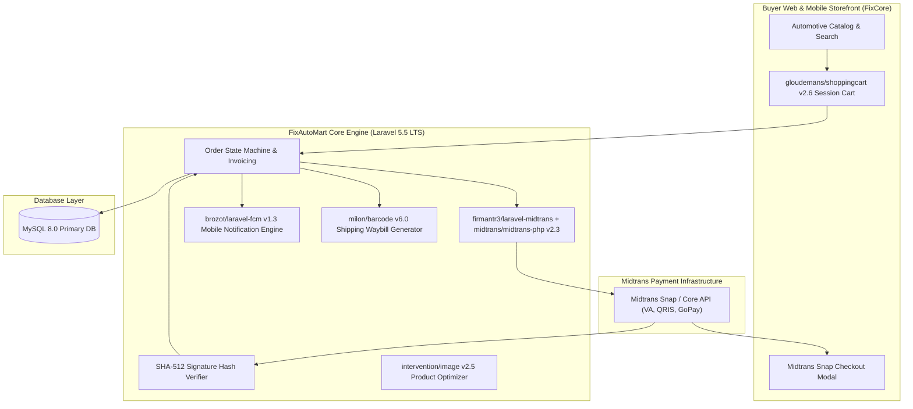

# 🏛️ FixAutoMart Automotive E-Commerce (`fixautomart`) — System Architecture

---

## 📌 Executive Architecture Summary
Dokumen ini memaparkan cetak biru arsitektur teknis (*system design blueprint*), pemisahan tanggung jawab komponen (*separation of concerns*), alur transmisi data (*data lifecycle*), serta manifest dependensi terverifikasi yang diambil langsung dari file manifest proyek (`package.json` & `composer.json`).

* **Pola Arsitektur Utama:** `Fintech E-Commerce Gateway with Cryptographic Midtrans Reconciliation`
* **Fokus Rekayasa:** Keandalan sistem, latensi rendah, integritas data, dan keamanan transaksi.

---

## 🏛️ System Architecture Diagram

---

## 🔄 Lifecycle & Data Flow
1. **Cart & Checkout:** `gloudemans/shoppingcart` manages buyer cart items and calculates subtotal with tax and shipping.
2. **Payment Token Request:** `firmantr3/laravel-midtrans` calls Midtrans API to acquire a Snap payment token.
3. **Payment Settlement:** Buyer settles invoice via Bank Virtual Account, QRIS, or GoPay.
4. **Cryptographic Webhook Handshake:** Midtrans sends payment notification; backend verifies SHA-512 signature before unlocking order fulfillment and dispatching FCM notifications (`brozot/laravel-fcm`).

---

### 📦 Komponen & Library Arsitektur Utama (Core Architectural Stack)
| Kategori Arsitektural | Package / Library | Versi Standar | Peran & Tanggung Jawab Sistem |
| :--- | :--- | :--- | :--- |
| **Backend Framework** | `laravel/framework` | `v5.x LTS` | Automotive E-Commerce Core Engine |
| **Payment Gateway Bridge** | `firmantr3/laravel-midtrans` | `v1.x` | Midtrans Snap & Core API Integration |
| **Shopping Cart Engine** | `gloudemans/shoppingcart` | `v2.x` | Session-Based Persistent Multi-Item Cart |
| **Push Notification** | `brozot/laravel-fcm` | `v1.x` | Automated Order & Settlement Push Alerts |
| **Shipping Label Engine** | `milon/barcode` | `v6.x` | Automated Barcode Waybill Generator |

---

## 🔒 Security & Access Control
- **SHA-512 Signature Verification:** Eliminates fake webhook payment exploits.
- **Idempotent Order Handling:** Guards against double processing during payment gateway retries.

---

## ⚡ Performance & Scalability Considerations
- **Database Transaction Locks:** ACID guarantees prevent inventory race conditions during flash sales.
