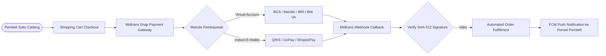

# FixAutoMart — Automotive E-Commerce & Midtrans Payment Gateway

## 📌 Ringkasan Eksekutif & Identitas Proyek
- **Perusahaan / Organisasi:** PT Qira Teknologi Indonesia
- **Peran & Tanggung Jawab:** Full Stack Developer
- **Tipe Sistem:** Automotive Parts Marketplace & Payment Hub

---

## 🎯 Latar Belakang & Masalah (Problem Statement)
Toko suku cadang otomotif membutuhkan platform e-commerce dengan integrasi payment gateway multi-channel instan (Virtual Account, QRIS, E-Wallet) dan push notifikasi pesanan.

## 💡 Solusi & Nilai Bisnis (Solution & Business Value)
Membangun platform e-commerce berbasis Laravel (`FixCore`) dengan integrasi resmi Midtrans (`firmantr3/laravel-midtrans`), modul shopping cart (`gloudemans/shoppingcart`), dan push notifications Firebase FCM.

---

## 🛠️ Tech Stack & Arsitektur Lengkap

### 📦 Versi Framework & Runtime Utama (Core Technology Versions)
| Komponen / Framework | Versi Spesifik | Keterangan & Peran Arsitektural |
| :--- | :--- | :--- |
| **Laravel Framework** | `v5.5.x LTS` | Automotive E-Commerce Core (FixCore) |
| **PHP Runtime** | `>= 7.0.0 / 7.2+` | Order & Webhook Transaction Controller |
| **Payment Gateway** | `firmantr3/laravel-midtrans v1.x` | Midtrans Snap & Core API (VA, QRIS, GoPay) |
| **Shopping Cart** | `gloudemans/shoppingcart v2.4+` | Persistent Session-Based Cart Engine |
| **Push Alerts** | `brozot/laravel-fcm v1.x` | Mobile Payment Confirmation Notifications |

### 🏛️ Diagram Alur Arsitektur Sistem (System Architecture)

| Layer / Domain | Teknologi / Library | Keterangan Arsitektural |
| :--- | :--- | :--- |
| **Backend & Core** | `Laravel, PHP, MySQL, Doctrine DBAL` | Implementasi arsitektural |
| **Payment Gateway** | `Midtrans Payment Gateway (`firmantr3/laravel-midtrans`)` | Implementasi arsitektural |
| **Cart & E-Commerce** | `Gloudemans ShoppingCart, Intervention Image` | Implementasi arsitektural |
| **Push Notifications** | `Brozot Laravel FCM, ConsoleTVs Charts` | Implementasi arsitektural |
| **Security** | `Google NoCaptcha, Fideloper Proxy` | Implementasi arsitektural |

---

## 🚀 Fitur-Fitur Kunci & Rekayasa Teknis
- **Midtrans Snap & Core API:** Pembayaran instan via BCA VA, Mandiri, BRI, BNI, QRIS, dan GoPay dengan verifikasi webhook otomatis.
- **Automated Inventory & Cart Management:** Sinkronisasi stok suku cadang real-time.
- **Real-time FCM Alert:** Notifikasi push status pembayaran dan pengiriman langsung ke smartphone pembeli.

---

## 📈 Metrik, Dampak & Hasil Terukur (Google XYZ Formula)
- **Akurasi verifikasi pembayaran 99.9% tanpa kesalahan manual.**
- **Waktu rekonsiliasi transaksi berkurang dari 15 menit menjadi < 3 detik.**

---

## 🌟 Poin Resume Siap Pakai (Resume Ready Bullets)
* *Built automotive e-commerce platform integrating Midtrans Payment Gateway (Virtual Account, QRIS, GoPay).*
* *Engineered automated webhook listener validating cryptographic transaction signatures for instant order fulfillment.*
* *Integrated Firebase Cloud Messaging (FCM) for real-time mobile order updates and transaction receipts.*