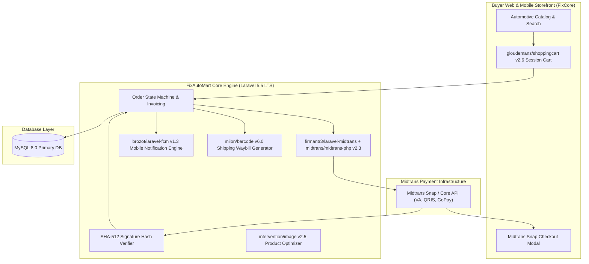

# 🏛️ FixAutoMart Automotive E-Commerce (`fixautomart`) — System Architecture

---

## 📌 Executive Architecture Summary
Dokumen ini memaparkan cetak biru arsitektur teknis (*system design blueprint*), pemisahan tanggung jawab komponen (*separation of concerns*), alur transmisi data (*data lifecycle*), serta manifest dependensi terverifikasi yang diambil langsung dari file manifest proyek (`package.json` & `composer.json`).

* **Pola Arsitektur Utama:** `Fintech E-Commerce Gateway with Cryptographic Midtrans Reconciliation`
* **Fokus Rekayasa:** Keandalan sistem, latensi rendah, integritas data, dan keamanan transaksi.

---

## 🏛️ System Architecture Diagram

---

## 🔄 Lifecycle & Data Flow
1. **Cart & Checkout:** `gloudemans/shoppingcart` manages buyer cart items and calculates subtotal with tax and shipping.
2. **Payment Token Request:** `firmantr3/laravel-midtrans` calls Midtrans API to acquire a Snap payment token.
3. **Payment Settlement:** Buyer settles invoice via Bank Virtual Account, QRIS, or GoPay.
4. **Cryptographic Webhook Handshake:** Midtrans sends payment notification; backend verifies SHA-512 signature before unlocking order fulfillment and dispatching FCM notifications (`brozot/laravel-fcm`).

---

### 📦 Manifest Dependensi Terverifikasi (Direct from Codebase Manifests)
| Manifest Source | Package / Library | Version Constraint | Category & Architectural Role |
| :--- | :--- | :--- | :--- |
| `package.json` (`FixCore\package.json`) | **`axios`** | `^0.17` | Dev Tool / Bundler |
| `package.json` (`FixCore\package.json`) | **`bootstrap-sass`** | `^3.3.7` | Dev Tool / Bundler |
| `package.json` (`FixCore\package.json`) | **`cross-env`** | `^5.1` | Dev Tool / Bundler |
| `package.json` (`FixCore\package.json`) | **`jquery`** | `^3.2` | Dev Tool / Bundler |
| `package.json` (`FixCore\package.json`) | **`laravel-mix`** | `^1.0` | Dev Tool / Bundler |
| `package.json` (`FixCore\package.json`) | **`lodash`** | `^4.17.4` | Dev Tool / Bundler |
| `package.json` (`FixCore\package.json`) | **`vue`** | `^2.5.7` | Dev Tool / Bundler |
| `composer.json` (`FixCore\composer.json`) | **`php`** | `>=7.0.0` | Backend Framework Component |
| `composer.json` (`FixCore\composer.json`) | **`anhskohbo/no-captcha`** | `^3.2` | Backend Framework Component |
| `composer.json` (`FixCore\composer.json`) | **`brozot/laravel-fcm`** | `^1.3` | Backend Framework Component |
| `composer.json` (`FixCore\composer.json`) | **`consoletvs/charts`** | `5.*` | Backend Framework Component |
| `composer.json` (`FixCore\composer.json`) | **`doctrine/dbal`** | `^2.11` | Backend Framework Component |
| `composer.json` (`FixCore\composer.json`) | **`fideloper/proxy`** | `~3.3` | Backend Framework Component |
| `composer.json` (`FixCore\composer.json`) | **`firmantr3/laravel-midtrans`** | `^1.0` | Backend Framework Component |
| `composer.json` (`FixCore\composer.json`) | **`gloudemans/shoppingcart`** | `^2.6` | Backend Framework Component |
| `composer.json` (`FixCore\composer.json`) | **`intervention/image`** | `^2.5` | Backend Framework Component |
| `composer.json` (`FixCore\composer.json`) | **`laravel/framework`** | `5.5.*` | Backend Framework Component |
| `composer.json` (`FixCore\composer.json`) | **`laravel/tinker`** | `~1.0` | Backend Framework Component |
| `composer.json` (`FixCore\composer.json`) | **`laravelcollective/html`** | `^5.3.0` | Backend Framework Component |
| `composer.json` (`FixCore\composer.json`) | **`midtrans/midtrans-php`** | `^2.3` | Backend Framework Component |
| `composer.json` (`FixCore\composer.json`) | **`milon/barcode`** | `6.0` | Backend Framework Component |
| `composer.json` (`FixCore\composer.json`) | **`barryvdh/laravel-debugbar`** | `^3.3` | Dev / Testing Tool |
| `composer.json` (`FixCore\composer.json`) | **`filp/whoops`** | `~2.0` | Dev / Testing Tool |
| `composer.json` (`FixCore\composer.json`) | **`fzaninotto/faker`** | `~1.4` | Dev / Testing Tool |
| `composer.json` (`FixCore\composer.json`) | **`mockery/mockery`** | `~1.0` | Dev / Testing Tool |
| `composer.json` (`FixCore\composer.json`) | **`phpunit/phpunit`** | `~6.0` | Dev / Testing Tool |
| `composer.json` (`FixCore\composer.json`) | **`symfony/thanks`** | `^1.0` | Dev / Testing Tool |

---

## 🔒 Security & Access Control
- **SHA-512 Signature Verification:** Eliminates fake webhook payment exploits.
- **Idempotent Order Handling:** Guards against double processing during payment gateway retries.

---

## ⚡ Performance & Scalability Considerations
- **Database Transaction Locks:** ACID guarantees prevent inventory race conditions during flash sales.
