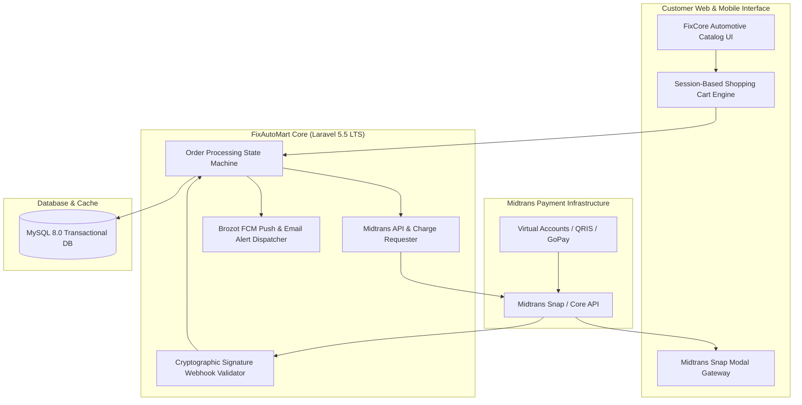

# 🏛️ FixAutoMart E-Commerce — Payment Architecture

---

## 📌 Executive Architecture Summary
Dokumen ini memaparkan cetak biru arsitektur teknis (*system design blueprint*), pemisahan tanggung jawab komponen (*separation of concerns*), alur transmisi data (*data lifecycle*), serta pertimbangan keamanan dan skalabilitas untuk **`fixautomart`**.

* **Pola Arsitektur Utama:** `Fintech E-Commerce Gateway with Cryptographic Webhook Reconciliation`
* **Fokus Rekayasa:** Keandalan sistem, latensi rendah, integritas data, dan keamanan transaksi.

---

## 🏛️ System Architecture Diagram

---

## 🔄 Lifecycle & Data Flow
1. **Order Checkout:** Buyer items are compiled from the shopping cart into an unpaid order record.
2. **Payment Token Request:** Backend requests a Snap token from Midtrans with order details and price breakdown.
3. **Customer Payment:** Buyer settles payment via Bank Transfer (VA), QRIS, or e-Wallet.
4. **Webhook Verification:** Midtrans calls the webhook URL; backend computes SHA-512 `hash(order_id + status_code + gross_amount + server_key)` to verify authenticity before unlocking order fulfillment.

---

## 🔒 Security & Access Control
- **SHA-512 Signature Hash Verification:** Protects against fake webhook payment injection attacks.
- **Idempotent Webhook Processing:** Prevents duplicate order fulfillment on network retries.

---

## ⚡ Performance & Scalability Considerations
- **Database Transactions:** ACID-compliant database locking guarantees inventory consistency during peak sales.
