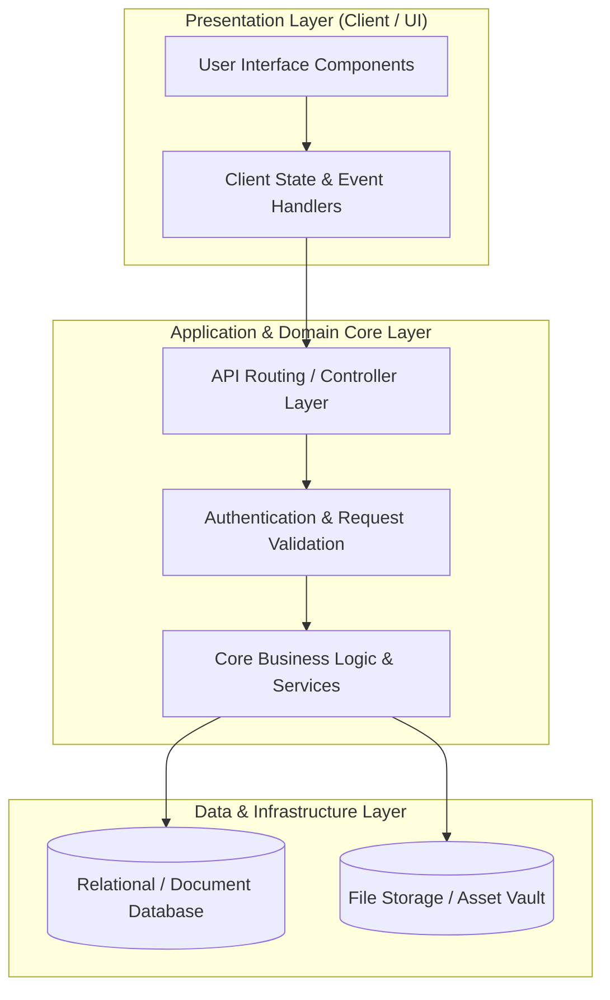

# 🏛️ Growth2 — System Architecture & Design Blueprint

---

## 📌 Executive Architecture Summary
Dokumen ini menguraikan arsitektur sistem, pemisahan lapisan logika (*Layer Separation*), alur transmisi data (*Data Flow*), integrasi database, dan manifest dependensi terverifikasi untuk subproyek **`growth2`**.

---

## 🏛️ System Architecture Diagram

---

## 🔄 Lifecycle & Data Flow
1. **Request Ingestion:** Klien mengirimkan request terotentikasi melalui antarmuka pengguna ke endpoint API.
2. **Validation & Authorization:** Middleware memvalidasi integritas payload, sanitasi input, dan otorisasi hak akses peran pengguna.
3. **Domain Processing:** Service layer mengeksekusi logika bisnis, perhitungan data, dan manajemen status sistem.
4. **Persistence & Response:** Data transaksi disimpan ke database penyimpanan utama, dan status respons dikembalikan ke klien.

---

### 📦 Manifest Dependensi Terverifikasi (Direct from Codebase Manifests)
| Manifest Source | Package / Library | Version Constraint | Category & Architectural Role |
| :--- | :--- | :--- | :--- |
| `package.json` (`growth\package.json`) | **`bootstrap-sass`** | `^3.0.0` | Production Dependency |
| `package.json` (`growth\package.json`) | **`laravel-elixir`** | `^4.0.0` | Production Dependency |
| `package.json` (`growth\package.json`) | **`toastr`** | `^2.1.2` | Production Dependency |
| `package.json` (`growth\package.json`) | **`gulp`** | `^3.9.1` | Dev Tool / Bundler |
| `package.json` (`growth\package.json`) | **`gulp-rename`** | `^1.2.2` | Dev Tool / Bundler |
| `package.json` (`growth\package.json`) | **`gulp-replace`** | `^0.6.1` | Dev Tool / Bundler |
| `composer.json` (`growth\composer.json`) | **`php`** | `>=5.5.9` | Backend Framework Component |
| `composer.json` (`growth\composer.json`) | **`laravel/framework`** | `5.2.*` | Backend Framework Component |
| `composer.json` (`growth\composer.json`) | **`maatwebsite/excel`** | `~2.0.0` | Backend Framework Component |
| `composer.json` (`growth\composer.json`) | **`khill/lavacharts`** | `3.0.*` | Backend Framework Component |
| `composer.json` (`growth\composer.json`) | **`brozot/laravel-fcm`** | `^1.2` | Backend Framework Component |
| `composer.json` (`growth\composer.json`) | **`barryvdh/laravel-ide-helper`** | `v2.4.1` | Backend Framework Component |
| `composer.json` (`growth\composer.json`) | **`intervention/image`** | `^2.4` | Backend Framework Component |
| `composer.json` (`growth\composer.json`) | **`laravelcollective/html`** | `^5.2.0` | Backend Framework Component |
| `composer.json` (`growth\composer.json`) | **`fzaninotto/faker`** | `~1.4` | Dev / Testing Tool |
| `composer.json` (`growth\composer.json`) | **`mockery/mockery`** | `0.9.*` | Dev / Testing Tool |
| `composer.json` (`growth\composer.json`) | **`phpunit/phpunit`** | `~4.0` | Dev / Testing Tool |
| `composer.json` (`growth\composer.json`) | **`symfony/css-selector`** | `2.8.*|3.0.*` | Dev / Testing Tool |
| `composer.json` (`growth\composer.json`) | **`symfony/dom-crawler`** | `2.8.*|3.0.*` | Dev / Testing Tool |

---

## 🔒 Security & Performance Considerations
* **Authentication & Authorization:** Mekanisme otentikasi berbasis token/session dengan kontrol hak akses berbasis peran (RBAC).
* **Data Sanitization:** Sanitasi input dan proteksi terhadap SQL Injection, XSS, dan CSRF.
* **Optimasi Kinerja:** Pemanfaatan caching dan query indexing untuk memastikan responsivitas sistem.
