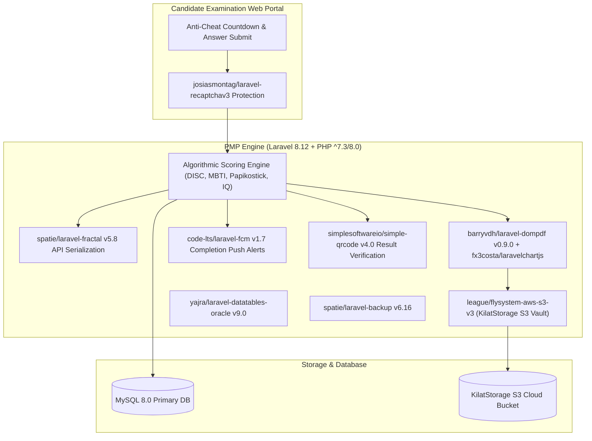

# 🏛️ PMP Smart Psychometrics Backend (`pmp-smart-backend`) — System Architecture

---

## 📌 Executive Architecture Summary
Dokumen ini memaparkan cetak biru arsitektur teknis (*system design blueprint*), pemisahan tanggung jawab komponen (*separation of concerns*), alur transmisi data (*data lifecycle*), serta manifest dependensi terverifikasi yang diambil langsung dari file manifest proyek (`package.json` & `composer.json`).

* **Pola Arsitektur Utama:** `Online Psychometric Assessment Engine with Cloud S3 Storage & Recaptcha v3`
* **Fokus Rekayasa:** Keandalan sistem, latensi rendah, integritas data, dan keamanan transaksi.

---

## 🏛️ System Architecture Diagram

---

## 🔄 Lifecycle & Data Flow
1. **Secure Exam Submission:** Answers submitted under `josiasmontag/laravel-recaptchav3` bot protection and server-side timer validation.
2. **Psychometric Scoring:** Computes trait dimensions, percentiles, and radar profiles instantly.
3. **Automated Psychogram Generation:** `barryvdh/laravel-dompdf` and `fx3costa/laravelchartjs` generate formatted multi-page psychological reports stamped with QR codes (`simplesoftwareio/simple-qrcode`).
4. **Cloud S3 Archiving:** Reports upload automatically to KilatStorage S3 via `league/flysystem-aws-s3-v3`.

---

### 📦 Komponen & Library Arsitektur Utama (Core Architectural Stack)
| Kategori Arsitektural | Package / Library | Versi Standar | Peran & Tanggung Jawab Sistem |
| :--- | :--- | :--- | :--- |
| **Backend Framework** | `laravel/framework` | `v8.x` | Psychometric Examination Engine |
| **Cloud Object Storage** | `flysystem-aws-s3 (KilatStorage)` | `v1.x` | S3 Storage for Answer Vaults & Assets |
| **Anti-Cheat Bot Shield** | `josiasmontag/laravel-recaptchav3` | `v1.x` | Automated Test-Taker Verification |
| **Automated Psychogram PDF** | `barryvdh/laravel-dompdf + chartjs` | `v0.9+` | Psychological Radar & Trait Report Generator |
| **Digital Signature Verification** | `simplesoftwareio/simple-qrcode` | `v4.x` | Dynamic Result Authenticity Verification |

---

## 🔒 Security & Access Control
- **Recaptcha v3 Invisible Score:** Blocks automated bots and scraping.
- **Spatie Permissions:** Candidates cannot access reports before official psychologist release.

---

## ⚡ Performance & Scalability Considerations
- **Asynchronous Report Compilation:** PDF generation queued in background workers to maintain instant response times.
