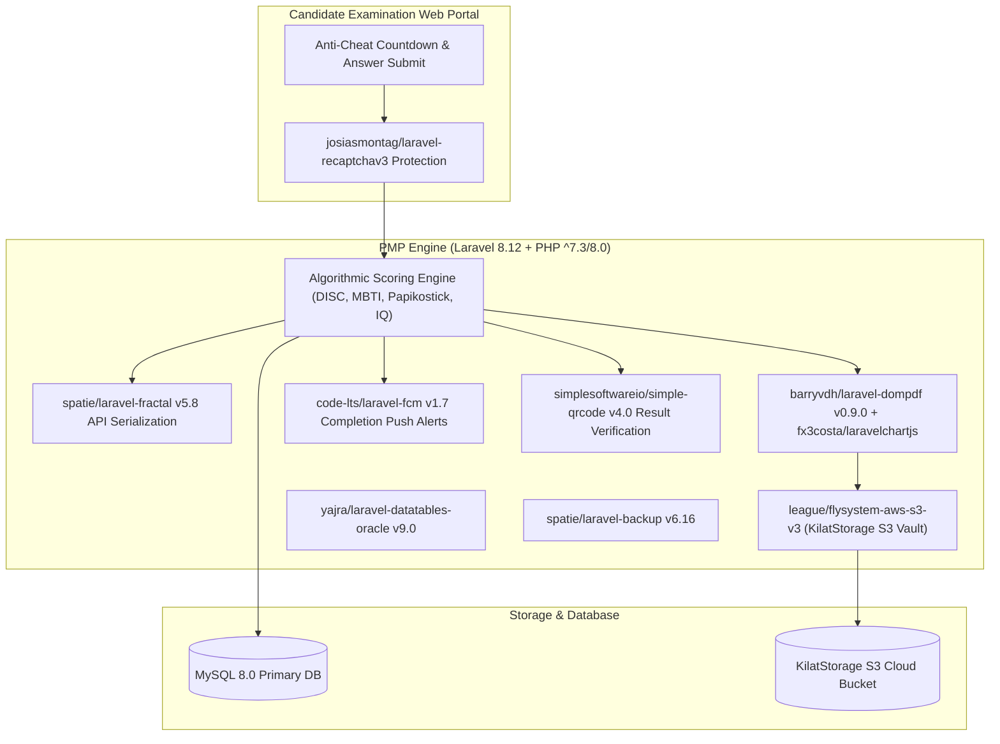

# 🏛️ PMP Smart Psychometrics Backend (`pmp-smart-backend`) — System Architecture

---

## 📌 Executive Architecture Summary
Dokumen ini memaparkan cetak biru arsitektur teknis (*system design blueprint*), pemisahan tanggung jawab komponen (*separation of concerns*), alur transmisi data (*data lifecycle*), serta manifest dependensi terverifikasi yang diambil langsung dari file manifest proyek (`package.json` & `composer.json`).

* **Pola Arsitektur Utama:** `Online Psychometric Assessment Engine with Cloud S3 Storage & Recaptcha v3`
* **Fokus Rekayasa:** Keandalan sistem, latensi rendah, integritas data, dan keamanan transaksi.

---

## 🏛️ System Architecture Diagram

---

## 🔄 Lifecycle & Data Flow
1. **Secure Exam Submission:** Answers submitted under `josiasmontag/laravel-recaptchav3` bot protection and server-side timer validation.
2. **Psychometric Scoring:** Computes trait dimensions, percentiles, and radar profiles instantly.
3. **Automated Psychogram Generation:** `barryvdh/laravel-dompdf` and `fx3costa/laravelchartjs` generate formatted multi-page psychological reports stamped with QR codes (`simplesoftwareio/simple-qrcode`).
4. **Cloud S3 Archiving:** Reports upload automatically to KilatStorage S3 via `league/flysystem-aws-s3-v3`.

---

### 📦 Manifest Dependensi Terverifikasi (Direct from Codebase Manifests)
| Manifest Source | Package / Library | Version Constraint | Category & Architectural Role |
| :--- | :--- | :--- | :--- |
| `package.json` (`package.json`) | **`axios`** | `^0.21` | Dev Tool / Bundler |
| `package.json` (`package.json`) | **`laravel-mix`** | `^6.0.6` | Dev Tool / Bundler |
| `package.json` (`package.json`) | **`lodash`** | `^4.17.19` | Dev Tool / Bundler |
| `package.json` (`package.json`) | **`postcss`** | `^8.1.14` | Dev Tool / Bundler |
| `package.json` (`public\assets\theme\backend\package.json`) | **`grunt`** | `^1.0.1` | Dev Tool / Bundler |
| `package.json` (`public\assets\theme\backend\package.json`) | **`grunt-contrib-connect`** | `^1.0.2` | Dev Tool / Bundler |
| `package.json` (`public\assets\theme\backend\package.json`) | **`grunt-contrib-copy`** | `^1.0.0` | Dev Tool / Bundler |
| `package.json` (`public\assets\theme\backend\package.json`) | **`grunt-contrib-jshint`** | `^1.0.0` | Dev Tool / Bundler |
| `package.json` (`public\assets\theme\backend\package.json`) | **`grunt-contrib-sass`** | `^1.0.0` | Dev Tool / Bundler |
| `package.json` (`public\assets\theme\backend\package.json`) | **`grunt-contrib-watch`** | `^1.0.0` | Dev Tool / Bundler |
| `package.json` (`public\assets\theme\backend\package.json`) | **`grunt-jscs`** | `^3.0.1` | Dev Tool / Bundler |
| `package.json` (`public\assets\theme\backend\package.json`) | **`grunt-open`** | `^0.2.3` | Dev Tool / Bundler |
| `composer.json` (`composer.json`) | **`php`** | `^7.3|^8.0.2` | Backend Framework Component |
| `composer.json` (`composer.json`) | **`barryvdh/laravel-dompdf`** | `^0.9.0` | Backend Framework Component |
| `composer.json` (`composer.json`) | **`code-lts/laravel-fcm`** | `^1.7` | Backend Framework Component |
| `composer.json` (`composer.json`) | **`fideloper/proxy`** | `^4.4` | Backend Framework Component |
| `composer.json` (`composer.json`) | **`fruitcake/laravel-cors`** | `^2.0` | Backend Framework Component |
| `composer.json` (`composer.json`) | **`fx3costa/laravelchartjs`** | `^3.0` | Backend Framework Component |
| `composer.json` (`composer.json`) | **`guzzlehttp/guzzle`** | `^7.0.1` | Backend Framework Component |
| `composer.json` (`composer.json`) | **`intervention/image`** | `^2.5` | Backend Framework Component |
| `composer.json` (`composer.json`) | **`josiasmontag/laravel-recaptchav3`** | `^1.0` | Backend Framework Component |
| `composer.json` (`composer.json`) | **`laravel/framework`** | `^8.12` | Backend Framework Component |
| `composer.json` (`composer.json`) | **`laravel/tinker`** | `^2.5` | Backend Framework Component |
| `composer.json` (`composer.json`) | **`laravelcollective/html`** | `^6.2` | Backend Framework Component |
| `composer.json` (`composer.json`) | **`league/flysystem-aws-s3-v3`** | `^1.0` | Backend Framework Component |
| `composer.json` (`composer.json`) | **`maatwebsite/excel`** | `^3.1` | Backend Framework Component |
| `composer.json` (`composer.json`) | **`milon/barcode`** | `^8.0` | Backend Framework Component |
| `composer.json` (`composer.json`) | **`simplesoftwareio/simple-qrcode`** | `~4` | Backend Framework Component |
| `composer.json` (`composer.json`) | **`spatie/laravel-backup`** | `^6.16` | Backend Framework Component |
| `composer.json` (`composer.json`) | **`spatie/laravel-fractal`** | `^5.8` | Backend Framework Component |
| `composer.json` (`composer.json`) | **`spatie/laravel-permission`** | `^4.0` | Backend Framework Component |
| `composer.json` (`composer.json`) | **`yajra/laravel-datatables-oracle`** | `~9.0` | Backend Framework Component |
| `composer.json` (`composer.json`) | **`facade/ignition`** | `^2.5` | Dev / Testing Tool |
| `composer.json` (`composer.json`) | **`fakerphp/faker`** | `^1.9.1` | Dev / Testing Tool |
| `composer.json` (`composer.json`) | **`laravel/sail`** | `^1.0.1` | Dev / Testing Tool |

---

## 🔒 Security & Access Control
- **Recaptcha v3 Invisible Score:** Blocks automated bots and scraping.
- **Spatie Permissions:** Candidates cannot access reports before official psychologist release.

---

## ⚡ Performance & Scalability Considerations
- **Asynchronous Report Compilation:** PDF generation queued in background workers to maintain instant response times.
