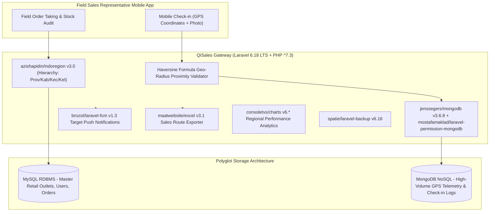

# 🏛️ QiSales Sales Force Automation (`qisales-backend`) — System Architecture

---

## 📌 Executive Architecture Summary
Dokumen ini memaparkan cetak biru arsitektur teknis (*system design blueprint*), pemisahan tanggung jawab komponen (*separation of concerns*), alur transmisi data (*data lifecycle*), serta manifest dependensi terverifikasi yang diambil langsung dari file manifest proyek (`package.json` & `composer.json`).

* **Pola Arsitektur Utama:** `Polyglot Persistence Architecture with GPS Geo-Fencing & SFA Mobile Backend`
* **Fokus Rekayasa:** Keandalan sistem, latensi rendah, integritas data, dan keamanan transaksi.

---

## 🏛️ System Architecture Diagram

---

## 🔄 Lifecycle & Data Flow
1. **Field GPS Check-in:** Sales agent submits GPS coordinates and outlet visit photo from mobile app.
2. **Proximity Validation:** Backend verifies location against registered outlet master coordinates using the Haversine formula.
3. **Polyglot Storage:** High-volume time-series GPS trails persist directly into `jenssegers/mongodb`; sales transactions persist into MySQL.
4. **Territory Reporting:** `azishapidin/indoregion` structures sales performance across Indonesian administrative hierarchies.

---

### 📦 Komponen & Library Arsitektur Utama (Core Architectural Stack)
| Kategori Arsitektural | Package / Library | Versi Standar | Peran & Tanggung Jawab Sistem |
| :--- | :--- | :--- | :--- |
| **Backend Framework** | `laravel/framework` | `v6.x LTS` | Sales Force Automation Gateway |
| **Polyglot NoSQL Logging** | `jenssegers/mongodb` | `v3.x` | High-Volume GPS Check-in & Route Telemetry |
| **Regional Hierarchy** | `azishapidin/indoregion` | `v3.x` | Indonesian Administrative Hierarchy Service |
| **Push Notifications** | `brozot/laravel-fcm` | `v1.x` | Field Route & Target Push Notifications |
| **Analytics & Reports** | `consoletvs/charts + excel` | `v6.x / v3.x` | Outlet Coverage & Territory Sales Reports |

---

## 🔒 Security & Access Control
- **Mock GPS Coordinate Filtering:** Jitter and speed validation to detect spoofed locations.
- **Role Management on MongoDB:** `mostafamaklad/laravel-permission-mongodb` enforces document-level permissions.

---

## ⚡ Performance & Scalability Considerations
- **Polyglot Separation:** Uncouples heavy telemetry logging from core financial order tables.
