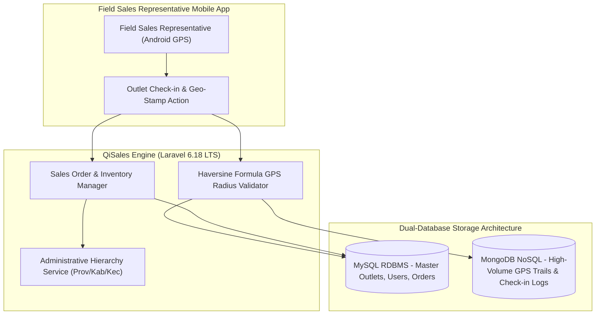

# 🏛️ QiSales Sales Force Automation (SFA) — Polyglot Architecture

---

## 📌 Executive Architecture Summary
Dokumen ini memaparkan cetak biru arsitektur teknis (*system design blueprint*), pemisahan tanggung jawab komponen (*separation of concerns*), alur transmisi data (*data lifecycle*), serta pertimbangan keamanan dan skalabilitas untuk **`qisales-backend`**.

* **Pola Arsitektur Utama:** `Polyglot Persistence Architecture with GPS Radius Validation`
* **Fokus Rekayasa:** Keandalan sistem, latensi rendah, integritas data, dan keamanan transaksi.

---

## 🏛️ System Architecture Diagram

---

## 🔄 Lifecycle & Data Flow
1. **Field Check-in:** Sales agent taps check-in on the Android app, transmitting current GPS coordinates and device timestamp.
2. **Geo-Fence Validation:** Backend executes the Haversine formula against the registered outlet coordinates to verify physical proximity (< 100m).
3. **Polyglot Storage:** Verified transaction and order data persist in MySQL; high-volume GPS telemetry paths append to MongoDB collections without locking relational tables.
4. **Analytics Reporting:** Supervisors visualize regional sales routes and real-time outlet coverage heatmaps.

---

## 🔒 Security & Access Control
- **Mock Location Detection:** Backend timestamp and coordinate jitter analysis to prevent GPS spoofing.
- **Sanctum API Token Authentication:** Revocable device-tied API tokens.

---

## ⚡ Performance & Scalability Considerations
- **Polyglot Separation:** Isolating time-series GPS pings to MongoDB preserves MySQL throughput for financial transactions.
